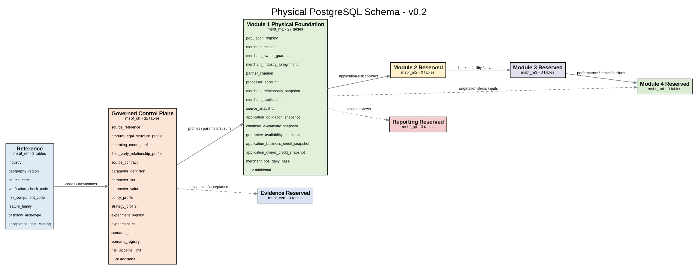
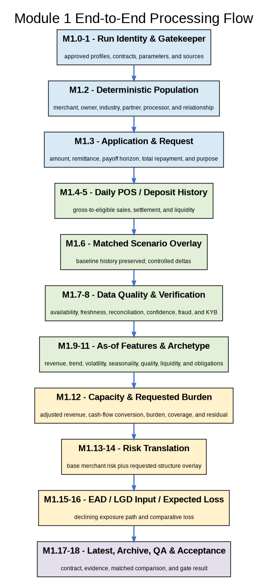
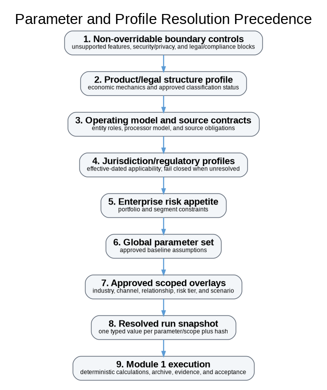
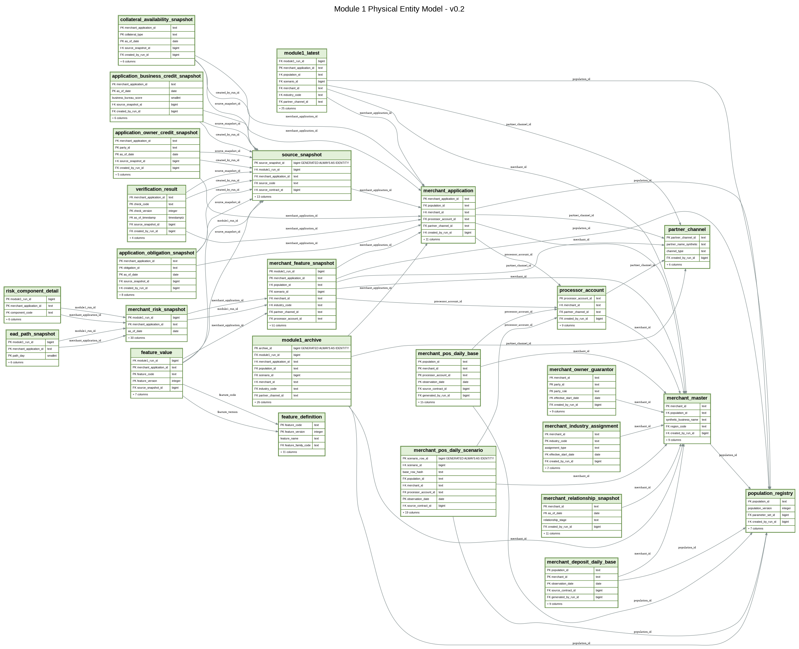

# Merchant Sales-Based Financing Strategy Simulator
## Module 1: Merchant POS Cash-Flow, Verification & Base-Risk Engine
### Business Requirements Document - Detailed Physical Design v0.2
Author: Andrew R. Goad  |  Version: 0.2  |  Date: July 23, 2026

# Document Control

**Table 1. Document control and ownership**

| Field | Value |
|---|---|
| Document title | Merchant Sales-Based Financing Strategy Simulator - Module 1 BRD |
| Module | Module 1: Merchant POS Cash-Flow, Verification & Base-Risk Engine |
| Version | 0.2 |
| Status | Detailed physical design - implementation foundation |
| Author | Andrew R. Goad |
| Date | July 23, 2026 |
| Primary audience | Credit Risk, Portfolio Strategy, Data Architecture, Model Validation, Finance, Product, Operations, Legal/Compliance, Information Security |
| Primary contract | M1_APPLICATION_RISK_SNAPSHOT_V1 |
| Acceptance gate | G2_M1_CONTRACT |
| Implementation target | PostgreSQL 14+ |
| Data boundary | Synthetic and public-demonstration data only |

> **Model and system boundary**  
> This BRD specifies a governed synthetic simulation engine. It does not approve a legal product classification, provide a production credit decision, establish customer pricing, certify regulatory compliance, or produce a calibrated probability of default or financial-reporting loss estimate.

# Executive Snapshot

**Table 2. Executive summary of the Module 1 design**

| Question | Design answer |
|---|---|
| What is Module 1? | A deterministic merchant/application and daily POS cash-flow engine that creates leakage-free origination features, transparent base/requested-structure risk proxies, declining EAD, LGD inputs, and comparative Expected Loss. |
| Why does it matter? | It gives a new merchant-finance business a governed, reproducible foundation for underwriting, offer design, stress testing, validation, and future performance learning without exposing real merchant or cardholder data. |
| What is the primary business insight? | Merchant risk emerges from the interaction of revenue level, trend, stability, transaction quality, liquidity, existing obligations, business/owner evidence, processor continuity, and the requested sales-linked repayment structure. |
| What is the output grain? | One row per population_id x Module 1 scenario x merchant_application_id. |
| What is implemented in the physical foundation? | Eight schemas, 70 tables, 1,041 columns, 141 foreign keys, 4 partitioned facts, 5 views, 3 functions, 155 parameter definitions, 397 scoped values, and 32 feature definitions. |
| What remains before run acceptance? | Execution against a clean PostgreSQL 14+ database, end-to-end population/history generation, contract-row production, and G2 validation evidence. |

# Table of Contents / Document Navigation

**Table 3. BRD navigation map**

| Section | Title | Purpose |
|---|---|---|
| 1 | Executive Summary | Final design position and implementation status |
| 2 | Business Objective and Strategic Value | Business questions, management value, and launch relevance |
| 3 | Product and Operating Context | Sales-linked mechanics and legal-neutral terminology |
| 4 | Design Principles | Determinism, as-of integrity, modularity, explainability, and governance |
| 5 | Scope and Boundaries | Included capabilities, exclusions, and interpretation limits |
| 6 | Enterprise and Physical Architecture | Schemas, control plane, functions, views, and database design |
| 7 | Module 1 Contract and Business Question | Input/output contract and downstream obligations |
| 8 | End-to-End Processing Stages | M1.0 through M1.18 sequence and acceptance points |
| 9 | Run Identity and Gatekeeper | Frozen profiles, parameters, source contracts, and fail-fast logic |
| 10 | Deterministic Merchant Population | Merchant, owner, industry, channel, processor, and relationship generation |
| 11 | Application and Requested Structure | Funding, fee/payback multiple, remittance, payoff horizon, and request use |
| 12 | Daily POS and Settlement History | Gross-to-eligible sales, transaction quality, fees, settlement, and continuity |
| 13 | Deposit and Liquidity History | Deposits, balances, NSF, negative balance, and buffer evidence |
| 14 | Scenario Overlay Framework | Matched history transformation and controlled downturn mechanics |
| 15 | Source Quality and Data Confidence | Availability, depth, freshness, completeness, reconciliation, and fallback |
| 16 | Verification, Fraud, and Continuity | Independent verification/fraud evidence and operating status |
| 17 | As-of Feature Engineering | Thirty-two governed features, windows, lineage, and leakage controls |
| 18 | Obligations, Liquidity, and Residual Cash Flow | Existing debt/remittances, stacking, and capacity effects |
| 19 | Cash-Flow Archetypes | Explainable merchant behavior classification |
| 20 | Capacity and Requested Burden | Adjusted revenue, conversion margin, remittance burden, coverage, and residual |
| 21 | Credit-Risk Proxy and Diagnostics | Transparent points, logistic translation, floors/caps, tiers, and reasons |
| 22 | EAD, LGD Inputs, and Expected Loss | Declining exposure path and comparative loss measures |
| 23 | Latest, Archive, Comparison, and Evidence | Persistence, hashes, contracts, and matched comparison |
| 24 | Parameter Governance | Definition/value separation, scoping, precedence, and change control |
| 25 | Physical Data Model | P0 table inventory, grains, keys, partitions, and lineage |
| 26 | Output Contract and Consumption | Mandatory fields, consumer expectations, and valid uses |
| 27 | Validation and Acceptance | Structural, temporal, economic, scenario, and contract QA |
| 28 | Security, Regulatory, and Conduct Boundaries | Fail-closed architecture and explicit non-certification |
| 29 | Implementation and Run Guidance | Build sequence, database execution gate, and operational handoff |
| 30 | Future Enhancement Roadmap | Module 1 implementation, validation, and later empirical learning |
| 31 | Final Design Statement | Design acceptance within documented boundaries |
| Appendices | A-F | Traceability, table catalog, features, parameters, tests, and formula glossary |

# 1. Executive Summary

Module 1 establishes the deterministic merchant, POS cash-flow, verification, and base-risk foundation for the Merchant Sales-Based Financing Strategy Simulator. It is designed for a business that provides or evaluates short-duration merchant financing in which repayment is linked to a percentage of eligible processed sales and is commonly structured around expected 30-, 60-, or 90-day payoff horizons.

The module is deliberately not limited to one bureau score, one month of revenue, or a fixed-payment consumer-credit analogy. It generates daily POS and optional deposit history, distinguishes gross sales from eligible sales, measures trend, volatility, seasonality, refunds, chargebacks, liquidity, existing obligations, source reliability, verification, fraud, processor continuity, and requested remittance burden, then translates that evidence into transparent synthetic risk and comparative loss outputs.

**Central Module 1 transmission chain**

```text
Merchant and Relationship Evidence
-> Daily POS / Deposit History
-> As-of Cash-Flow and Data-Confidence Features
-> Requested Sales-Linked Structure
-> Base and Requested-Structure Risk Proxies
-> Declining EAD + LGD Inputs
-> Comparative Expected Loss
-> Versioned Module 1 Contract
```

Version 0.2 moves the project from logical architecture into a physical PostgreSQL implementation foundation. The schema and reference seed establish the governed control plane, Module 1 operational tables, deterministic helper functions, latest/archive views, contract validation function, parameter dictionary, feature dictionary, industry assumptions, and static validation evidence required before the analytical engine is coded.

**Table 4. Current physical-design status**

| Implementation measure | v0.2 result |
|---|---|
| PostgreSQL schemas | 8 |
| Physical tables | 70 |
| Physical columns | 1041 |
| Foreign keys | 141 |
| Partitioned tables | 4 |
| Views | 5 |
| Functions | 3 |
| Parameter definitions | 155 |
| Baseline scoped values | 397 |
| Feature definitions | 32 |
| Static SQL validation | PASS - 0 errors, 0 warnings |
| Live database execution | Required future acceptance gate |

> **Final executive assessment**  
> The Module 1 design is sufficiently specified to begin PostgreSQL implementation without reopening the product mechanics, core grains, contract identity, source-quality framework, risk dimensions, or latest/archive architecture. The delivered SQL is statically validated but has not yet been executed on a live PostgreSQL server.

# 2. Business Objective and Strategic Value

## 2.1 Primary objective

Create a governed, deterministic, daily-grain merchant cash-flow and risk simulation engine that allows a new merchant-finance business to test product, underwriting, repayment-burden, risk, loss, and scenario assumptions before production deployment and before institution-specific performance data are available.

## 2.2 Management questions answered

- What merchant and source evidence is available as of the application date?
- How much eligible POS revenue is stable enough to support a short-duration sales-linked repayment obligation?
- How do recent sales decline, volatility, seasonality, refunds, chargebacks, liquidity, stacking, and business stability alter relative risk?
- How does the requested funded amount, payback multiple, remittance percentage, and expected payoff horizon change capacity and requested-structure risk?
- What declining exposure and comparative Expected Loss result from the requested structure?
- Which merchants should be hard-stopped, routed to manual review, or passed to Module 2 for candidate-offer design?
- How do matched recession, industry, processor, or source-quality scenarios affect the same merchants without population noise?

## 2.3 Strategic value to a new entrant

**Table 5. Strategic value of the Module 1 foundation**

| Strategic need | Module 1 contribution |
|---|---|
| Launch control | Centralizes assumptions, source contracts, product/operating profiles, and acceptance gates before scale. |
| Safe learning | Uses synthetic data and controlled scenarios to develop the analytical architecture before real merchant performance is available. |
| Data strategy | Defines the sources, history depth, freshness, reconciliation, lineage, and quality evidence that should be collected from launch. |
| Credit differentiation | Separates business capacity, owner/business evidence, fraud, source confidence, and processor continuity rather than collapsing them into one score. |
| Product economics foundation | Produces requested burden, declining exposure, LGD inputs, and comparative Expected Loss for downstream price and contribution analysis. |
| Governance | Provides immutable run snapshots, versioned contracts, hashes, archives, evidence, and acceptance results. |
| Scalability | Preserves future repeat applications, facilities, advances, daily performance, line management, loss mitigation, and stress testing through distinct entities. |

# 3. Product and Operating Context

## 3.1 Working economic mechanics

The working demonstration product is processor-linked merchant working-capital financing. A merchant receives upfront funding and repays through an automatic percentage of eligible daily POS sales until the total contractual or purchased repayment amount is delivered. Actual payoff timing varies with realized sales unless an approved legal structure establishes a different contractual mechanism.

**Working product mechanics**

```text
Eligible Daily POS Sales x Requested Remittance Percentage
= Expected Daily Sales-Linked Remittance

Funded Amount + Fixed Finance Charge
= Total Repayment / Delivery Amount

Total Repayment Amount / Expected Daily Remittance
= Expected Payoff Days
```

## 3.2 Expected payoff horizon versus contractual maturity

The 30-, 60-, and 90-day values in Module 1 are expected payoff-horizon design bands. They are not automatically contractual maturity dates, and they do not imply conventional 30/60/90 days-past-due monitoring. Module 3 will assess daily remittance fulfillment, minimum-progress checkpoints, payoff slippage, processor continuity, and percentage-of-life interruption severity.

## 3.3 Legal-neutral structure

**Table 6. Configurable product-structure treatment**

| Configuration code | Economic interpretation | Module 1 treatment |
|---|---|---|
| SALES_BASED_LOAN | Business credit with payments tied to sales | Uses approved profile; Module 1 does not determine legal coverage. |
| RECEIVABLES_PURCHASE | Purchase of future receivables up to an agreed amount | Uses approved profile; reconciliation/recourse attributes are versioned. |
| HYBRID_OR_OTHER | Structure combining sales-linked and other contractual mechanics | Requires explicit approved profile and may route to compliance review. |
| UNSPECIFIED_DEMONSTRATION | Public portfolio artifact only | Permitted for synthetic mechanics; cannot produce a compliance-clear conclusion. |

> **Critical classification boundary**  
> Commercial terminology does not establish legal or regulatory classification. Module 1 consumes an approved effective-dated product and operating-model profile; it does not infer a legal conclusion from the words loan, advance, MCA, factor rate, or receivables purchase.

# 4. Design Principles

**Table 7. Module 1 design principles**

| Principle | Design requirement |
|---|---|
| Deterministic reproducibility | All synthetic draws are generated from stable identities, population IDs, seed labels, and versioned helper functions; identical inputs must reproduce identical rows and hashes. |
| As-of integrity | Every origination feature uses observations on or before the application as-of date. Future performance, later profile changes, and later collateral or covenant evidence are prohibited. |
| Daily-grain authenticity | POS and liquidity behavior are generated daily so the engine can measure zero-sales days, short-term decline, volatility, seasonality, refunds, chargebacks, and rapid paydown. |
| Multi-source separation | Source availability, freshness, completeness, reconciliation, and confidence are modeled explicitly and are not treated as merchant deterioration. |
| Separation of concerns | Merchant attributes, daily history, feature engineering, capacity, risk translation, EAD/LGD inputs, and contract persistence are distinct stages and tables. |
| Explainable risk | The risk framework uses transparent component points and a bounded logistic translation, not an opaque production model. |
| Matched scenario design | Baseline history is immutable; scenarios transform matched merchant/day observations under governed overlays. |
| Latest/archive discipline | Latest accepted output is replaceable for convenience; immutable archives and comparison registries are the source of evidence. |
| Configuration before code | Assumptions and thresholds are versioned parameters or profiles; downstream logic should not be edited for ordinary strategy testing. |
| Fail closed | Missing, stale, ambiguous, unsupported, or unapproved configuration prevents a run or creates an explicit review/block status. |
| Boundary-aware communication | Synthetic realism supports strategy design; it does not create production underwriting, pricing, legal, compliance, capital, or accounting conclusions. |

# 5. Scope and Boundaries

## 5.1 Included in Module 1

- Versioned run, profile, parameter, source, scenario, contract, evidence, and acceptance controls.
- Deterministic merchant, owner/guarantor, industry, geography, relationship, partner/channel, and processor population.
- One synthetic application per merchant in the initial vertical slice, with repeat-application extensibility.
- Daily baseline POS/settlement history and optional daily deposit/liquidity history.
- Matched scenario-adjusted history that preserves baseline facts.
- As-of source quality, verification, fraud, credit, obligations, collateral-availability, and guarantee-availability snapshots.
- Thirty-two versioned cash-flow, liquidity, capacity, and requested-structure features.
- Explainable cash-flow archetypes.
- Transparent base and requested-structure risk proxies with component diagnostics.
- Daily expected-EAD path, industry LGD inputs, simple EL, and schedule-adjusted EL.
- Latest output, immutable archive, contract view, run reconciliation, evidence, and G2 acceptance.

## 5.2 Explicit exclusions

- Final offer amount, price, acceptance probability, collateral package, covenant package, credit allocation, or compliance-clear determination.
- Observed post-booking remittance performance, delinquency, renewal, line management, workout, recovery, or survival analysis.
- Production KYB, AML, sanctions, fraud, fair-lending, disclosure, licensing, state-law, PCI, or regulatory reporting certification.
- Real merchant, owner, processor, bank-account, cardholder, or payment-account data.
- Calibrated probability of default, reserve, CECL, capital, accounting, or financial-reporting outputs.
- Production customer decisions or adverse-action notices.
- Macroeconomic forecasts or empirically estimated price elasticity.

## 5.3 Scope prioritization

**Table 8. Scope priority standard**

| Priority | Definition | Examples |
|---|---|---|
| P0 | Required for the first accepted vertical slice | Control plane, merchant/application, daily POS, optional deposits, features, risk, EAD/EL, latest/archive, QA. |
| P1 | Designed now; implementation follows G2 | Expanded source evidence, scenario library, deeper collateral availability, advanced diagnostics. |
| P2 | Future analytical enhancement | Empirical calibration, ML challengers, performance feedback, broader products. |

# 6. Enterprise and Physical Architecture



*Figure 1. Physical PostgreSQL schema overview*

## 6.1 Schema organization

**Table 9. PostgreSQL schema architecture**

| Schema | Purpose | Representative content |
|---|---|---|
| msbf_ref | Reference catalogs | Industry, geography, sources, checks, risk components, feature families, archetypes, acceptance gates |
| msbf_ctl | Shared control plane | Profiles, contracts, parameters, policies, strategies, scenarios, risk appetite, requirements, runs, evidence, acceptance |
| msbf_m1 | Module 1 operational and analytical data | Merchant/application, POS/deposits, sources, features, risk, EAD, latest/archive |
| msbf_m2 | Reserved downstream namespace | Offer, pricing, collateral, covenants, compliance package, decisions, booking |
| msbf_m3 | Reserved downstream namespace | Daily performance, health, line management, renewal, loss mitigation |
| msbf_m4 | Reserved downstream namespace | Economic scenarios, industry dependencies, stress, robustness, capacity allocation |
| msbf_evd | Reserved evidence namespace | Persistent validation and campaign evidence |
| msbf_rpt | Reserved reporting namespace | Accepted source-to-report views |

## 6.2 Physical implementation summary

**Table 10. Physical implementation measures**

| Object type | Count | Design role |
|---|---|---|
| Schemas | 8 | Module separation and security boundary |
| Tables | 70 | Governance and Module 1 physical persistence |
| Columns | 1041 | Typed business, lineage, diagnostic, and audit fields |
| Foreign keys | 141 | Referential and contract integrity |
| Partitioned fact tables | 4 | Daily/history and archive scalability |
| Views | 5 | Active parameters, contract output, latest accepted, feature lineage, run reconciliation |
| Functions | 3 | Deterministic uniform/normal draws and contract validation |

## 6.3 Database standards

- PostgreSQL 14+ target.
- Lowercase snake_case names; module-prefixed schemas.
- Text status codes backed by reference catalogs or check constraints where appropriate.
- Identity keys for technical persistence; stable text keys for deterministic merchant/application identities.
- JSONB reserved for flexible approved configuration, evidence, and source payloads - not as a substitute for core relational fields.
- Timestamptz for technical timestamps; date for as-of and effective-date logic.
- Numeric precision chosen to support daily currency, rates, risk proxies, and row-hash reconciliation.
- Comment-on-table and comment-on-column metadata included in catalogs.
- No reliance on session random(); deterministic helper functions are versioned and seeded by stable business keys.

## 6.4 Current validation posture

The DDL and seed scripts passed static lexical, catalog, insert-column, foreign-key-target, deterministic-design, required-object, and placeholder validation with 0 errors and 0 warnings. This does not replace execution on a clean PostgreSQL server.

# 7. Module 1 Business Question and Contract

> **Primary business question**  
> Given a deterministic merchant/application population and an application as-of date, what cash-flow, liquidity, data-confidence, verification, fraud, credit-risk, requested-structure, EAD, LGD-input, and Expected Loss evidence is available without using future information?

## 7.1 Primary output grain

**Module 1 archive grain**

```text
one row per
population_id
x scenario_id
x merchant_application_id
```

## 7.2 Contract identity

**Table 11. Module 1 contract properties**

| Contract property | Value |
|---|---|
| Contract code | M1_APPLICATION_RISK_SNAPSHOT |
| Contract version | 1 |
| Canonical label | M1_APPLICATION_RISK_SNAPSHOT_V1 |
| Provider module | M1 |
| Primary consumer | M2 |
| Acceptance gate | G2_M1_CONTRACT |
| Latest convenience table | msbf_m1.module1_latest |
| Immutable source | msbf_m1.module1_archive |
| Contract view | msbf_m1.v_module1_application_risk_contract_v1 |
| Validation function | msbf_m1.validate_module1_contract(run_id) |

## 7.3 Mandatory field families

- Run, profile, scenario, population, merchant, application, industry, partner, and processor identity.
- Application, as-of, history-start, history-end, and source-cutoff dates.
- Source availability, history depth, freshness, completeness, reconciliation, confidence, and fallback path.
- Verification status, fraud tier, operational continuity, and review/hard-stop recommendations.
- Revenue level, trend, stability, seasonality, transaction quality, liquidity, obligations, business stability, and cash-flow archetype.
- Requested funded amount, total repayment, payback multiple, remittance rate, expected payoff horizon, and expected daily remittance.
- Adjusted eligible revenue, cash-flow conversion, total burden, post-financing coverage, residual cash flow, and funding-to-sales.
- Risk component points, base/requested proxies, risk tier, floor/cap diagnostics, EAD, LGD input, EL, and reason evidence.
- Contract code/version, contract row hash, creation/archive timestamps.

## 7.4 Downstream obligations

Module 2 may create offer-specific candidate risk and economics, but it must preserve Module 1 source history, as-of feature values, base merchant-risk evidence, and contract identity. Downstream modules may add evidence; they may not silently rewrite an accepted Module 1 archive row.

# 8. End-to-End Processing Stages



*Figure 2. Module 1 end-to-end processing stages*

**Table 12. Module 1 stage map**

| Stage | Name | Principal logic | Primary output |
|---|---|---|---|
| M1.0 | Scope and boundary | Module purpose, legal-neutral product assumptions, non-use boundaries | Approved design identity |
| M1.1 | Run/profile/parameter/source gatekeeper | Approved effective-dated profiles, source contracts, parameter resolution, contract identity | Frozen run snapshots or blocking resolution errors |
| M1.2 | Deterministic population | Merchant, owner, industry, geography, partner, processor, relationship | Stable population and merchant keys |
| M1.3 | Application and request | Funded amount, payback multiple, total repayment, remittance, horizon, use | One as-of application per merchant |
| M1.4 | Baseline POS history | Daily sales, transactions, refunds, chargebacks, reversals, fees, settlement | Immutable merchant/day POS facts |
| M1.5 | Deposit/liquidity history | Deposits, withdrawals, balances, NSF, negative balance | Optional merchant/day liquidity facts |
| M1.6 | Matched scenario overlay | Controlled sales, volatility, quality, deposit, obligation, processor effects | Scenario facts preserving baseline |
| M1.7 | Source quality | Availability, depth, freshness, completeness, reconciliation, confidence | Application/source snapshot |
| M1.8 | Verification and fraud | Entity/owner/bank/processor/sanctions/fraud evidence | Separate verification and fraud status |
| M1.9 | Cash-flow features | Revenue, trend, volatility, seasonality, transaction quality | As-of cash-flow features |
| M1.10 | Liquidity and obligations | Balances, buffer, debt service, active advances, stacking | Residual cash-flow inputs |
| M1.11 | Cash-flow archetype | Explainable behavioral classification | One archetype per application/run |
| M1.12 | Capacity and burden | Adjusted revenue, cash-flow conversion, expected remittance, coverage | Requested-structure capacity evidence |
| M1.13 | Base merchant risk | Cash flow, quality, liquidity, obligations, stability, credit, industry, data | Base relative risk proxy |
| M1.14 | Requested-structure overlay | Burden and coverage points added to base risk | Requested-structure risk proxy |
| M1.15 | EAD and LGD inputs | Declining daily balance path and collateral/guarantee availability | Expected EAD and synthetic LGD input |
| M1.16 | Comparative Expected Loss | Simple and schedule-adjusted loss | Dollar and rate outputs |
| M1.17 | Latest and archive | Contract rows, hashes, latest replacement, archive append | Versioned persistent outputs |
| M1.18 | QA and acceptance | Reconciliation, reproducibility, scenario, contract, evidence | G2 pass/fail result |

# 9. M1.0-M1.1: Run Identity and Fail-Fast Gatekeeper



*Figure 3. Parameter and profile resolution precedence*

## 9.1 Frozen run context

Every run is represented by msbf_ctl.run_registry and linked to immutable run-profile, run-parameter, and run-source snapshots. The design records the exact approved configuration used by the analytical result rather than relying on whatever is active when a reviewer later inspects the database.

**Table 13. Frozen run context**

| Run identity family | Required evidence |
|---|---|
| Technical identity | run_id, run_code, run_version, module_code, run_type, code_version |
| Analytical identity | population_id, scenario_id, as_of_date, contract_id |
| Governance identity | parameter_set, policy, strategy where applicable, product structure, operating model, jurisdiction |
| Snapshot hashes | parameter_snapshot_hash, profile_snapshot_hash, source_snapshot_hash |
| Lifecycle | run_status, started_at, completed_at, row_count, notes |

## 9.2 Resolution precedence

**Table 14. Parameter and profile resolution precedence**

| Rank | Layer | Treatment |
|---|---|---|
| 1 | Non-overridable boundaries | Synthetic-only, no real payment account data, no production decisions, no legal/compliance certification |
| 2 | Product/legal structure | Approved effective-dated economic and legal profile |
| 3 | Operating model and sources | Entity roles, processor model, third parties, source contracts |
| 4 | Jurisdiction/regulatory profiles | Approved applicability and unresolved-item handling |
| 5 | Risk appetite | Enterprise and portfolio constraints |
| 6 | Global parameter set | Approved baseline values |
| 7 | Scoped overlays | Industry, channel, relationship stage, risk tier, scenario |
| 8 | Frozen run snapshot | Resolved typed value, source row, resolution rank, hash |

## 9.3 Blocking failure conditions

- Missing required parameter or profile.
- Multiple equally specific approved values.
- Effective-date gap, overlap, stale review, or unapproved status.
- Out-of-range value or invalid cross-parameter ordering.
- Scenario override of a non-overridable boundary.
- Source contract missing for an enabled source.
- Contract code/version or schema hash mismatch.
- Unsupported feature or real-data flag enabled.

All resolution failures are persisted in msbf_ctl.profile_resolution_error. A run with a blocking error cannot proceed to population generation or receive G2 acceptance.

# 10. M1.2: Deterministic Merchant and Relationship Population

## 10.1 Vertical-slice baseline

**Table 15. Initial deterministic population configuration**

| Population dimension | Baseline design |
|---|---|
| Merchants / applications | 750 / 750 |
| Daily history | 180 calendar days |
| Industries | 8 |
| Synthetic regions | 5 |
| Merchant size tiers | MICRO, SMALL, LOWER_MIDDLE, MIDDLE |
| Relationship stages | NEW, RETURNING_GOOD, RETURNING_MIXED, LOW_AND_GROW |
| Legal entity types | LLC, CORPORATION, SOLE_PROPRIETOR, PARTNERSHIP |
| Owner/guarantor count | 1-3 |
| Processor tenure | 3-120 months |
| Months in business | 6-240 months |
| Applications per merchant | 1 in Version 1; schema supports repeats |

## 10.2 Deterministic method

**Deterministic pseudo-random generation**

```text
uniform_draw = deterministic_uniform(population_id, stable_entity_key, seed_label, seed_version)
normal_draw  = deterministic_normal(population_id, stable_entity_key, seed_label, seed_version)
```

A distinct seed label is required for every stochastic concept. Changing one parameter should not re-randomize unrelated merchant attributes. A new population_id intentionally creates a new merchant population; a new scenario_id must preserve the merchant population and baseline history when the analytical objective is matched comparison.

## 10.3 Industry design

**Table 16. Baseline synthetic industry assumptions**

| Industry | Mix | Daily sales center | Daily CV | Zero-sales probability | Cash-flow conversion | LGD baseline |
|---|---|---|---|---|---|---|
| Restaurant & Food Service | 0.16 | 3500 | 0.48 | 0.08 | 0.14 | 0.68 |
| General Retail | 0.16 | 4200 | 0.42 | 0.05 | 0.17 | 0.66 |
| Professional Services | 0.15 | 3000 | 0.28 | 0.18 | 0.32 | 0.58 |
| Construction & Skilled Trades | 0.13 | 5200 | 0.55 | 0.3 | 0.2 | 0.72 |
| Transportation & Logistics | 0.12 | 4800 | 0.46 | 0.1 | 0.16 | 0.74 |
| Energy Services | 0.08 | 6200 | 0.62 | 0.38 | 0.18 | 0.76 |
| Healthcare Services | 0.11 | 4500 | 0.3 | 0.22 | 0.3 | 0.56 |
| E-Commerce & Digital | 0.09 | 3900 | 0.58 | 0.03 | 0.24 | 0.7 |

> **Interpretation boundary**  
> Industry assumptions are transparent synthetic demonstration values intended to create differentiated cash-flow and loss behavior. They are not industry benchmarks, production credit policy, or forecasts.

## 10.4 Correlation and mixed-signal realism

The population must model tendencies rather than rigid stereotypes. Strong owner or business credit may coexist with declining sales or high requested burden; weak owner credit may coexist with stable business cash flow; large merchants may be volatile; small merchants may be stable. Aggregate gradients should remain directionally plausible while preserving meaningful row-level overlap.

# 11. M1.3: Application and Requested Sales-Linked Structure

## 11.1 Application grain and identity

msbf_m1.merchant_application stores one row per synthetic financing request. merchant_id, merchant_application_id, application_date, as_of_date, population_id, product structure, operating model, use of proceeds, requested amount, payback multiple, total repayment amount, remittance percentage, expected payoff horizon, and source channel are separate governed fields.

## 11.2 Request mechanics

**Requested structure calculations**

```text
Requested Total Repayment Amount
= Requested Funded Amount x Requested Payback Multiple

Requested Expected Daily Remittance
= Expected Eligible Daily Sales x Requested Remittance Rate

Indicative Expected Payoff Days
= Requested Total Repayment Amount / Requested Expected Daily Remittance
```

## 11.3 Baseline boundaries

**Table 17. Initial request-structure parameters**

| Parameter | Baseline / scope |
|---|---|
| Funding amount | $5,000-$150,000 |
| Funding-to-annualized-sales maximum | 25% |
| Payback multiple range | 1.08-1.35 |
| Risk-tier payback centers | 1.12, 1.16, 1.20, 1.25, 1.30 |
| Remittance-rate range | 5%-30% |
| 30-day center | 18% |
| 60-day center | 13% |
| 90-day center | 10% |
| Expected payoff mix | 25% / 45% / 30% for 30 / 60 / 90 days |
| Use of proceeds | Working capital, inventory, equipment repair, seasonal need, expansion, emergency |

These values are not customer pricing or offer policy. They create a heterogeneous request set so Module 2 can test candidate amount, remittance, horizon, price, collateral, covenant, and counteroffer strategies.

# 12. M1.4: Daily POS and Settlement History

## 12.1 Fact grain

**Baseline POS fact grain**

```text
one row per population_id x merchant_id x processor_account_id x observation_date
```

## 12.2 Gross-to-eligible reconciliation

**Daily sales and settlement identity**

```text
Gross POS Sales
- Refund Amount
- Chargeback Amount
- Reversal Amount
- Governed Exclusion Amount
= Eligible POS Sales

Eligible POS Sales
- Processor Fee Amount
= Settlement Amount

Settlement Amount adjusted for timing / holds
= Net Merchant Proceeds
```

## 12.3 Generated fields

**Table 18. Baseline daily POS physical fields**

| Column | Type | Business meaning |
|---|---|---|
| population_id | text | Daily POS/settlement evidence. |
| merchant_id | text | Daily POS/settlement evidence. |
| processor_account_id | text | Daily POS/settlement evidence. |
| observation_date | date | Daily POS/settlement evidence. |
| gross_pos_sales | numeric(18,2) | Gross daily processed sales. |
| transaction_count | integer | Daily transaction count. |
| average_ticket_amount | numeric(18,2) | Gross sales divided by transactions when positive. |
| refund_amount | numeric(18,2) | Daily POS/settlement evidence. |
| chargeback_amount | numeric(18,2) | Daily POS/settlement evidence. |
| reversal_amount | numeric(18,2) | Daily POS/settlement evidence. |
| governed_exclusion_amount | numeric(18,2) | Daily POS/settlement evidence. |
| eligible_pos_sales | numeric(18,2) | Gross less refunds, chargebacks, reversals, and exclusions. |
| processor_fee_amount | numeric(18,2) | Daily POS/settlement evidence. |
| settlement_amount | numeric(18,2) | Daily POS/settlement evidence. |
| net_merchant_proceeds | numeric(18,2) | Daily POS/settlement evidence. |
| zero_sales_day_flag | boolean | Daily POS/settlement evidence. |
| processor_status | text | Operating status of processor relationship. |
| data_connection_status | text | Whether source connection is available. |
| source_contract_id | bigint | Daily POS/settlement evidence. |
| generated_by_run_id | bigint | Daily POS/settlement evidence. |
| row_hash | text | Deterministic row hash. |

## 12.4 Generation behavior

- Merchant-level sales center is drawn around an industry and merchant-size center using lognormal dispersion.
- Daily sales vary through merchant growth, day-of-week, industry weekend factor, seasonality, deterministic daily volatility, and zero-sales probability.
- Transaction count and average ticket reconcile to gross sales within rounding tolerance.
- Refunds, chargebacks, reversals, processor fees, settlement, and merchant proceeds are calculated separately.
- Source outage changes data_connection_status and source completeness; it must not manufacture a zero-sales day.
- Baseline history is immutable. Scenario rows preserve the base key and record governed transformed values and deltas.

# 13. M1.5: Deposit and Liquidity History

Deposit history is optional but enabled in the baseline design because it provides a second source for revenue reconciliation and liquidity stress. It is not presented as a full bank-statement transaction categorization engine.

**Table 19. Deposit and liquidity design requirements**

| Field family | Required behavior |
|---|---|
| Deposits | Derived from settled POS and configured capture rate, with deterministic non-POS variation where permitted. |
| Withdrawals | Represent synthetic operating cash outflow relative to deposits. |
| Available balance | Roll-forward balance after deposits, withdrawals, and holds. |
| Negative balance | Boolean and amount evidence, not inferred from missing source data. |
| NSF events | Rare daily events whose probability rises by risk tier. |
| Cash-flow buffer | Average available balance divided by average daily eligible sales. |
| Reconciliation | Deposit-to-eligible-sales rate evaluated separately from credit risk. |
| Outage | Missing deposit source lowers confidence; it does not automatically create liquidity distress. |

## 13.1 Baseline assumptions

- Industry deposit-capture centers range from 78% to 96%.
- Deposit-capture sigma is 8 percentage points.
- Withdrawal-to-deposit center is 92%.
- Industry cash-buffer centers range from four to sixteen days.
- Deposit history has an 8% synthetic missingness probability; source confidence reflects the missing source.

# 14. M1.6: Matched Scenario Overlay Framework

## 14.1 Scenario identity

scenario_set groups related tests; scenario identifies a particular assumption set; population_id identifies who is being tested. A scenario name must never be used as a population key.

## 14.2 Baseline and initial stress

**Table 20. Initial Module 1 scenario family**

| Scenario | Purpose | Principal direct effects |
|---|---|---|
| BASELINE | Reference merchant environment | All scenario multipliers equal one; no outage shock. |
| RECESSION_ENERGY | Recession with energy and dependent-industry stress | Sales level down, volatility and zero-sales probability up, transaction quality and liquidity pressure, obligations up, possible processor disruption. |

## 14.3 Overlay parameters

**Table 21. Scenario overlay parameter family**

| Parameter | Scope | Default | Purpose |
|---|---|---|---|
| scenario_sales_level_multiplier | SCENARIO\|INDUSTRY | 1 | Sales-level shock. |
| scenario_sales_volatility_multiplier | SCENARIO\|INDUSTRY | 1 | Volatility shock. |
| scenario_zero_sales_probability_multiplier | SCENARIO\|INDUSTRY | 1 | Zero-sales shock. |
| scenario_refund_rate_multiplier | SCENARIO\|INDUSTRY | 1 | Refund shock. |
| scenario_chargeback_rate_multiplier | SCENARIO\|INDUSTRY | 1 | Chargeback shock. |
| scenario_deposit_capture_multiplier | SCENARIO\|INDUSTRY | 1 | Deposit shock. |
| scenario_obligation_multiplier | SCENARIO\|INDUSTRY | 1 | Obligation shock. |
| scenario_processor_outage_rate | SCENARIO | 0 | Processor outage stress. |
| scenario_direct_shock_cap | GLOBAL | 0.6 | Direct shock cap. |
| scenario_propagated_shock_cap | GLOBAL | 0.35 | Propagated shock cap. |
| scenario_damping_factor | GLOBAL | 0.65 | Propagation damping. |
| scenario_lag_days | SCENARIO | 7 | Scenario lag. |

## 14.4 Attribution controls

- Baseline merchant, owner, industry, relationship, application, and source identities remain fixed.
- Scenario effects apply only through approved scenario parameters and effective-dated industry overlays.
- Direct shock, propagated shock, damping, cap, and lag are separately preserved.
- Scenario source outages are tagged as source/processor events and are not conflated with merchant sales decline.
- Matched comparison requires 100% application-key coverage unless an explicitly governed exclusion exists.

# 15. M1.7: Source Quality and Data Confidence

## 15.1 Source snapshot grain

**Run-scoped source snapshot grain**

```text
one row per module1_run_id x merchant_application_id x source_code
```

The source snapshot is run-scoped so matched source-quality or processor-outage scenarios can preserve separate availability, freshness, completeness, reconciliation, confidence, and fallback evidence without colliding with the baseline run. Source-linked obligation, collateral, guarantee, credit, verification, and feature rows carry same-run referential controls where applicable.

## 15.2 Source dimensions

**Table 22. Source quality framework**

| Dimension | Definition | Credit treatment |
|---|---|---|
| Availability | Was the source accessible at the required cutoff? | Missing source affects confidence/fallback, not merchant behavior. |
| History depth | Available observations and start/end dates versus required window | Partial history may create THIN_HISTORY or review. |
| Freshness | Hours/days between latest source observation and as-of timestamp | Stale source lowers quality status. |
| Completeness | Observed versus expected observation count | Low completeness lowers confidence. |
| Reconciliation | Cross-source agreement, especially POS versus deposit | Material conflict may route to review. |
| Confidence score | Weighted result after source-specific penalties | Published separately from credit risk. |
| Fallback path | Approved alternative source or review route | No silent imputation across a blocking source gap. |

## 15.3 Baseline thresholds

**Table 23. Initial source-quality thresholds**

| Control | Pass | Warning / review |
|---|---|---|
| POS history depth | >= 90 days | Partial history flagged |
| Deposit history depth | >= 90 days when enabled | Missing deposit allowed with confidence penalty |
| Source freshness | <= 2 days | Warning through 5 days |
| Completeness | >= 97% | Warning at 90%-97% |
| POS/deposit reconciliation | >= 90% | Warning at 75%-90% |
| Source conflict count | 0 | Review at >= 1 |

> **Do not equate missing data with poor business performance**  
> A processor outage, API delay, or missing deposit source is a data problem. The engine must preserve that distinction so a merchant is not penalized for a source failure.

# 16. M1.8: Verification, Fraud, and Operational Continuity

Verification and fraud evidence are modeled separately from cash-flow capacity and historical credit risk. This prevents a merchant with strong cash flow but failed ownership or account-matching evidence from receiving a low-risk interpretation.

**Table 24. Verification-check treatment**

| Check | Baseline treatment | Module 1 effect |
|---|---|---|
| KYB entity | Hard-stop profile | Verification status and reason evidence |
| Beneficial-owner evidence | Hard-stop profile | Verification status and reason evidence |
| Sanctions screen | Hard-stop profile | Verification status and reason evidence |
| Bank-account match | Hard-stop profile | Verification/fraud evidence |
| Processor match | Hard-stop profile | Verification/continuity evidence |
| Fraud screen | Review profile | Fraud points/tier and manual-review recommendation |

## 16.1 Fraud-points framework

**Table 25. Illustrative fraud-points assumptions**

| Evidence | Synthetic points |
|---|---|
| Bank-account mismatch | 40 |
| Processor mismatch | 35 |
| Identity conflict | 30 |
| Abnormal refund behavior | 12 |
| Abnormal chargeback behavior | 18 |
| Fraud tier 2 / 3 / 4 / 5 thresholds | 10 / 25 / 45 / 70 |

Fraud tier, verification status, data confidence, and processor continuity remain distinct contract fields. A hard-stop recommendation is not a production decline; it is a synthetic routing signal for Module 2.

# 17. M1.9: As-of Feature Engineering Framework

## 17.1 Leakage-control standard

**Feature timing rule**

```text
For every feature observation:
observation_date <= application_as_of_date

history_end_date = application_as_of_date
history_start_date = application_as_of_date - governed lookback + 1
```

Each feature is registered in msbf_m1.feature_definition and may be persisted in the wide merchant_feature_snapshot and the long feature_value table. The wide snapshot is the contract-efficient representation; the long table preserves version, value, source, window, and lineage evidence for validation and future model development.

## 17.2 Governed feature inventory

**Table 26. Module 1 feature dictionary**

| Family | Feature | Window | Formula / business meaning | Expected direction |
|---|---|---|---|---|
| REVENUE_LEVEL | AVG_DAILY_ELIGIBLE_SALES_7D | 7 | Average eligible sales over prior 7 calendar days. | HIGHER_CAPACITY |
| REVENUE_LEVEL | AVG_DAILY_ELIGIBLE_SALES_30D | 30 | Average eligible sales over prior 30 days. | HIGHER_CAPACITY |
| REVENUE_LEVEL | AVG_DAILY_ELIGIBLE_SALES_60D | 60 | Average eligible sales over prior 60 days. | HIGHER_CAPACITY |
| REVENUE_LEVEL | AVG_DAILY_ELIGIBLE_SALES_90D | 90 | Average eligible sales over prior 90 days. | HIGHER_CAPACITY |
| REVENUE_LEVEL | ANNUALIZED_ELIGIBLE_SALES | 90 | 90-day average daily eligible sales multiplied by 365. | HIGHER_CAPACITY |
| REVENUE_TREND | SALES_GROWTH_7D_VS_30D | 30 | Recent 7-day average divided by 30-day average minus one. | LOWER_RISK |
| REVENUE_TREND | SALES_GROWTH_30D_VS_90D | 90 | 30-day average divided by 90-day average minus one. | LOWER_RISK |
| REVENUE_STABILITY | DAILY_SALES_CV_30D | 30 | Standard deviation divided by mean daily eligible sales. | HIGHER_RISK |
| REVENUE_STABILITY | DAILY_SALES_CV_90D | 90 | Standard deviation divided by mean daily eligible sales. | HIGHER_RISK |
| REVENUE_STABILITY | ZERO_SALES_DAY_RATE_30D | 30 | Zero-sales days divided by available days. | HIGHER_RISK |
| REVENUE_STABILITY | SEASONALITY_INDEX_180D | 180 | Peak/trough seasonal contrast with weekday adjustment. | CONTEXTUAL |
| REVENUE_STABILITY | LARGEST_30D_SHARE_180D | 180 | Largest rolling 30-day sales divided by 180-day sales. | HIGHER_RISK |
| TRANSACTION_QUALITY | REFUND_RATE_30D | 30 | Refund amount divided by gross POS sales. | HIGHER_RISK |
| TRANSACTION_QUALITY | CHARGEBACK_RATE_30D | 30 | Chargeback amount divided by gross POS sales. | HIGHER_RISK |
| TRANSACTION_QUALITY | REVERSAL_RATE_30D | 30 | Non-refund reversals divided by gross POS sales. | HIGHER_RISK |
| LIQUIDITY | DEPOSIT_TO_ELIGIBLE_SALES_RATE_30D | 30 | Deposits divided by eligible POS sales. | CONTEXTUAL |
| LIQUIDITY | NEGATIVE_BALANCE_DAY_RATE_30D | 30 | Negative balance days divided by observed days. | HIGHER_RISK |
| LIQUIDITY | NSF_COUNT_30D | 30 | NSF events in prior 30 days. | HIGHER_RISK |
| LIQUIDITY | AVERAGE_AVAILABLE_BALANCE_30D | 30 | Average daily available balance. | LOWER_RISK |
| LIQUIDITY | CASH_FLOW_BUFFER_DAYS | 30 | Average available balance divided by average daily eligible sales. | LOWER_RISK |
| OBLIGATIONS | EXISTING_MONTHLY_DEBT_SERVICE | - | Sum of observed monthly fixed obligations. | HIGHER_RISK |
| OBLIGATIONS | EXISTING_DAILY_REMITTANCE | - | Expected daily remittance across active short-term obligations. | HIGHER_RISK |
| OBLIGATIONS | ACTIVE_SHORT_TERM_ADVANCE_COUNT | - | Count of active short-term sales-based obligations. | HIGHER_RISK |
| OBLIGATIONS | STACKING_FLAG | - | True when active short-term financing exceeds configured condition. | HIGHER_RISK |
| BUSINESS_STABILITY | MONTHS_IN_BUSINESS | - | Months between incorporation and as-of date. | LOWER_RISK |
| BUSINESS_STABILITY | PROCESSOR_TENURE_MONTHS | - | Months with current processor account. | LOWER_RISK |
| DATA_CONFIDENCE | SOURCE_CONFIDENCE_SCORE | - | Weighted source availability, depth, freshness and reconciliation. | LOWER_RISK |
| CAPACITY | ADJUSTED_ELIGIBLE_DAILY_REVENUE | 90 | Conservative minimum/recent/trailing eligible revenue after quality and confidence haircuts. | HIGHER_CAPACITY |
| CAPACITY | ADJUSTED_DAILY_CASH_FLOW_AVAILABLE | 90 | Adjusted eligible revenue times industry conversion margin less existing obligations. | HIGHER_CAPACITY |
| REQUESTED_STRUCTURE | REQUESTED_EXPECTED_DAILY_REMITTANCE | - | Expected eligible sales times requested remittance rate. | HIGHER_RISK |
| REQUESTED_STRUCTURE | POST_FINANCING_COVERAGE_RATIO | - | Adjusted daily cash flow available divided by total daily fixed/remittance obligations. | LOWER_RISK |
| REQUESTED_STRUCTURE | FUNDING_TO_ANNUALIZED_SALES_RATE | - | Requested funding divided by annualized eligible sales. | HIGHER_RISK |

## 17.3 Feature lineage

msbf_m1.feature_value records feature_code, feature_version, value, observation window, source_snapshot_id, and row hash. msbf_m1.v_module1_feature_lineage provides a reviewer-facing lineage view. A feature formula change is MODEL_LOGIC and requires matched regression, diagnostics, and contract review.

# 18. M1.10: Obligations, Liquidity, and Residual Cash Flow

## 18.1 Existing obligations

**Table 27. Existing-obligation measures**

| Measure | Definition |
|---|---|
| Existing monthly debt service | Synthetic fixed business obligations observed as of application date. |
| Existing daily remittance | Expected daily sales-linked remittance across active short-term obligations. |
| Active short-term advance count | Count of current obligations meeting the configured short-term definition. |
| Stacking flag | True when concurrent short-term financing meets the governed stacking condition. |
| Stacking capacity haircut | 35% baseline reduction applied to capacity when stacking is present. |

## 18.2 Residual cash-flow identity

**Residual cash-flow calculation**

```text
Adjusted Daily Cash Flow Available
- Existing Daily Fixed / Remittance Obligations
- Requested Expected Daily Remittance
= Residual Daily Cash Flow
```

Existing debt and stacking influence both capacity and risk but should not be double-counted without transparent component treatment. The feature snapshot preserves existing obligations, requested remittance, total burden, coverage, and residual cash flow so reviewers can distinguish amount pressure from historical merchant risk.

# 19. M1.11: Cash-Flow Archetype Assignment

Cash-flow archetypes are explainable behavioral labels used for segmentation and diagnostics. They do not replace continuous features or assign a final credit outcome.

**Table 28. Cash-flow archetype taxonomy**

| Archetype | Primary evidence | Interpretation |
|---|---|---|
| STABLE | Manageable trend and volatility, sufficient history | Reference cash-flow profile |
| GROWING | Positive recent-versus-trailing trend with controlled quality | Growth opportunity; validate sustainability |
| SEASONAL | Meaningful periodic concentration consistent with industry/weekday behavior | Structure around expected seasonality rather than mislabeling decline |
| VOLATILE | Elevated coefficient of variation or zero-sales behavior | Greater uncertainty and potential capacity haircut |
| DECLINING | Material negative recent trend | Deterioration risk |
| RECENT_DISRUPTION | Sharp short-window change not fully reflected in longer history | Manual-review or stress-sensitive profile |
| THIN_HISTORY | Insufficient observation depth or incomplete source | Data-confidence issue; not automatically weak credit |

## 19.1 Classification precedence

The classification should use an explicit precedence so one merchant receives one primary archetype per run. THIN_HISTORY and RECENT_DISRUPTION take precedence over stable-growth labels when evidence is insufficient or abruptly changed; SEASONAL should be assigned only when the pattern is structurally supported rather than used as a blanket explanation for decline.

# 20. M1.12: Capacity and Requested Burden

## 20.1 Adjusted eligible revenue

**Adjusted eligible revenue framework**

```text
Conservative Revenue Base
= minimum of recent and trailing eligible-sales measures
x Revenue-Stability Haircut
x Transaction-Quality Haircut
x Data-Confidence Haircut
= Adjusted Eligible Daily Revenue
```

## 20.2 Cash-flow availability

**Daily cash-flow capacity**

```text
Adjusted Eligible Daily Revenue
x Synthetic Industry Cash-Flow Conversion Margin
- Existing Daily Fixed and Sales-Linked Obligations
= Adjusted Daily Cash Flow Available
```

## 20.3 Requested burden

**Requested burden measures**

```text
Requested Expected Daily Remittance
= Expected Eligible Daily Sales x Requested Remittance Rate

New Remittance-to-Sales
= Requested Expected Daily Remittance / Adjusted Eligible Daily Revenue

Total Remittance-to-Sales
= (Existing Daily Remittance + Requested Remittance) / Adjusted Eligible Daily Revenue

Post-Financing Coverage
= Adjusted Daily Cash Flow Available / (Existing Daily Obligations + Requested Remittance)
```

## 20.4 Baseline capacity controls

**Table 29. Initial capacity and burden controls**

| Control | Initial value | Use |
|---|---|---|
| Minimum post-financing coverage | 1.10x | Capacity floor / hard-stop recommendation input |
| Coverage review threshold | 1.20x | Manual-review or counteroffer input |
| Maximum total remittance-to-sales | Industry scoped; 20% generic maximum | Structural burden guardrail |
| Minimum residual daily cash flow | $0 | No negative residual in baseline request test |
| Recent revenue haircut floor | 65% | Prevents aggressive extrapolation |
| Volatility haircut slope | 35% | Reduces capacity as uncertainty rises |
| Transaction-quality haircut slope | 50% | Reflects refunds, chargebacks, reversals |
| Data-confidence haircut slope | 25% | Reflects weaker evidence without treating it as merchant loss |

> **Gross sales are not cash flow**  
> The primary capacity measure uses adjusted eligible sales and an industry conversion assumption. Payment-to-sales remains a supporting burden metric; it does not substitute for operating cash-flow coverage.

# 21. M1.13-M1.14: Credit-Risk Proxy and Diagnostics

## 21.1 Framework objective

The Module 1 credit-risk measure is a transparent synthetic relative-risk proxy designed for ranking, segmentation, scenario comparison, requested-structure testing, and comparative Expected Loss. It is not an empirically calibrated probability of default.

## 21.2 Component families

**Table 30. Risk-component families**

| Component | Principal evidence |
|---|---|
| Cash-flow risk | Sales decline, volatility, zero-sales behavior |
| Transaction quality | Refunds, chargebacks, reversals |
| Liquidity risk | Buffer, negative balance, NSF, deposit inconsistency |
| Obligation risk | Existing debt/remittance and stacking |
| Business stability | Months in business and processor tenure |
| Business/owner credit | Synthetic business bureau and owner credit evidence |
| Industry/channel | Industry risk and approved channel evidence |
| Data confidence | Source completeness, freshness, reconciliation, uncertainty |
| Requested structure | Remittance burden, coverage, residual cash flow, funding-to-sales |

## 21.3 Points and logistic translation

**Synthetic risk-proxy translation**

```text
base_points = sum(cash_flow, quality, liquidity, obligations, stability, business_owner_credit, industry_channel, data_confidence)
requested_points = base_points + requested_structure_points

raw_logit = base_risk_intercept + risk_logistic_scale x (points / 100)

unbounded_proxy = 1 / (1 + exp(-raw_logit))
bounded_proxy = risk_proxy_floor + (risk_proxy_cap - risk_proxy_floor) x unbounded_proxy
```

The baseline intercept is -3.2, logistic scale is 1.0, floor is 0.5%, and cap is 45%. Zone point values are 0, 8, 18, and 30 for low, moderate, high, and severe evidence, with additional explicit points for stacking and industry. The risk cap is a governance boundary, not a real-world default forecast.

## 21.4 Base versus requested-structure risk

**Table 31. Risk outputs and separation**

| Output | Includes | Purpose |
|---|---|---|
| base_credit_risk_proxy | Merchant cash flow, quality, liquidity, obligations, stability, credit, industry, data confidence | Relative merchant risk before the requested structure |
| requested_structure_risk_proxy | Base risk plus requested burden and coverage effects | Risk associated with the current request |
| credit_risk_tier | Governed mapping from requested proxy | Segmentation and Module 2 input |
| fraud_risk_tier | Separate fraud evidence | Verification/routing, not credit capacity |
| data_confidence_tier | Separate source reliability evidence | Fallback/review and confidence interpretation |

## 21.5 Diagnostic requirements

- Every point family is stored separately in merchant_risk_snapshot.
- risk_component_detail preserves rule/zone, raw value, points, source feature, parameter, and explanation.
- Floor/cap flags and cap share are monitored.
- Hard-stop and manual-review recommendations remain separate.
- Primary reason code is deterministic and traceable to component evidence.
- Base and requested proxies must be monotonic with added requested-structure points, subject only to the governed cap.

# 22. M1.15-M1.16: EAD, LGD Inputs, and Comparative Expected Loss

## 22.1 Expected exposure path

Short-duration sales-based financing pays down rapidly. Module 1 therefore publishes both a full-funded-amount reconciliation measure and a daily schedule-adjusted Expected Loss. msbf_m1.ead_path_snapshot stores one row per application and path day.

**Daily expected exposure framework**

```text
Expected Outstanding Balance(day t)
= max(0, Requested Funding - cumulative expected principal reduction through day t)

Expected EAD
= sum(Expected Outstanding Balance(day t) x Default Timing Weight(day t))
```

**Table 32. Initial paydown-curve assumptions**

| Horizon | Baseline paydown-curve shape | Interpretation |
|---|---|---|
| 30 days | 0.85 | Faster early paydown profile |
| 60 days | 1.00 | Approximately linear reference |
| 90 days | 1.15 | Slightly later paydown profile |

Default timing weights are allocated 38% early, 37% middle, and 25% late. Day-level weights must sum to one within a tolerance of 0.000001.

## 22.2 LGD input

Module 1 uses an industry baseline LGD input and may apply limited availability haircuts for collateral or guarantees observed at application. Availability is not final collateral perfection, control, priority, valuation, or enforceability. Module 2 owns the candidate collateral and covenant package; later modules own recovery performance.

**Table 33. LGD-input controls**

| LGD control | Baseline |
|---|---|
| Industry baseline range | 56%-76% across the eight synthetic industries |
| Collateral-availability haircut | 5 percentage points |
| Guarantee-availability haircut | 3 percentage points |
| LGD floor | 20% |
| LGD cap | 95% |

## 22.3 Expected Loss outputs

**Comparative Expected Loss calculations**

```text
Simple Expected Loss
= Requested Structure Risk Proxy x LGD Input x Requested Funding Amount

Schedule-Adjusted Expected Loss
= Requested Structure Risk Proxy x LGD Input x Expected EAD

Expected Loss Rate
= Schedule-Adjusted Expected Loss / Requested Funding Amount
```

> **Expected Loss boundary**  
> These outputs are synthetic comparative measures for strategy analysis. They are not reserve, CECL, capital, accounting, financial-reporting, or production profitability estimates.

# 23. M1.17-M1.18: Latest, Archive, Comparison, Evidence, and Acceptance

## 23.1 Persistence pattern

**Table 34. Latest/archive/evidence architecture**

| Object | Behavior | Use |
|---|---|---|
| module1_latest | Replaceable by merchant_application_id after accepted run | Convenient current consumer view |
| module1_archive | Append-only unique run/application contract rows | Governed history and comparison source |
| comparison_registry | Explicit baseline/challenger/scenario pairing | Prevents ambiguous comparisons |
| run_evidence | Technical, analytical, and governance evidence | Review and audit package |
| acceptance_gate_result | Immutable result by run and gate | G2 contract acceptance |

## 23.2 Contract hashes

Feature, risk, EAD-path, and archive rows contain deterministic hashes. Run-level parameter, profile, and source snapshots also contain hashes. The contract row hash should be derived from the canonical ordered output fields so a consumer can detect silent change or corruption.

## 23.3 Matched comparison

**Matched scenario comparison standard**

```text
match key = population_id + merchant_application_id
comparison controls = same contract version + same as_of_date + same baseline population
scenario deltas = scenario output - baseline output
```

## 23.4 G2 acceptance

G2_M1_CONTRACT is a blocking gate. A run is accepted only when all required structural, deterministic, temporal, source, economic, distributional, risk, scenario, and contract tests pass or an explicitly documented non-blocking condition is approved.

# 24. Parameter Governance and Configuration Framework

## 24.1 Dictionary structure

**Table 35. Parameter-governance layers**

| Layer | Purpose | Delivered artifact |
|---|---|---|
| parameter_definition | Canonical type, unit, bounds, scope, owner, stage, change class, rule, boundary | 155 definitions |
| parameter_set | Versioned immutable configuration package | M1_BASELINE_DEMO v1 |
| parameter_value | Typed global or scoped value with effective dates and source | 397 baseline values |
| run_parameter_snapshot | Resolved value, rank, source row, and hash | Frozen per run |
| Parameter workbook | Human-readable definitions, values, features, industries, validation, physical catalogs | Module1_Parameter_Dictionary_v0_2.xlsx |

## 24.2 Parameter categories

**Table 36. Module 1 parameter categories**

| Category | Definitions | Primary owner(s) | Stages |
|---|---|---|---|
| APPLICATION_AND_PRODUCT | 12 | Product/Credit Strategy | M1.3 |
| CAPACITY_AND_BURDEN | 10 | Credit Risk | M1.12 |
| CONTROL_AND_BOUNDARIES | 8 | Legal/Compliance/Security | M1.1 |
| CREDIT_RISK_PROXY | 20 | Credit Risk/Model Development | M1.13-14 |
| DEPOSIT_AND_LIQUIDITY | 8 | Analytics | M1.5 |
| EAD_LGD_EXPECTED_LOSS | 12 | Credit Risk/Finance | M1.15-16 |
| POPULATION_DESIGN | 13 | Credit Risk, Data Architecture, Portfolio Strategy | M1.2 |
| POS_GENERATION | 15 | Analytics | M1.4 |
| QA_AND_ACCEPTANCE | 11 | Independent Validation | M1.18 |
| RUN_AND_POPULATION | 10 | Analytics, Credit Strategy, Data Architecture, Data Owner, Finance, Model Development, Portfolio Strategy | M1.1, M1.17, M1.3, M1.5, M1.6 |
| SCENARIO_OVERLAYS | 12 | Portfolio Stress | M1.6 |
| SOURCE_AND_DATA_QUALITY | 12 | Data Owner | M1.7 |
| VERIFICATION_AND_FRAUD | 12 | Fraud/Financial Crime | M1.8 |

## 24.3 Change classes

**Table 37. Parameter change-control classes**

| Change class | Required treatment |
|---|---|
| STANDARD | Owner review and baseline QA; block only if invalid. |
| MATERIAL | Business owner, Credit Risk, and Validation review; matched comparison required. |
| MODEL_LOGIC | Model owner and independent validation; regression, diagnostics, edge cases, and contract evidence required. |
| REGULATORY | Legal/Compliance approval and effective-date/package regression required. |
| SECURITY | Information Security/Privacy approval and data-flow/access/fail-closed evidence required. |

The companion parameter workbook is the authoritative human-readable catalog. The SQL seed is the machine-loadable baseline. Ordinary scenario design should use approved scoped parameter values rather than modify the core DDL or feature formulas.

# 25. Physical Data Model



*Figure 4. Module 1 physical entity-relationship model*

## 25.1 Core modeling separations

- Merchant identity is separate from application, facility, and advance identity.
- Baseline daily history is separate from scenario-adjusted daily history.
- Application-time collateral and guarantee availability are separate from final offer requirements and perfected/control status.
- Wide feature snapshot is separate from long feature values and lineage.
- Base risk, requested-structure risk, fraud, data confidence, and operational continuity are separate.
- Latest output is separate from immutable archive.
- Control-plane definitions are separate from run-resolved snapshots.

## 25.2 P0 Module 1 table domains

**Table 38. P0 control-plane and Module 1 physical tables**

| Schema | Table | Columns | Primary key | Partition | Purpose |
|---|---|---|---|---|---|
| msbf_ref | industry | 9 | industry_code | - | Industry taxonomy for merchant risk and network stress. |
| msbf_ref | geography_region | 5 | region_code | - | Synthetic region taxonomy; no address or protected-class data. |
| msbf_ref | source_code | 7 | source_code | - | Approved source-type catalog. |
| msbf_ref | verification_check_code | 6 | check_code | - | Synthetic verification and fraud check catalog. |
| msbf_ref | risk_component_code | 6 | component_code | - | Transparent Module 1 risk-component catalog. |
| msbf_ref | feature_family | 5 | feature_family_code | - | Feature-family taxonomy. |
| msbf_ref | cashflow_archetype | 5 | archetype_code | - | Explainable merchant cash-flow archetypes. |
| msbf_ref | acceptance_gate_catalog | 6 | gate_id | - | Build and run acceptance-gate catalog. |
| msbf_ctl | source_reference | 12 | source_reference_id | - | Official/approved source lineage. |
| msbf_ctl | product_legal_structure_profile | 23 | product_structure_profile_id | - | Effective-dated legal/economic profile; no legal conclusion inferred from label. |
| msbf_ctl | operating_model_profile | 24 | operating_model_profile_id | - | Effective-dated entity-role and operating-model profile. |
| msbf_ctl | source_contract | 17 | source_contract_id | - | Versioned source data contract. |
| msbf_ctl | parameter_definition | 25 | parameter_name | - | Canonical parameter dictionary. |
| msbf_ctl | parameter_set | 14 | parameter_set_id | - | Immutable versioned parameter set. |
| msbf_ctl | parameter_value | 16 | parameter_value_id | - | Typed and scoped parameter value. |
| msbf_ctl | scenario_set | 9 | scenario_set_id | - | Scenario family registry. |
| msbf_ctl | scenario_registry | 13 | scenario_id | - | Versioned baseline or stress scenario. |
| msbf_ctl | contract_registry | 13 | contract_id | - | Versioned intermodule contract registry. |
| msbf_ctl | run_registry | 25 | run_id | - | Technical run identity and frozen-governance references. |
| msbf_ctl | run_profile_snapshot | 8 | run_id,profile_domain,profile_code | - | Frozen profile snapshot by run. |
| msbf_ctl | run_parameter_snapshot | 7 | run_id,parameter_name,scope_key | - | Frozen resolved parameter snapshot. |
| msbf_ctl | run_source_snapshot | 8 | run_id,source_code | - | Frozen source-contract and cutoff evidence. |
| msbf_ctl | comparison_registry | 11 | comparison_id | - | Governed matched comparison registry. |
| msbf_ctl | run_evidence | 11 | run_id,evidence_code,segment_key | - | Technical, analytical, and governance evidence. |
| msbf_ctl | acceptance_gate_result | 10 | run_id,gate_id,review_version | - | Immutable acceptance-gate result. |
| msbf_ctl | profile_resolution_error | 8 | resolution_error_id | - | Fail-fast profile/parameter/source resolution errors. |
| msbf_m1 | population_registry | 11 | population_id | - | Deterministic synthetic population identity. |
| msbf_m1 | merchant_master | 14 | merchant_id | - | Stable synthetic merchant identity. |
| msbf_m1 | merchant_owner_guarantor | 14 | merchant_id,party_id,party_role,effective_start_date | - | Synthetic owner/guarantor risk evidence; no real PII. |
| msbf_m1 | merchant_industry_assignment | 7 | merchant_id,industry_code,effective_start_date | - | Effective-dated merchant industry assignment. |
| msbf_m1 | partner_channel | 10 | partner_channel_id | - | Synthetic acquisition/processor channel. |
| msbf_m1 | processor_account | 13 | processor_account_id | - | Merchant-processor account and continuity metadata. |
| msbf_m1 | merchant_relationship_snapshot | 15 | merchant_id,as_of_date | - | As-of relationship evidence for low-and-grow, renewal, and wallet strategy. |
| msbf_m1 | merchant_application | 17 | merchant_application_id | - | Application/request identity and sales-linked structure. |
| msbf_m1 | source_snapshot | 18 | source_snapshot_id | - | Run-scoped application/source availability, depth, freshness, reconciliation, and confidence. |
| msbf_m1 | application_obligation_snapshot | 13 | merchant_application_id,obligation_id,as_of_date | - | As-of existing debt/remittance obligations and stacking evidence. |
| msbf_m1 | collateral_availability_snapshot | 11 | merchant_application_id,collateral_type,as_of_date | - | Collateral availability only; not final lien/perfection or offer package. |
| msbf_m1 | guarantee_availability_snapshot | 9 | merchant_application_id,party_id,guarantee_type,as_of_date | - | Guarantee availability evidence; not an executed guarantee. |
| msbf_m1 | application_business_credit_snapshot | 11 | merchant_application_id,as_of_date | - | As-of synthetic business credit evidence. |
| msbf_m1 | application_owner_credit_snapshot | 10 | merchant_application_id,party_id,as_of_date | - | As-of synthetic owner/guarantor credit evidence. |
| msbf_m1 | merchant_pos_daily_base | 21 | population_id,merchant_id,processor_account_id,observation_date | RANGE (observation_date) | Immutable deterministic baseline daily POS and settlement history. |
| msbf_m1 | merchant_pos_daily_scenario | 27 | scenario_row_id,observation_date | RANGE (observation_date) | Scenario-adjusted daily POS history; baseline retained separately. |
| msbf_m1 | merchant_deposit_daily_base | 14 | population_id,merchant_id,observation_date | RANGE (observation_date) | Optional baseline deposit/liquidity history. |
| msbf_m1 | merchant_deposit_daily_scenario | 18 | scenario_row_id,observation_date | RANGE (observation_date) | Scenario-adjusted deposit/liquidity history. |
| msbf_m1 | verification_result | 10 | merchant_application_id,check_code,check_version,as_of_timestamp | - | Synthetic verification, KYB, identity, sanctions, bank/processor match, and fraud evidence. |
| msbf_m1 | feature_definition | 15 | feature_code,feature_version | - | Versioned Module 1 feature dictionary. |
| msbf_m1 | merchant_feature_snapshot | 59 | module1_run_id,merchant_application_id | - | Wide as-of Module 1 feature contract input. |
| msbf_m1 | feature_value | 12 | module1_run_id,merchant_application_id,feature_code,feature_version | - | Long feature values with source and observation-window lineage. |
| msbf_m1 | merchant_risk_snapshot | 33 | module1_run_id,merchant_application_id | - | Transparent synthetic base/requested-structure risk and comparative loss output. |
| msbf_m1 | risk_component_detail | 9 | module1_run_id,merchant_application_id,component_code | - | Risk component contributions and diagnostics. |
| msbf_m1 | ead_path_snapshot | 9 | module1_run_id,merchant_application_id,path_day | - | Declining expected exposure path for 30/60/90-day structures. |
| msbf_m1 | module1_latest | 32 | merchant_application_id | - | Replaceable latest accepted Module 1 output. |
| msbf_m1 | module1_archive | 34 | archive_id | - | Immutable Module 1 application-risk archive. |

## 25.3 Partition and scale design

Daily and archive facts are designed for partitioning so the vertical slice can scale without changing the grain. Partition keys, index paths, retention, and maintenance should be finalized during live database implementation after query plans and expected campaign volumes are measured.

## 25.4 Physical catalog

The companion workbook contains the full 70-table and 1,041-column physical catalogs. The CSV catalogs provide machine-readable schema metadata for QA, documentation automation, and future DDL diffing.

# 26. Output Contract and Consumption Framework

## 26.1 Archive output fields

**Table 39. Module 1 archive physical contract fields**

| Field | Type | Null? | Purpose |
|---|---|---|---|
| archive_id | bigint GENERATED ALWAYS AS IDENTITY | No | Module 1 contract field. |
| module1_run_id | bigint | No | Module 1 contract field. |
| merchant_application_id | text | No | Module 1 contract field. |
| population_id | text | No | Module 1 contract field. |
| scenario_id | bigint | No | Module 1 contract field. |
| merchant_id | text | No | Module 1 contract field. |
| as_of_date | date | No | Module 1 contract field. |
| industry_code | text | No | Module 1 contract field. |
| partner_channel_id | text | Yes | Module 1 contract field. |
| data_confidence_tier | text | No | Module 1 contract field. |
| fraud_risk_tier | smallint | No | Module 1 contract field. |
| processor_continuity_status | text | No | Module 1 contract field. |
| cashflow_archetype_code | text | No | Module 1 contract field. |
| adjusted_eligible_daily_revenue | numeric(18,2) | No | Module 1 contract field. |
| requested_funding_amount | numeric(18,2) | No | Module 1 contract field. |
| requested_remittance_rate | numeric(9,6) | No | Module 1 contract field. |
| requested_expected_payoff_days | smallint | No | Module 1 contract field. |
| requested_expected_daily_remittance | numeric(18,2) | No | Module 1 contract field. |
| post_financing_coverage_ratio | numeric(12,6) | Yes | Module 1 contract field. |
| base_credit_risk_proxy | numeric(12,8) | No | Module 1 contract field. |
| requested_structure_risk_proxy | numeric(12,8) | No | Module 1 contract field. |
| credit_risk_tier | smallint | No | Module 1 contract field. |
| expected_ead_amount | numeric(18,2) | No | Module 1 contract field. |
| lgd_input_rate | numeric(12,8) | No | Module 1 contract field. |
| schedule_adjusted_expected_loss_amount | numeric(18,2) | No | Module 1 contract field. |
| expected_loss_rate | numeric(12,8) | No | Module 1 contract field. |
| hard_stop_recommended_flag | boolean | No | Module 1 contract field. |
| manual_review_recommended_flag | boolean | No | Module 1 contract field. |
| primary_reason_code | text | Yes | Module 1 contract field. |
| contract_code | text | No | Module 1 contract field. |
| contract_version | integer | No | Module 1 contract field. |
| contract_row_hash | text | No | Module 1 contract field. |
| created_at | timestamptz | No | Module 1 contract field. |
| archived_at | timestamptz | No | Module 1 contract field. |

## 26.2 Valid consumption use cases

- Module 2 candidate-offer, pricing, collateral, covenant, counteroffer, compliance-package, and allocation design.
- Module 4 origination stress and portfolio-vulnerability analysis.
- Portfolio, industry, channel, relationship-stage, cash-flow-archetype, risk-tier, and source-confidence profiling.
- Matched baseline/stress comparison.
- Feature, risk-component, EAD, and Expected Loss validation.
- Training, governance, and executive design demonstration without real merchant data.

## 26.3 Invalid uses

- Real merchant approval, decline, price, limit, collateral, covenant, or collection action.
- Production model scoring or default forecasting.
- Financial reporting, reserve, capital, profitability, or valuation.
- Legal classification or compliance-clear conclusion.
- Fair-lending or protected-class analysis.
- Use of current latest output when an archive/version-specific comparison is required.

# 27. Validation, QA, and Acceptance Framework

## 27.1 Validation layers

**Table 40. Module 1 validation layers**

| Validation family | Required evidence | Severity |
|---|---|---|
| Structural integrity | Expected counts, key uniqueness, required values, one active configuration, archive uniqueness | Blocking |
| Deterministic reproducibility | Identical inputs reproduce merchant, history, features, risk, EAD, hashes | Blocking |
| Temporal integrity | No observation, source, profile, credit, collateral, or verification evidence after as-of | Blocking |
| Source quality | Availability, freshness, completeness, reconciliation, confidence, fallback remain distinct | Blocking |
| Economic reconciliation | Gross-to-eligible sales, settlement, deposits, capacity, burden, EAD, EL identities | Blocking |
| Population and distribution | Mixes, central tendency, spread, industry behavior, tail frequency | Material |
| Mixed-signal realism | Strong and weak evidence coexist; no rigid stereotypes | Material |
| Risk translation | Components directional, tiers monotonic, proxy bounded, cap share controlled | Blocking |
| Scenario attribution | Matched keys, same baseline history, governed deltas, source outages distinguished | Blocking |
| Contract acceptance | Contract version, rows, hashes, latest/archive, reconciliation view, consumer schema | Blocking |

## 27.2 Quantitative acceptance thresholds

**Table 41. Initial QA and acceptance parameters**

| Test | Baseline requirement |
|---|---|
| Population count tolerance | 0 rows |
| Mix tolerance | 1 percentage point |
| Financial reconciliation tolerance | $0.02 |
| Reproducibility | 100% identical under same inputs |
| No-future-data | 100% pass |
| Maximum risk-cap share | 15% |
| Minimum mixed-signal share | 1% |
| Maximum source-conflict share | 10% |
| Scenario matched share | 100% |
| Contract row hash | Required for every archive row |

## 27.3 Required test cases

**Table 42. Minimum Module 1 test-case register**

| Test ID | Area | Expected result | Severity |
|---|---|---|---|
| M1-QA-001 | Parameter resolution | All required global/scoped parameters resolve once | Block |
| M1-QA-002 | Population reproducibility | Repeat run produces identical merchant/application keys and hashes | Block |
| M1-QA-003 | POS reconciliation | Gross - deductions = eligible; eligible - fees = settlement | Block |
| M1-QA-004 | Source outage distinction | Outage lowers availability/confidence without creating zero sales | Block |
| M1-QA-005 | No future data | All feature and evidence dates <= as-of | Block |
| M1-QA-006 | Feature windows | Window counts and start/end dates reconcile | Block |
| M1-QA-007 | Capacity identity | Adjusted cash flow and residual reconcile | Block |
| M1-QA-008 | Risk monotonicity | Added adverse points do not reduce proxy | Block |
| M1-QA-009 | Risk cap crowding | Cap share <= configured maximum | Block |
| M1-QA-010 | EAD path | Day 0 through payoff horizon present; balance nonnegative/nonincreasing; weights sum to one; weighted EAD reconciles | Block |
| M1-QA-011 | EL identity | Simple and schedule-adjusted loss reconcile to inputs | Block |
| M1-QA-012 | Matched scenario | All baseline applications match; only approved fields change | Block |
| M1-QA-013 | Mixed signals | Required exception patterns present | Material |
| M1-QA-014 | Latest/archive | Latest equals most recent accepted archive row | Block |
| M1-QA-015 | Contract validation | validate_module1_contract confirms run existence, row count, temporal integrity, contract identity/hashes, risk ordering, EAD completeness/monotonicity/reconciliation, and EL identity | Block |

## 27.4 Static and live execution status

The delivered SQL passed static validation. The next mandatory gate is execution in a clean PostgreSQL 14+ database, including server-log capture, information_schema and pg_catalog reconciliation, index/constraint review, seed idempotence, deterministic function tests, and msbf_m1.validate_module1_contract execution.

# 28. Security, Regulatory, Conduct, and Model Boundaries

## 28.1 Non-overridable controls

**Table 43. Non-overridable project boundaries**

| Control | Required value |
|---|---|
| synthetic_data_only_flag | TRUE |
| real_cardholder_data_allowed_flag | FALSE |
| real_merchant_pii_allowed_flag | FALSE |
| production_decisioning_allowed_flag | FALSE |
| legal_conclusion_allowed_flag | FALSE |
| regulatory_certification_allowed_flag | FALSE |
| fair_lending_conclusion_allowed_flag | FALSE |
| unsupported_feature_fail_closed_flag | TRUE |

## 28.2 Regulatory-aware, not regulatory-determinative

The control plane contains effective-dated product/legal, operating-model, jurisdiction, regulatory, disclosure, permission, reporting, data-segregation, retention, financial-crime, and payment-data-scope profiles. This allows the platform to represent approved obligations and unresolved items without hard-coding a point-in-time legal survey into credit logic.

Module 1 may consume verification status and source roles but may not certify KYC, AML, sanctions, beneficial-owner, PCI, disclosure, licensing, or regulatory reporting compliance. Missing or unresolved approved profiles fail closed for later offer finalization.

## 28.3 Unsupported features and conduct controls

- No confessions of judgment or similar unsupported enforcement features.
- No unauthorized withdrawal logic.
- No hidden-fee or deceptive-price treatment.
- No real cardholder/payment account data.
- No production customer action.
- No legal or regulatory conclusion from marketing terminology.

## 28.4 Boundary-aware language

**Table 44. Boundary-aware communication standard**

| Avoid | Use |
|---|---|
| The model predicts default. | The engine produces a synthetic relative-risk proxy. |
| This is the approved factor/APR. | This is an illustrative request or pricing assumption used for burden analysis. |
| This merchant should be declined. | This synthetic application triggers a hard-stop or review recommendation for Module 2 strategy testing. |
| Expected Loss is the forecasted loss. | Expected Loss is a comparative simulation metric. |
| The recession scenario forecasts losses. | The scenario evaluates controlled sensitivity under documented assumptions. |
| The MCA is legally excluded/allowed. | The platform consumes an approved effective-dated classification and records unresolved applicability. |

# 29. Implementation and Run Guidance

## 29.1 Delivered physical files

**Table 45. Physical foundation deliverables**

| File | Purpose |
|---|---|
| sql/00_msbf_physical_schema_v0_2.sql | Schemas, tables, constraints, indexes, comments, functions, views, and contract validation. |
| sql/01_msbf_reference_parameter_seed_v0_2.sql | Reference catalogs, parameter definitions/values, source contracts, product/operating profiles, scenario and contract seed. |
| docs/Module1_Parameter_Dictionary_v0_2.xlsx | Governed human-readable parameter, feature, industry, validation, table, and column catalog. |
| catalogs/*.csv and *.json | Machine-readable physical and analytical catalogs and build statistics. |
| diagrams/* | Physical architecture, Module 1 ERD, processing flow, and precedence diagrams. |

## 29.2 Recommended database execution

**Recommended clean-database load sequence**

```text
createdb msbf_strategy_simulator
psql -v ON_ERROR_STOP=1 -d msbf_strategy_simulator -f sql/00_msbf_physical_schema_v0_2.sql
psql -v ON_ERROR_STOP=1 -d msbf_strategy_simulator -f sql/01_msbf_reference_parameter_seed_v0_2.sql
```

## 29.3 Post-load verification

1. Confirm all eight schemas exist.
2. Reconcile 70 physical tables and 1,041 columns to delivered catalogs.
3. Confirm 141 foreign keys, indexes, constraints, comments, views, and functions.
4. Rerun the seed script and confirm idempotence.
5. Test deterministic_uniform and deterministic_normal with repeat inputs.
6. Inspect active parameter and contract views.
7. Load a synthetic run context and verify parameter/profile/source snapshots.
8. Implement Module 1 stage SQL, populate latest/archive, and run validate_module1_contract.
9. Capture evidence and write G2 acceptance only after all blocking tests pass.

## 29.4 Development sequence

**Table 46. Module 1 implementation sequence**

| Work package | Output | Gate |
|---|---|---|
| A. Control-plane execution | Profiles, contracts, parameters, runs, evidence resolve | G1 |
| B. Population and application | Deterministic merchant/application rows | M1 internal |
| C. POS/deposit histories | Daily baseline facts and scenario overlays | M1 internal |
| D. Source/verification snapshots | Quality, confidence, fraud, continuity evidence | M1 internal |
| E. Feature/capacity/risk | Wide/long features, risk components, EAD/EL | M1 internal |
| F. Contract persistence | Latest/archive, hashes, reconciliation view | G2 |
| G. Validation summary | Run evidence and acceptance report | G2 complete |

# 30. Future Enhancement Roadmap

**Table 47. Module 1 and downstream roadmap**

| Priority | Enhancement | Why later |
|---|---|---|
| P0 next | Implement Module 1 stage SQL and validation campaign | Physical design is ready; execution evidence is now the critical path. |
| P0 next | Create Module 1 Validation Summary | Required to accept G2 and establish directional realism. |
| P0 after G2 | Module 2 offer/pricing/collateral/covenant engine | Consumes accepted M1 contract. |
| P1 | Additional industries and dependency relationships | Requires initial segment validation and stress design. |
| P1 | Expanded source types and real-world data contracts | Requires partner/source discovery and security/compliance review. |
| P1 | Row-level collateral valuation and LGD refinement | Requires candidate-offer and recovery architecture. |
| P2 | Empirical credit/fraud calibration | Requires observed booked-account outcomes. |
| P2 | Machine-learning challengers | Requires governance, performance data, explainability, and validation. |
| P2 | Module 3 daily performance and survival analysis | Requires booked synthetic advances and performance-state design. |

> **Roadmap principle**  
> Future functionality should be added through new modules or separately validated workstreams. Module 1 should not be retroactively reinterpreted as a production model because later data or methods become available.

# 31. Final Design Statement

Module 1 v0.2 is specified as a governed, deterministic, daily-grain, scenario-capable synthetic merchant cash-flow and base-risk engine. The design establishes the economic and technical path from merchant and POS evidence into adjusted revenue, capacity, requested burden, transparent relative risk, declining exposure, LGD inputs, comparative Expected Loss, immutable contract output, and validation evidence.

The physical PostgreSQL foundation, parameter dictionary, feature dictionary, diagrams, and static validation package are complete for the current design stage. The schema is structurally ready for the Module 1 analytical implementation, but live PostgreSQL execution and end-to-end contract validation remain mandatory before the module can be described as implemented or accepted.

> **Design posture**  
> Accepted as a detailed physical-design and implementation foundation for controlled synthetic strategy simulation. Not yet accepted as an executed Module 1 analytical engine.

# Appendix A. Requirements Traceability

**Table 48. Module 1 design-to-validation traceability**

| Requirement | Design requirement | Stage | Physical anchor | Validation |
|---|---|---|---|---|
| M1-REQ-001 | Deterministic merchant population | M1.2 | population_registry, merchant_master | Reproducibility and mix QA |
| M1-REQ-002 | Daily POS history | M1.4 | merchant_pos_daily_base/scenario | History count and reconciliation |
| M1-REQ-003 | No future-data leakage | M1.7-M1.10 | source_snapshot, feature_value | As-of date test |
| M1-REQ-004 | Separate source confidence | M1.7 | source_snapshot, feature snapshot | Outage/conflict tests |
| M1-REQ-005 | Verification/fraud separation | M1.8 | verification_result, risk snapshot | Hard-stop/review and tier tests |
| M1-REQ-006 | Adjusted eligible revenue | M1.12 | merchant_feature_snapshot | Haircut and identity test |
| M1-REQ-007 | Requested burden and coverage | M1.12 | merchant_feature_snapshot | Coverage/residual reconciliation |
| M1-REQ-008 | Transparent base/requested risk | M1.13-14 | merchant_risk_snapshot, risk_component_detail | Component/monotonicity/cap QA |
| M1-REQ-009 | Declining expected EAD | M1.15 | ead_path_snapshot | Nonincreasing balance and weight test |
| M1-REQ-010 | Comparative Expected Loss | M1.16 | merchant_risk_snapshot | Simple/schedule identity |
| M1-REQ-011 | Matched scenarios | M1.6/M1.18 | scenario facts, comparison registry | 100% match and allowed-change test |
| M1-REQ-012 | Latest/archive separation | M1.17 | module1_latest/archive | Persistence reconciliation |
| M1-REQ-013 | Versioned contract | M1.17 | contract_registry, contract view | Schema/version/hash QA |
| M1-REQ-014 | Evidence and acceptance | M1.18 | run_evidence, acceptance_gate_result | G2 result |
| M1-REQ-015 | Synthetic/security boundaries | M1.0-1 | control parameters, unsupported catalog | Fail-closed boundary test |

# Appendix B. Full Physical Table Catalog

**Table 49. Complete physical table catalog**

| Schema | Table | Columns | Primary key | FKs | Partition | Purpose |
|---|---|---|---|---|---|---|
| msbf_ref | industry | 9 | industry_code | 0 | - | Industry taxonomy for merchant risk and network stress. |
| msbf_ref | geography_region | 5 | region_code | 0 | - | Synthetic region taxonomy; no address or protected-class data. |
| msbf_ref | source_code | 7 | source_code | 0 | - | Approved source-type catalog. |
| msbf_ref | verification_check_code | 6 | check_code | 0 | - | Synthetic verification and fraud check catalog. |
| msbf_ref | risk_component_code | 6 | component_code | 0 | - | Transparent Module 1 risk-component catalog. |
| msbf_ref | feature_family | 5 | feature_family_code | 0 | - | Feature-family taxonomy. |
| msbf_ref | cashflow_archetype | 5 | archetype_code | 0 | - | Explainable merchant cash-flow archetypes. |
| msbf_ref | acceptance_gate_catalog | 6 | gate_id | 0 | - | Build and run acceptance-gate catalog. |
| msbf_ctl | source_reference | 12 | source_reference_id | 0 | - | Official/approved source lineage. |
| msbf_ctl | product_legal_structure_profile | 23 | product_structure_profile_id | 2 | - | Effective-dated legal/economic profile; no legal conclusion inferred from label. |
| msbf_ctl | operating_model_profile | 24 | operating_model_profile_id | 1 | - | Effective-dated entity-role and operating-model profile. |
| msbf_ctl | third_party_relationship_profile | 26 | third_party_relationship_profile_id | 1 | - | Third-party role, oversight, continuity, and exit profile. |
| msbf_ctl | source_contract | 17 | source_contract_id | 1 | - | Versioned source data contract. |
| msbf_ctl | parameter_definition | 25 | parameter_name | 0 | - | Canonical parameter dictionary. |
| msbf_ctl | parameter_set | 14 | parameter_set_id | 1 | - | Immutable versioned parameter set. |
| msbf_ctl | parameter_value | 16 | parameter_value_id | 3 | - | Typed and scoped parameter value. |
| msbf_ctl | policy_profile | 20 | policy_profile_id | 3 | - | Governed policy profile. |
| msbf_ctl | strategy_profile | 19 | strategy_profile_id | 1 | - | Governed strategy profile. |
| msbf_ctl | experiment_registry | 13 | experiment_id | 0 | - | Controlled randomized test registry. |
| msbf_ctl | experiment_cell | 7 | experiment_cell_id | 1 | - | Experiment control/treatment cell. |
| msbf_ctl | scenario_set | 9 | scenario_set_id | 0 | - | Scenario family registry. |
| msbf_ctl | scenario_registry | 13 | scenario_id | 2 | - | Versioned baseline or stress scenario. |
| msbf_ctl | risk_appetite_limit | 18 | limit_id | 1 | - | Risk appetite target, warning, hard limit, action, and owner. |
| msbf_ctl | jurisdiction_profile | 20 | jurisdiction_profile_id | 0 | - | Effective-dated jurisdiction scope. |
| msbf_ctl | data_segregation_profile | 20 | data_segregation_profile_id | 0 | - | Restricted data segregation and access profile. |
| msbf_ctl | record_retention_profile | 19 | record_retention_profile_id | 0 | - | Record retention profile. |
| msbf_ctl | financial_crime_profile | 21 | financial_crime_profile_id | 1 | - | Financial-crime responsibility profile. |
| msbf_ctl | payment_data_scope_profile | 21 | payment_data_scope_profile_id | 0 | - | Payment-data scope profile; public simulator is synthetic/aggregate only. |
| msbf_ctl | regulatory_requirement | 16 | regulatory_requirement_id | 2 | - | Effective-dated regulatory requirement and implementation mapping. |
| msbf_ctl | disclosure_requirement | 10 | disclosure_requirement_id | 1 | - | Disclosure/package requirement. |
| msbf_ctl | permission_requirement | 10 | permission_requirement_id | 1 | - | License/registration/permission requirement. |
| msbf_ctl | reporting_requirement | 12 | reporting_requirement_id | 1 | - | Reporting-program requirement. |
| msbf_ctl | unsupported_feature_catalog | 9 | feature_code,feature_version | 1 | - | Unsupported/prohibited strategy feature catalog. |
| msbf_ctl | reason_code_catalog | 11 | reason_code,reason_version | 1 | - | Simulated explanation/action reason catalog; not regulatory notices. |
| msbf_ctl | contract_registry | 13 | contract_id | 0 | - | Versioned intermodule contract registry. |
| msbf_ctl | run_registry | 25 | run_id | 8 | - | Technical run identity and frozen-governance references. |
| msbf_ctl | run_profile_snapshot | 8 | run_id,profile_domain,profile_code | 1 | - | Frozen profile snapshot by run. |
| msbf_ctl | run_parameter_snapshot | 7 | run_id,parameter_name,scope_key | 3 | - | Frozen resolved parameter snapshot. |
| msbf_ctl | run_source_snapshot | 8 | run_id,source_code | 3 | - | Frozen source-contract and cutoff evidence. |
| msbf_ctl | comparison_registry | 11 | comparison_id | 2 | - | Governed matched comparison registry. |
| msbf_ctl | run_evidence | 11 | run_id,evidence_code,segment_key | 1 | - | Technical, analytical, and governance evidence. |
| msbf_ctl | acceptance_gate_result | 10 | run_id,gate_id,review_version | 2 | - | Immutable acceptance-gate result. |
| msbf_ctl | profile_resolution_error | 8 | resolution_error_id | 1 | - | Fail-fast profile/parameter/source resolution errors. |
| msbf_m1 | population_registry | 11 | population_id | 2 | - | Deterministic synthetic population identity. |
| msbf_m1 | merchant_master | 14 | merchant_id | 3 | - | Stable synthetic merchant identity. |
| msbf_m1 | merchant_owner_guarantor | 14 | merchant_id,party_id,party_role,effective_start_date | 2 | - | Synthetic owner/guarantor risk evidence; no real PII. |
| msbf_m1 | merchant_industry_assignment | 7 | merchant_id,industry_code,effective_start_date | 3 | - | Effective-dated merchant industry assignment. |
| msbf_m1 | partner_channel | 10 | partner_channel_id | 1 | - | Synthetic acquisition/processor channel. |
| msbf_m1 | processor_account | 13 | processor_account_id | 3 | - | Merchant-processor account and continuity metadata. |
| msbf_m1 | merchant_relationship_snapshot | 15 | merchant_id,as_of_date | 2 | - | As-of relationship evidence for low-and-grow, renewal, and wallet strategy. |
| msbf_m1 | merchant_application | 17 | merchant_application_id | 5 | - | Application/request identity and sales-linked structure. |
| msbf_m1 | source_snapshot | 18 | source_snapshot_id | 4 | - | Run-scoped application/source availability, depth, freshness, reconciliation, and confidence. |
| msbf_m1 | application_obligation_snapshot | 13 | merchant_application_id,obligation_id,as_of_date | 3 | - | As-of existing debt/remittance obligations and stacking evidence. |
| msbf_m1 | collateral_availability_snapshot | 11 | merchant_application_id,collateral_type,as_of_date | 3 | - | Collateral availability only; not final lien/perfection or offer package. |
| msbf_m1 | guarantee_availability_snapshot | 9 | merchant_application_id,party_id,guarantee_type,as_of_date | 3 | - | Guarantee availability evidence; not an executed guarantee. |
| msbf_m1 | application_business_credit_snapshot | 11 | merchant_application_id,as_of_date | 3 | - | As-of synthetic business credit evidence. |
| msbf_m1 | application_owner_credit_snapshot | 10 | merchant_application_id,party_id,as_of_date | 3 | - | As-of synthetic owner/guarantor credit evidence. |
| msbf_m1 | merchant_pos_daily_base | 21 | population_id,merchant_id,processor_account_id,observation_date | 5 | RANGE (observation_date) | Immutable deterministic baseline daily POS and settlement history. |
| msbf_m1 | merchant_pos_daily_scenario | 27 | scenario_row_id,observation_date | 6 | RANGE (observation_date) | Scenario-adjusted daily POS history; baseline retained separately. |
| msbf_m1 | merchant_deposit_daily_base | 14 | population_id,merchant_id,observation_date | 4 | RANGE (observation_date) | Optional baseline deposit/liquidity history. |
| msbf_m1 | merchant_deposit_daily_scenario | 18 | scenario_row_id,observation_date | 5 | RANGE (observation_date) | Scenario-adjusted deposit/liquidity history. |
| msbf_m1 | verification_result | 10 | merchant_application_id,check_code,check_version,as_of_timestamp | 4 | - | Synthetic verification, KYB, identity, sanctions, bank/processor match, and fraud evidence. |
| msbf_m1 | feature_definition | 15 | feature_code,feature_version | 1 | - | Versioned Module 1 feature dictionary. |
| msbf_m1 | merchant_feature_snapshot | 59 | module1_run_id,merchant_application_id | 9 | - | Wide as-of Module 1 feature contract input. |
| msbf_m1 | feature_value | 12 | module1_run_id,merchant_application_id,feature_code,feature_version | 3 | - | Long feature values with source and observation-window lineage. |
| msbf_m1 | merchant_risk_snapshot | 33 | module1_run_id,merchant_application_id | 1 | - | Transparent synthetic base/requested-structure risk and comparative loss output. |
| msbf_m1 | risk_component_detail | 9 | module1_run_id,merchant_application_id,component_code | 2 | - | Risk component contributions and diagnostics. |
| msbf_m1 | ead_path_snapshot | 9 | module1_run_id,merchant_application_id,path_day | 1 | - | Declining expected exposure path for 30/60/90-day structures. |
| msbf_m1 | module1_latest | 32 | merchant_application_id | 7 | - | Replaceable latest accepted Module 1 output. |
| msbf_m1 | module1_archive | 34 | archive_id | 7 | - | Immutable Module 1 application-risk archive. |

# Appendix C. Full Feature Dictionary

**Table 50. Complete Module 1 feature dictionary**

| Feature | Family | Type | Unit | Window | Formula | Direction | Boundary |
|---|---|---|---|---|---|---|---|
| AVG_DAILY_ELIGIBLE_SALES_7D | REVENUE_LEVEL | NUMERIC | CURRENCY_PER_DAY | 7 | Average eligible sales over prior 7 calendar days. | HIGHER_CAPACITY | Synthetic POS/cash-flow feature; not production-calibrated. |
| AVG_DAILY_ELIGIBLE_SALES_30D | REVENUE_LEVEL | NUMERIC | CURRENCY_PER_DAY | 30 | Average eligible sales over prior 30 days. | HIGHER_CAPACITY | Synthetic POS/cash-flow feature; not production-calibrated. |
| AVG_DAILY_ELIGIBLE_SALES_60D | REVENUE_LEVEL | NUMERIC | CURRENCY_PER_DAY | 60 | Average eligible sales over prior 60 days. | HIGHER_CAPACITY | Synthetic POS/cash-flow feature; not production-calibrated. |
| AVG_DAILY_ELIGIBLE_SALES_90D | REVENUE_LEVEL | NUMERIC | CURRENCY_PER_DAY | 90 | Average eligible sales over prior 90 days. | HIGHER_CAPACITY | Synthetic POS/cash-flow feature; not production-calibrated. |
| ANNUALIZED_ELIGIBLE_SALES | REVENUE_LEVEL | NUMERIC | CURRENCY | 90 | 90-day average daily eligible sales multiplied by 365. | HIGHER_CAPACITY | Synthetic POS/cash-flow feature; not production-calibrated. |
| SALES_GROWTH_7D_VS_30D | REVENUE_TREND | NUMERIC | RATE | 30 | Recent 7-day average divided by 30-day average minus one. | LOWER_RISK | Synthetic POS/cash-flow feature; not production-calibrated. |
| SALES_GROWTH_30D_VS_90D | REVENUE_TREND | NUMERIC | RATE | 90 | 30-day average divided by 90-day average minus one. | LOWER_RISK | Synthetic POS/cash-flow feature; not production-calibrated. |
| DAILY_SALES_CV_30D | REVENUE_STABILITY | NUMERIC | COEFFICIENT_OF_VARIATION | 30 | Standard deviation divided by mean daily eligible sales. | HIGHER_RISK | Synthetic POS/cash-flow feature; not production-calibrated. |
| DAILY_SALES_CV_90D | REVENUE_STABILITY | NUMERIC | COEFFICIENT_OF_VARIATION | 90 | Standard deviation divided by mean daily eligible sales. | HIGHER_RISK | Synthetic POS/cash-flow feature; not production-calibrated. |
| ZERO_SALES_DAY_RATE_30D | REVENUE_STABILITY | NUMERIC | RATE | 30 | Zero-sales days divided by available days. | HIGHER_RISK | Synthetic POS/cash-flow feature; not production-calibrated. |
| SEASONALITY_INDEX_180D | REVENUE_STABILITY | NUMERIC | INDEX | 180 | Peak/trough seasonal contrast with weekday adjustment. | CONTEXTUAL | Synthetic POS/cash-flow feature; not production-calibrated. |
| LARGEST_30D_SHARE_180D | REVENUE_STABILITY | NUMERIC | RATE | 180 | Largest rolling 30-day sales divided by 180-day sales. | HIGHER_RISK | Synthetic POS/cash-flow feature; not production-calibrated. |
| REFUND_RATE_30D | TRANSACTION_QUALITY | NUMERIC | RATE | 30 | Refund amount divided by gross POS sales. | HIGHER_RISK | Synthetic POS/cash-flow feature; not production-calibrated. |
| CHARGEBACK_RATE_30D | TRANSACTION_QUALITY | NUMERIC | RATE | 30 | Chargeback amount divided by gross POS sales. | HIGHER_RISK | Synthetic POS/cash-flow feature; not production-calibrated. |
| REVERSAL_RATE_30D | TRANSACTION_QUALITY | NUMERIC | RATE | 30 | Non-refund reversals divided by gross POS sales. | HIGHER_RISK | Synthetic POS/cash-flow feature; not production-calibrated. |
| DEPOSIT_TO_ELIGIBLE_SALES_RATE_30D | LIQUIDITY | NUMERIC | RATE | 30 | Deposits divided by eligible POS sales. | CONTEXTUAL | Synthetic POS/cash-flow feature; not production-calibrated. |
| NEGATIVE_BALANCE_DAY_RATE_30D | LIQUIDITY | NUMERIC | RATE | 30 | Negative balance days divided by observed days. | HIGHER_RISK | Synthetic POS/cash-flow feature; not production-calibrated. |
| NSF_COUNT_30D | LIQUIDITY | INTEGER | COUNT | 30 | NSF events in prior 30 days. | HIGHER_RISK | Synthetic POS/cash-flow feature; not production-calibrated. |
| AVERAGE_AVAILABLE_BALANCE_30D | LIQUIDITY | NUMERIC | CURRENCY | 30 | Average daily available balance. | LOWER_RISK | Synthetic POS/cash-flow feature; not production-calibrated. |
| CASH_FLOW_BUFFER_DAYS | LIQUIDITY | NUMERIC | DAYS_OF_SALES | 30 | Average available balance divided by average daily eligible sales. | LOWER_RISK | Synthetic POS/cash-flow feature; not production-calibrated. |
| EXISTING_MONTHLY_DEBT_SERVICE | OBLIGATIONS | NUMERIC | CURRENCY_PER_MONTH | - | Sum of observed monthly fixed obligations. | HIGHER_RISK | Synthetic POS/cash-flow feature; not production-calibrated. |
| EXISTING_DAILY_REMITTANCE | OBLIGATIONS | NUMERIC | CURRENCY_PER_DAY | - | Expected daily remittance across active short-term obligations. | HIGHER_RISK | Synthetic POS/cash-flow feature; not production-calibrated. |
| ACTIVE_SHORT_TERM_ADVANCE_COUNT | OBLIGATIONS | INTEGER | COUNT | - | Count of active short-term sales-based obligations. | HIGHER_RISK | Synthetic POS/cash-flow feature; not production-calibrated. |
| STACKING_FLAG | OBLIGATIONS | BOOLEAN | FLAG | - | True when active short-term financing exceeds configured condition. | HIGHER_RISK | Synthetic POS/cash-flow feature; not production-calibrated. |
| MONTHS_IN_BUSINESS | BUSINESS_STABILITY | INTEGER | MONTHS | - | Months between incorporation and as-of date. | LOWER_RISK | Synthetic POS/cash-flow feature; not production-calibrated. |
| PROCESSOR_TENURE_MONTHS | BUSINESS_STABILITY | INTEGER | MONTHS | - | Months with current processor account. | LOWER_RISK | Synthetic POS/cash-flow feature; not production-calibrated. |
| SOURCE_CONFIDENCE_SCORE | DATA_CONFIDENCE | NUMERIC | RATE | - | Weighted source availability, depth, freshness and reconciliation. | LOWER_RISK | Synthetic POS/cash-flow feature; not production-calibrated. |
| ADJUSTED_ELIGIBLE_DAILY_REVENUE | CAPACITY | NUMERIC | CURRENCY_PER_DAY | 90 | Conservative minimum/recent/trailing eligible revenue after quality and confidence haircuts. | HIGHER_CAPACITY | Synthetic POS/cash-flow feature; not production-calibrated. |
| ADJUSTED_DAILY_CASH_FLOW_AVAILABLE | CAPACITY | NUMERIC | CURRENCY_PER_DAY | 90 | Adjusted eligible revenue times industry conversion margin less existing obligations. | HIGHER_CAPACITY | Synthetic POS/cash-flow feature; not production-calibrated. |
| REQUESTED_EXPECTED_DAILY_REMITTANCE | REQUESTED_STRUCTURE | NUMERIC | CURRENCY_PER_DAY | - | Expected eligible sales times requested remittance rate. | HIGHER_RISK | Synthetic POS/cash-flow feature; not production-calibrated. |
| POST_FINANCING_COVERAGE_RATIO | REQUESTED_STRUCTURE | NUMERIC | RATIO | - | Adjusted daily cash flow available divided by total daily fixed/remittance obligations. | LOWER_RISK | Synthetic POS/cash-flow feature; not production-calibrated. |
| FUNDING_TO_ANNUALIZED_SALES_RATE | REQUESTED_STRUCTURE | NUMERIC | RATE | - | Requested funding divided by annualized eligible sales. | HIGHER_RISK | Synthetic POS/cash-flow feature; not production-calibrated. |

# Appendix D. Critical Parameter Reference

The full 155-definition and 397-value catalog is provided in the companion XLSX, CSV, JSON, and SQL seed artifacts.

**Table 51. Critical global parameter reference**

| Parameter | Category | Default | Min | Max | Change class | Owner | Boundary |
|---|---|---|---|---|---|---|---|
| population_size | RUN_AND_POPULATION | 750 | 100 | 100000 | MATERIAL | Analytics | Synthetic demonstration assumption; not production policy. |
| history_days | RUN_AND_POPULATION | 180 | 30 | 730 | MATERIAL | Data Architecture | Synthetic demonstration assumption; not production policy. |
| pos_minimum_history_days | SOURCE_AND_DATA_QUALITY | 90 | 7 | 365 | MATERIAL | Data Owner | Synthetic demonstration assumption; not production policy. |
| deposit_minimum_history_days | SOURCE_AND_DATA_QUALITY | 90 | 0 | 365 | MATERIAL | Data Owner | Synthetic demonstration assumption; not production policy. |
| source_freshness_pass_days | SOURCE_AND_DATA_QUALITY | 2 | 0 | 30 | MATERIAL | Data Owner | Synthetic demonstration assumption; not production policy. |
| source_completeness_pass_rate | SOURCE_AND_DATA_QUALITY | 0.97 | 0 | 1 | MATERIAL | Data Owner | Synthetic demonstration assumption; not production policy. |
| funding_amount_min | APPLICATION_AND_PRODUCT | 5000 | 100 | 1000000 | MATERIAL | Product/Credit Strategy | Synthetic demonstration assumption; not production policy. |
| funding_amount_max | APPLICATION_AND_PRODUCT | 150000 | 1000 | 5000000 | MATERIAL | Product/Credit Strategy | Synthetic demonstration assumption; not production policy. |
| funding_to_annualized_sales_max | APPLICATION_AND_PRODUCT | 0.25 | 0 | 2 | MATERIAL | Product/Credit Strategy | Synthetic demonstration assumption; not production policy. |
| payback_multiple_min | APPLICATION_AND_PRODUCT | 1.08 | 1 | 3 | MATERIAL | Product/Credit Strategy | Synthetic demonstration assumption; not production policy. |
| payback_multiple_max | APPLICATION_AND_PRODUCT | 1.35 | 1 | 5 | MATERIAL | Product/Credit Strategy | Synthetic demonstration assumption; not production policy. |
| requested_remittance_rate_min | APPLICATION_AND_PRODUCT | 0.05 | 0.001 | 1 | MATERIAL | Product/Credit Strategy | Synthetic demonstration assumption; not production policy. |
| requested_remittance_rate_max | APPLICATION_AND_PRODUCT | 0.3 | 0.001 | 1 | MATERIAL | Product/Credit Strategy | Synthetic demonstration assumption; not production policy. |
| minimum_post_financing_coverage_ratio | CAPACITY_AND_BURDEN | 1.1 | 0 | 10 | MATERIAL | Credit Risk | Synthetic demonstration assumption; not production policy. |
| coverage_review_threshold | CAPACITY_AND_BURDEN | 1.2 | 0 | 10 | MATERIAL | Credit Risk | Synthetic demonstration assumption; not production policy. |
| stacking_capacity_haircut | CAPACITY_AND_BURDEN | 0.35 | 0 | 1 | MATERIAL | Credit Risk | Synthetic demonstration assumption; not production policy. |
| risk_proxy_floor | CREDIT_RISK_PROXY | 0.005 | 0 | 1 | MODEL_LOGIC | Credit Risk/Model Development | Synthetic relative risk proxy, not calibrated probability of default. |
| risk_proxy_cap | CREDIT_RISK_PROXY | 0.45 | 0 | 1 | MODEL_LOGIC | Credit Risk/Model Development | Synthetic relative risk proxy, not calibrated probability of default. |
| ead_method_code | EAD_LGD_EXPECTED_LOSS | WEIGHTED_DAILY_BALANCE |  |  | MODEL_LOGIC | Credit Risk/Finance | Comparative synthetic loss measure; not CECL, reserve, capital, or forecast. |
| lgd_floor | EAD_LGD_EXPECTED_LOSS | 0.2 | 0 | 1 | MATERIAL | Credit Risk/Finance | Comparative synthetic loss measure; not CECL, reserve, capital, or forecast. |
| lgd_cap | EAD_LGD_EXPECTED_LOSS | 0.95 | 0 | 1 | MATERIAL | Credit Risk/Finance | Comparative synthetic loss measure; not CECL, reserve, capital, or forecast. |
| qa_max_risk_cap_share | QA_AND_ACCEPTANCE | 0.15 | 0 | 1 | MATERIAL | Independent Validation | Synthetic demonstration assumption; not production policy. |
| qa_min_scenario_matched_share | QA_AND_ACCEPTANCE | 1.0 | 0 | 1 | MATERIAL | Independent Validation | Synthetic demonstration assumption; not production policy. |
| module1_contract_version | RUN_AND_POPULATION | M1_APPLICATION_RISK_SNAPSHOT_V1 |  |  | MATERIAL | Data Architecture | Synthetic demonstration assumption; not production policy. |

# Appendix E. Validation Evidence Checklist

**Table 52. Module 1 acceptance evidence checklist**

| Evidence package | Required content |
|---|---|
| Configuration | Approved profiles/values, no overlaps/gaps, frozen hashes |
| Data generation | Counts, keys, mix, distributions, deterministic row hashes |
| Temporal | Source cutoffs, history windows, no future data |
| POS/settlement | Gross-to-eligible-to-settlement reconciliation |
| Deposits/liquidity | Roll-forward, deposit reconciliation, outages distinct |
| Sources | Availability, history, freshness, completeness, reconciliation, confidence |
| Verification/fraud | Check statuses, points, tiers, hard-stop/review separation |
| Features | Wide/long reconciliation, versions, windows, lineage |
| Capacity | Adjusted revenue, conversion, obligations, requested burden, residual |
| Risk | Component points, proxy translation, tiers, floor/cap, reasons |
| EAD/LGD/EL | Path, weights, LGD bounds, simple and schedule loss identities |
| Scenarios | Matched population/history, allowed deltas, direct/indirect attribution |
| Contract | Version, field completeness, hashes, latest/archive, validation function |
| Acceptance | Run evidence, issues, owner, decision, G2 status |

# Appendix F. Formula and Terminology Glossary

**Table 53. Formula and terminology glossary**

| Term | Definition |
|---|---|
| Eligible POS sales | Gross sales less refunds, chargebacks, reversals, and governed exclusions. |
| Adjusted eligible revenue | Conservative eligible revenue after recency, stability, transaction-quality, and confidence haircuts. |
| Cash-flow conversion margin | Synthetic industry assumption converting eligible sales into cash flow available before obligations. |
| Requested remittance | Expected eligible sales multiplied by requested remittance percentage. |
| Payback multiple | Total repayment or delivery amount divided by funded amount; not treated as APR. |
| Expected payoff horizon | Analytical 30/60/90-day expected duration, not automatically contractual maturity. |
| Post-financing coverage | Adjusted cash flow available divided by existing plus requested obligations. |
| Base risk proxy | Synthetic relative merchant risk excluding requested-structure burden. |
| Requested-structure risk proxy | Base risk plus requested burden and coverage effect. |
| Expected EAD | Default-timing-weighted declining expected balance. |
| LGD input | Synthetic loss-severity input for comparative strategy analysis. |
| Expected Loss | Risk proxy x LGD input x exposure; comparative, not a production forecast. |
| Source confidence | Separate measure of source availability, depth, freshness, completeness, and reconciliation. |
| Cash-flow archetype | Explainable behavioral classification, not a final decision. |
| Module 1 contract | Versioned archive row consumed by Module 2 and validation. |

