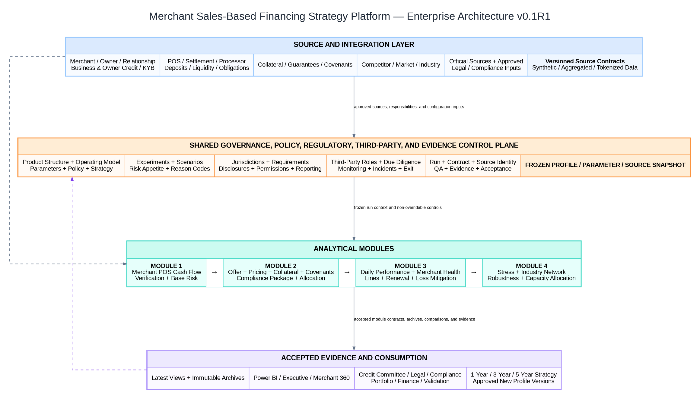

# Enterprise Architecture Overview
## Merchant Sales-Based Financing Strategy Simulator v0.1R1

# 1. Executive architecture statement

The platform is a governed synthetic strategy environment for short-duration, processor-linked merchant financing. It connects merchant cash-flow evidence to offer construction, pricing, collateral, covenants, daily account management, loss mitigation, stress testing, and multi-year portfolio strategy.

The target state contains four analytical modules supported by a shared control plane and consumed through an evidence/reporting layer.



# 2. Architecture objectives

The architecture must:

1. preserve deterministic merchant and account populations;
2. separate legal/economic product structure from credit mechanics;
3. separate credit decision from compliance disposition;
4. preserve daily POS, settlement, remittance, and performance grains;
5. support 30/60/90-day expected payoff horizons without relying on traditional monthly DPD;
6. make price, amount, remittance, collateral, covenants, acceptance, loss, and contribution jointly analyzable;
7. support dynamic lines, renewals, workouts, and wallet-share opportunities;
8. propagate direct and second-order industry stress through merchant cash flow and portfolio outcomes;
9. maintain latest-run convenience and immutable historical evidence separately;
10. allow every material output to be reproduced from frozen profile, parameter, source, and code versions.

# 3. Architectural layers

## 3.1 Source and integration layer

Synthetic or future production-aligned source domains include:

- merchant and owner/guarantor master data;
- processor and settlement data;
- deposit and liquidity data;
- business and owner credit evidence;
- verification, fraud, sanctions, and KYB evidence;
- collateral and guarantee data;
- covenant definitions and monitoring data;
- competitor and market assumptions;
- macroeconomic and industry scenarios;
- official-source and approved regulatory profiles.

The public simulator uses synthetic aggregates and tokenized identifiers. It excludes real cardholder data.

## 3.2 Shared governance and evidence control plane

The control plane stores approved, effective-dated configuration and execution identity. It is not a fifth analytical module. It supplies:

- product legal-structure and operating-model profiles;
- parameters and calculation profiles;
- credit policy and strategy profiles;
- experiment and scenario definitions;
- risk-appetite limits;
- regulatory and jurisdiction profiles;
- source/data-contract definitions;
- reason codes;
- run/comparison identity;
- parameter and policy snapshots;
- evidence and acceptance records.

## 3.3 Module 1 — Merchant POS Cash-Flow, Verification, and Base Risk

Produces an as-of merchant application-risk snapshot from deterministic merchant, POS, deposit, verification, credit, collateral-availability, and obligation evidence.

**Stops before:** final offer construction, pricing optimization, compliance disposition, booking, or account performance.

## 3.4 Module 2 — Origination, Offer, Pricing, Collateral, Covenant, and Allocation

Generates and evaluates candidate offers, applies approved credit and compliance profiles, calculates acceptance and contribution, selects a final treatment, and allocates within funding and concentration limits.

**Stops before:** observed remittance performance, account health, workout execution, or macro stress propagation.

## 3.5 Module 3 — Daily Performance, Merchant Health, Line Management, and Loss Mitigation

Monitors booked advances and facilities daily, distinguishes lower sales from missing remittance or data failure, tests covenants, updates collateral and health, and recommends line, renewal, workout, or exit actions.

**Stops before:** enterprise scenario construction and cross-portfolio capital allocation.

## 3.6 Module 4 — Portfolio Strategy, Stress, Industry Dependency, and Capacity Allocation

Applies economic and industry-network scenarios, calculates stressed risk/loss/contribution, evaluates concentration and risk appetite, compares strategy robustness, and recommends segment-level capacity deployment.

**Stops before:** operational execution of credit, servicing, or compliance actions.

## 3.7 Evidence and reporting layer

The reporting layer consumes accepted archive/evidence outputs rather than transient stage tables. It supports:

- executive portfolio strategy;
- origination and pricing frontier;
- merchant cash-flow and offer explorer;
- daily performance and health;
- line and loss-mitigation actions;
- stress, dependencies, and concentration;
- one-/three-/five-year roadmap and scale gates.

# 4. Primary end-to-end flows

## 4.1 Origination flow

```text
Approved Profiles and Parameters
→ Source Snapshot
→ Module 1 Application-Risk Snapshot
→ Module 2 Candidate Offers
→ Credit Decision
→ Regulatory Applicability
→ Compliance Disposition and Package
→ Portfolio Allocation
→ Final Offer / Review / Decline
→ Booking Contract
```

## 4.2 Daily lifecycle flow

```text
Booked Facility and Advance
+ Daily POS / Settlement / Remittance
+ Covenant and Collateral Evidence
→ Module 3 Account-Day Performance
→ Merchant Health
→ Line / Renewal / Loss-Mitigation Candidate
→ Governed Action Recommendation
→ Executed-Action Evidence or No-Action Record
```

## 4.3 Stress and portfolio flow

```text
Accepted M1/M2/M3 Archive
+ Economic Scenario
+ Industry Dependency Network
+ Funding / Competitor Assumptions
→ Module 4 Merchant-Level Stress
→ Segment and Portfolio Aggregation
→ Risk-Appetite Status
→ Strategy Robustness
→ Capacity-Allocation Recommendation
```

## 4.4 Learning feedback loop

```text
Observed Synthetic Performance Evidence
→ Strategy / Experiment Evaluation
→ Policy Recommendation
→ Governance Review
→ New Approved Profile Version
→ Future Run
```

No output silently overwrites an approved policy. Recommendations become active only through a new version and approval record.

# 5. Latest, archive, and evidence separation

| Layer | Purpose | Update behavior |
|---|---|---|
| Stage tables | Intermediate calculation and diagnostics | Replaceable within run |
| Latest output | Convenient current accepted result | Replaceable by new selected run |
| Archive | Persistent row-level history | Append-only by governed business key/version |
| Evidence summary | Portfolio/segment metrics and validations | Append-only per accepted run |
| Acceptance record | Formal gate result and residual limitations | Immutable except superseding review |

Timestamps are audit attributes; deterministic business keys and version IDs are comparison keys.

# 6. Regulation-aware architecture

The platform does not encode a legal answer. It applies only approved, effective-dated configurations. Module 2 produces both:

```text
Credit outcome
and
Compliance disposition / offer compliance package
```

A compliance block cannot be overridden by the credit strategy. Stale or unresolved profiles fail closed.

# 7. Security and data boundary

The public design uses:

- synthetic merchant and owner records;
- daily aggregate POS and settlement measures;
- tokenized processor/account identifiers;
- synthetic verification and financial-crime statuses;
- no PAN, CVV, PIN, or sensitive authentication data;
- role-based access concepts for restricted reporting data;
- separate storage design for any demographic information collected under an approved reporting profile.

# 8. Target-state versus first implementation

## P0 first vertical slice

- 500–1,000 merchants;
- 180 days of daily POS history;
- 30/60/90-day expected payoff profiles;
- one generic demonstration jurisdiction profile;
- one baseline and one stress scenario;
- one baseline and one challenger strategy;
- candidate amount/remittance/price grid;
- one collateral and two covenant options;
- booked advance and 90 days of daily performance;
- basic line/workout recommendation;
- portfolio and segment evidence.

## Target-state design retained but deferred

- multiple simultaneous advances;
- empirical elasticity, default, cure, and recovery models;
- production API integration;
- full multi-jurisdiction rules service;
- capital and accounting calculations;
- machine-learning challengers;
- production BI and workflow execution.

# 9. Architecture acceptance criteria

The architecture is accepted when:

- each calculation and table has one module owner;
- no module uses data beyond its as-of date;
- module contracts specify grain, keys, mandatory fields, version, and reject rules;
- credit and compliance dispositions remain separate;
- legal/regulatory profiles are effective-dated and approved;
- latest/archive/evidence layers are distinct;
- matched comparison preserves stable merchants/accounts;
- downstream outputs reconcile to upstream contracts;
- all P0 requirements map to a module, table, contract, and validation test;
- the design can be implemented in PostgreSQL without changing the conceptual boundaries.

## M1.16 ROADMAP AMENDMENT — Acquisition Evidence and Economics

M1.16 adds a governed application-level acquisition contract between accepted M1.15 and final M1.17/G2 assurance. It preserves M1.15 and joins the two contracts read-only for downstream consumption.
