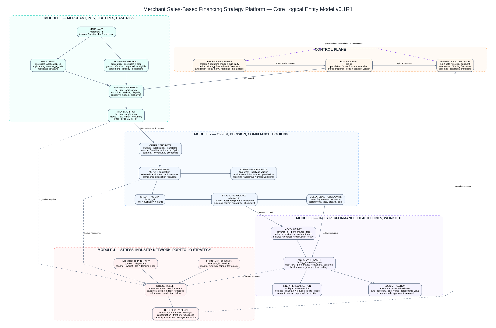

# Logical Data Model
## Merchant Sales-Based Financing Strategy Simulator v0.1R1

# 1. Modeling principles

- merchant, application, facility, and advance are separate entities;
- daily POS/deposit history is separated from as-of feature snapshots;
- candidate offers are separated from final decisions and booked advances;
- collateral availability, required collateral, and perfected/controlled collateral are separate states;
- covenant definitions are separated from account assignment and test results;
- credit outcome is separated from compliance disposition;
- account-day performance is separated from merchant/facility health;
- scenarios and strategy versions are identities, not descriptive text only;
- latest tables are convenience views; archive tables are the comparison source;
- every effective-dated profile preserves history rather than being updated in place.

# 2. Domain model

## 2.1 Merchant and relationship domain

| Entity | Purpose | Priority |
|---|---|---:|
| `merchant_master` | Stable synthetic merchant identity and intrinsic characteristics | P0 |
| `merchant_owner_guarantor` | Owner/guarantor relationship and synthetic risk evidence | P0 |
| `merchant_industry_assignment` | Primary/secondary industry and effective dates | P0 |
| `merchant_relationship_snapshot` | New/returning stage, prior funding, wallet and relationship evidence | P0 |
| `partner_channel` | Partner, processor, broker, and acquisition channel reference | P0 |
| `processor_account` | Merchant-processor account and continuity metadata | P0 |

## 2.2 Application, facility, and advance domain

| Entity | Purpose | Priority |
|---|---|---:|
| `merchant_application` | Financing request and origination as-of date | P0 |
| `credit_facility` | Relationship-level approved limit and status | P0 |
| `facility_limit_snapshot` | Effective-dated limit, utilization, and availability | P0 |
| `financing_advance` | Specific booked transaction under facility | P0 |
| `advance_balance_schedule` | Expected balance/EAD path | P0 |
| `advance_event` | Funding, payoff, restructure, default, charge-off, renewal events | P1 |

## 2.3 POS, settlement, deposit, and source domain

| Entity | Purpose | Priority |
|---|---|---:|
| `merchant_pos_daily_base` | Immutable deterministic baseline daily POS history | P0 |
| `merchant_pos_daily_scenario` | Scenario-adjusted daily history | P0 |
| `merchant_deposit_daily_base` | Baseline deposit/liquidity history | P0 |
| `merchant_deposit_daily_scenario` | Scenario-adjusted deposit history | P1 |
| `source_snapshot` | Availability, freshness, completeness, reconciliation, and confidence | P0 |
| `source_lineage` | Field/feature-to-source lineage | P0 |
| `verification_result` | KYB/identity/beneficial-owner/sanctions/fraud status | P0 |

## 2.4 Feature and base-risk domain

| Entity | Purpose | Priority |
|---|---|---:|
| `merchant_feature_snapshot` | As-of cash-flow, liquidity, stability, and obligation features | P0 |
| `merchant_risk_snapshot` | Credit/fraud/data/operational risk and requested-structure EL | P0 |
| `risk_component_detail` | Transparent component contributions | P0 |
| `ead_path_snapshot` | Expected declining exposure by day/week | P0 |

## 2.5 Offer, decision, mitigation, and compliance domain

| Entity | Purpose | Priority |
|---|---|---:|
| `application_segment_snapshot` | Strategy segmentation at decision time | P0 |
| `offer_candidate` | Candidate amount/remittance/horizon/price structure | P0 |
| `candidate_collateral_requirement` | Required collateral/guarantee for candidate | P0 |
| `candidate_covenant_requirement` | Required covenant package for candidate | P0 |
| `candidate_risk_economics` | Candidate risk, EAD, LGD, EL, costs, contribution | P0 |
| `elasticity_result` | Acceptance, competitor, adverse-selection, relationship effects | P0 |
| `offer_decision` | Final credit outcome and selected candidate | P0 |
| `offer_reason_code` | Deterministic reason-code evidence | P0 |
| `regulatory_applicability_snapshot` | Frozen approved requirement applicability | P0 |
| `offer_compliance_package` | Required/satisfied disclosure, document, permission, reporting, and data controls | P0 |
| `portfolio_allocation_result` | Funding/concentration allocation decision | P0 |

## 2.6 Collateral, guarantee, and covenant domain

| Entity | Purpose | Priority |
|---|---|---:|
| `collateral_asset` | Asset or collateral pool identity | P0 |
| `collateral_valuation_snapshot` | Value, haircut, control, lien, cost, timing, and stressed value | P0 |
| `guarantee` | Guarantor and guarantee terms/status | P0 |
| `advance_collateral_link` | Collateral assigned to a booked advance/facility | P0 |
| `covenant_definition` | Governed covenant catalog/version | P0 |
| `advance_covenant` | Covenant assigned to facility/advance | P0 |
| `covenant_test_result` | Test result by date, warning, breach, cure, waiver | P0 |
| `collateral_monitoring_snapshot` | Post-booking collateral status/value | P1 |

## 2.7 Daily performance and lifecycle domain

| Entity | Purpose | Priority |
|---|---|---:|
| `daily_remittance_performance` | Expected/actual remittance and balance roll-forward | P0 |
| `minimum_progress_checkpoint_result` | Contractual progress check | P0 |
| `processor_continuity_event` | Outage, switch, diversion, or data issue | P0 |
| `performance_state_transition` | State history and transition evidence | P0 |
| `merchant_health_snapshot` | Component and final health state | P0 |
| `early_warning_event` | Trigger, severity, owner, status | P0 |
| `line_management_candidate` | Potential line action and economics | P0 |
| `line_management_action` | Recommended/approved/executed action | P0 |
| `renewal_candidate` | Renewal and wallet opportunity | P1 |
| `loss_mitigation_candidate` | Workout option and expected value | P0 |
| `workout_action` | Approved/executed treatment and outcome | P1 |

## 2.8 Stress and portfolio domain

| Entity | Purpose | Priority |
|---|---|---:|
| `economic_scenario` | Scenario identity, version, owner, boundary | P0 |
| `scenario_factor_shock` | Macro/funding/competitor shock values | P0 |
| `industry_dependency` | Directed dependency, channel, weight, lag, damping, cap | P0 |
| `scenario_industry_shock` | Direct and propagated industry shock | P0 |
| `stress_merchant_result` | Merchant-level stressed cash flow/risk/loss/contribution | P0 |
| `stress_advance_result` | Advance-level stressed performance/EAD/LGD | P1 |
| `portfolio_segment_snapshot` | Portfolio aggregation by governed segment | P0 |
| `portfolio_limit_status` | Limit/early warning/breach/action/owner | P0 |
| `strategy_frontier_result` | Strategy outcome point | P0 |
| `strategy_robustness_result` | Cross-scenario resilience | P0 |
| `capacity_allocation_result` | Incremental capacity ranking/action | P1 |
| `multi_year_strategy_evidence` | One-/three-/five-year KPI and scale-gate evidence | P1 |

## 2.9 Control, regulatory, and evidence domain

| Entity | Purpose | Priority |
|---|---|---:|
| `product_legal_structure_profile` | Legal-neutral structure and review status | P0 |
| `operating_model_profile` | Entity-role responsibilities | P0 |
| `third_party_relationship_profile` | Provider/service responsibilities, due diligence, monitoring, incidents, continuity, remediation, and exit | P0 |
| `parameter_set` / `parameter_value` | Central assumptions | P0 |
| `policy_profile` | Approved credit/lifecycle policy version | P0 |
| `strategy_profile` | Strategy objective and levers | P0 |
| `experiment_registry` / `experiment_cell` / `experiment_assignment` | Controlled testing | P0 |
| `scenario_registry` | Governed scenario family/version | P0 |
| `risk_appetite_limit` | Limit, warning, action, owner | P0 |
| `jurisdiction_profile` | Approved jurisdiction/product/entity scope | P0 |
| `regulatory_requirement` | Effective-dated sourced obligation | P0 |
| `regulatory_applicability_rule` | Approved rule conditions | P0 |
| `disclosure_template` / `calculation_profile` | Compliance package methods | P0 |
| `license_registration_requirement` | Required permission and status | P0 |
| `reporting_requirement` | Reporting/data/retention profile | P0 |
| `data_segregation_requirement` | Firewall/access/storage controls | P0 |
| `financial_crime_role_profile` | KYB/AML responsibility matrix | P0 |
| `payment_data_scope_profile` | Data-security scope | P0 |
| `unsupported_feature_catalog` | Excluded features | P0 |
| `run_registry` | Technical execution identity | P0 |
| `comparison_registry` | Baseline/challenger/scenario pairing | P0 |
| `reason_code_catalog` | Explanation/action codes | P0 |
| `run_evidence` / `segment_evidence` | Accepted metrics and findings | P0 |
| `acceptance_gate_result` | Gate decision and residual limitations | P0 |

# 3. Core relationships

1. One merchant can have many applications, facilities, advances, owners, processor accounts, and daily observations.
2. An application can produce many candidates but exactly one final decision per strategy run.
3. A facility can have many advances over time; V1 permits at most one active advance.
4. A booked advance inherits one accepted compliance package, collateral package, and covenant package.
5. An advance has one daily performance row per calendar/processing date.
6. A facility has one merchant-health/action row per review date.
7. Stress results reference immutable portfolio/account snapshots and do not alter source history.
8. All module outputs reference run/profile/source/contract versions.

# 4. Temporal design

The model uses:

- effective dates for profiles, limits, relationships, collateral values, and covenants;
- application `as_of_date` for origination features;
- booking/funding dates for account inception;
- performance date for daily lifecycle;
- review date for health and line actions;
- scenario reference date and horizon;
- regulatory selection date and effective period.

# 5. Physical implementation guidance

- control-plane tables use effective-dated immutable versions;
- high-volume daily fact tables are partition candidates by date/scenario;
- feature/risk/decision/performance/stress archives use composite unique keys;
- latest tables may be materialized views or replaceable tables derived from accepted archives;
- JSON may hold low-volume diagnostics, but core decision fields remain typed columns;
- arrays should not replace normalized reason, covenant, collateral, or requirement child tables;
- synthetic identifiers are UUIDs or deterministic text/hash keys; business sequence IDs may be added for readability.

# 6. V1 scope discipline

P0 implementation should not create every P1 entity immediately. The first build can use approximately 30 core physical tables while preserving the full logical target state. The grain catalog identifies the minimum sequence.

## M1.16 LOGICAL MODEL ADDENDUM

Adds Source Profile → Acquisition Campaign → Funnel / Cost Ledger → Application Touchpoint → Attribution → Cost Snapshot / Components → Latest / Archive Contract. M1.15 remains scenario-aware; M1.16 remains application-level and scenario-invariant.
