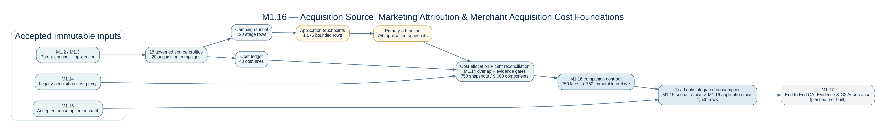

# M1.16 — Acquisition Source, Marketing Attribution & Merchant Acquisition Cost Foundations

> **Accepted package:** `v0.2R3`  
> **Accepted generation:** `v0.2R1`  
> **Methodology:** `M1_16_METHOD_V1`  
> **Contract:** `M1_ACQUISITION_CONSUMPTION v1`  
> **Schema:** `M1_ACQUISITION_SCHEMA_V1`  
> **Final status:** `M1_16_ACCEPTED`  
> **Combined canonical hash:** `86df51a0ca68d84096d00ff0f1b19f33`

## Strategic Intent

**How did each merchant application arrive, what did that acquisition path cost, how reliable is the attribution, and how should those economics connect to the accepted Module 1 risk and unit-economics foundation without double counting?**

M1.16 answers that question through a governed, deterministic acquisition-evidence layer. It extends the accepted Module 1 platform beyond a broad parent-channel label and a single acquisition-cost proxy into an explainable chain of source profiles, marketing campaigns, funnel evidence, application touchpoints, primary attribution, incurred and conditional costs, overlap controls, and an immutable downstream companion contract.

This is not a marketing dashboard and it is not a credit-decision stage. It is the acquisition and merchant-CAC evidence foundation required before Module 2 can evaluate channel-aware offer economics and later portfolio learning.

---

## Architecture

[](./v0.2R3_ACCEPTED/docs/architecture/M1_16_ARCHITECTURE.png)

[Open the M1.16 architecture full size](./v0.2R3_ACCEPTED/docs/architecture/M1_16_ARCHITECTURE.png) · [Open the scalable SVG](./v0.2R3_ACCEPTED/docs/architecture/M1_16_ARCHITECTURE.svg)

```text
Accepted M1.2 / M1.3 parent-channel and application lineage
+ accepted M1.14 legacy acquisition-cost proxy
+ accepted M1.15 scenario-aware consumption contract
        ↓
18 governed source profiles and 20 acquisition campaigns
        ↓
Six-stage campaign funnel and 40-line cost ledger
        ↓
1,075 bounded application touchpoints
        ↓
750 governed primary-attribution snapshots
        ↓
Cost allocation, residual-cent reconciliation,
M1.14 overlap bridge, and evidence gates
        ↓
750 acquisition-cost snapshots and 9,000 components
        ↓
750-row latest companion contract
+ 750-row immutable archive
        ↓
Read-only M1.15 × M1.16 integrated consumption
1,500 scenario-aware rows
```

---

## Why This Stage Matters

The accepted platform already knew each merchant's broad parent channel and included an M1.14 acquisition-cost proxy. That was a valid foundation, but it could not answer several enterprise questions:

- Was the application sourced through a processor, bank relationship, paid digital campaign, strategic partner, broker, or purchased lead?
- Which campaign and interaction path produced the application?
- Which costs were already incurred before approval, and which become payable only if the merchant funds?
- How should campaign spend be allocated to submitted applications?
- How much of the new detailed acquisition cost overlaps the accepted M1.14 proxy?
- When is an enhanced acquisition-cost total supported, partial, or blocked?
- How can application-level acquisition evidence join to both accepted risk scenarios without scenario drift?

M1.16 makes those questions traceable without modifying accepted M1.14 or M1.15 records.

---

## Accepted Inputs

| Accepted source | M1.16 use | Preservation rule |
|---|---|---|
| **M1.2 / M1.3** | Parent acquisition channel, merchant, application, and relationship lineage | Parent identities remain authoritative |
| **M1.14** | Scenario-invariant legacy acquisition-cost rate and amount | No unit-economics row, component, contribution, return, tier, or hash is rewritten |
| **M1.15** | Accepted scenario-aware Module 1 consumption contract | Latest, archive, comparison, registry, and hashes remain immutable |

The accepted predecessor hashes remained unchanged:

```text
M1.14 combined set  3a47f59b56fa158c18c111caa1c64909
M1.15 combined set  fcd2704e17ec0d2e73191ea36061d74b
```

---

## Accepted Outputs and Grain

| Output family | Accepted rows | Grain |
|---|---:|---|
| Acquisition-source profiles | 18 | One governed normalized source profile |
| Acquisition campaigns | 20 | One governed synthetic campaign |
| Funnel evidence | 120 | Campaign × six normalized funnel stages |
| Acquisition cost ledger | 40 | Campaign × incurred/allocated or conditional cost line |
| Application touchpoints | 1,075 | Application × bounded touch sequence |
| Attribution snapshots | 750 | One governed acquisition attribution per application |
| Acquisition-cost snapshots | 750 | One evidence-gated acquisition-cost record per application |
| Long-form cost components | 9,000 | Application × 12 transparent cost components |
| Latest companion contract | 750 | One current acquisition contract per application |
| Immutable archive | 750 | Run/versioned acquisition contract per application |
| Integrated M1.15 × M1.16 view | 1,500 | Application × accepted scenario |
| Canonical entities | 13,274 | All persisted source, campaign, funnel, cost, attribution, contract, and archive entities |

---

## Governed Acquisition Funnel

```text
TARGETED_OR_ELIGIBLE          4,704
DELIVERED_OR_PRESENTED        4,164
ENGAGED_OR_RESPONDED          1,978
QUALIFIED_LEAD                1,160
APPLICATION_STARTED             870
APPLICATION_SUBMITTED           750
```

The funnel is monotonically nonincreasing and ends at the exact accepted application population. Non-applicants are represented through campaign-level counts rather than fabricated person-level records.

Campaign incurred spend reconciles exactly:

```text
Campaign incurred ledger amount       $53,199.50
Application allocated incurred cost   $53,199.50
Allocation difference                       $0.00
```

---

## Attribution Evidence

| Evidence view | COMPLETE | PARTIAL | BLOCKED |
|---|---:|---:|---:|
| Acquisition contract | 9 | 714 | 27 |
| Attribution evidence | 55 | 680 | 15 |

Parent-channel reconciliation produced:

```text
MATCH                 735
BLOCKED_CONFLICT       15
Physical mismatches     0
```

The 15 `BLOCKED_CONFLICT` records retain the accepted parent-channel identity while preserving a material attribution-evidence conflict. They were not reclassified as favorable matches merely to obtain a pass.

Attribution is descriptive and allocative—not causal. Every application has one to three bounded touchpoints, exactly one primary touch with weight `1.0`, and zero-weight assisted touches retained for context.

---

## Merchant Acquisition Cost Foundation

M1.16 separates costs that have already been incurred from costs that become payable only if the merchant funds.

```text
Direct attributable incurred cost                    $6,574.50
Internally allocated acquisition cost               $46,625.00
Detailed incurred acquisition cost                  $53,199.50
Detailed conditional partner / broker cost         $213,530.80
Detailed total acquisition cost if booked          $266,730.30
```

The accepted M1.14 legacy acquisition cost remains visible and immutable:

```text
Accepted M1.14 legacy acquisition cost              $315,834.35
Identified supported M1.14 overlap                  $224,293.73
Incremental M1.16 cost beyond M1.14                 $31,587.73
Supported enhanced total acquisition cost          $335,108.33
```

For the 723 `COMPLETE` or `PARTIAL` records with supportable overlap and fully loaded totals:

```text
Supported-population M1.14 legacy cost              $303,520.60
+ Incremental M1.16 cost beyond M1.14               $31,587.73
= Supported enhanced acquisition cost              $335,108.33
```

The 27 blocked records retain known components and the accepted M1.14 legacy amount, but do not receive an unsupported enhanced total.

---

## Scenario-Invariant Acquisition Contract

M1.16 publishes one application-level acquisition contract and joins it read-only to both accepted M1.15 scenario rows:

```text
BASELINE integrated rows                 750
RECESSION_ENERGY integrated rows         750
Total integrated rows                  1,500
Scenario-specific acquisition drift        0
```

Average accepted acquisition measures across the application population:

```text
Average incurred acquisition cost         $70.932667
Average supported enhanced cost           $463.496999
```

Acquisition source and application-stage cost remain invariant across the matched scenarios. M1.15 risk, resilience, loss, and unit-economics fields retain their accepted scenario-specific behavior.

---

## Governance and Deterministic Evidence

```text
112 / 112 positive controls        PASS
 20 /  20 negative controls        PASS
24 detailed-report result sets     COMPLETE
Deterministic mismatches           0
Archive mismatches                 0
Blocking / stage-boundary errors   0
Master report                      PASS
Acceptance gate                    PASS
```

The independently reconciled combined hash is:

```text
86df51a0ca68d84096d00ff0f1b19f33
```

### Component set hashes

| Canonical set | Hash |
|---|---|
| Source profiles | `f29cd5ffd27c2039da5c8ee61440456d` |
| Campaigns | `f1c0c9e2c8ee9c1a4700d74018a03a8a` |
| Funnel | `1ebb3e75a96fbf463e7c970e814c77bf` |
| Cost ledger | `97081e655a81381c13c0ae153c80e53c` |
| Touchpoints | `e75a2f28cfd181fba43450e1405a3444` |
| Attribution | `ff62a26ebe5ad9bd554e696502d47d21` |
| Acquisition-cost snapshots | `9add563f4af9f77d7896142131b91c58` |
| Cost components | `2fb3311e3e649e25e59cc12a8d3375c1` |
| Latest acquisition contract | `a94699d1e65f3787bc184ce7119f5c25` |
| Immutable archive | `6c0469623d892af2d574e8584568bb03` |
| Contract registry | `5a4b419da2c707504d030bd2aeb0db32` |

---

## Controlled Correction History

### v0.2 — Campaign projection defect

Program 118 omitted `campaign_evidence_status` from an intermediate campaign projection. PostgreSQL stopped the transaction before M1.16 business data committed.

### v0.2R1 — Committed generation and parent-reconciliation control

The corrected generator committed all 13,274 canonical entities with zero mismatches. POS087 then incorrectly treated 15 governed `BLOCKED_CONFLICT` attribution records as physical parent-channel mismatches.

### v0.2R2 — Parent identity separated from evidence status

POS087 was corrected to distinguish physical parent identity from attribution-evidence conflict. The retained audit-history row then exposed a separate POS050 specification issue: a broad evidence count returned 26 rows rather than the exact 25 governed generation records.

### v0.2R3 — Exact evidence inventory and acceptance

POS050 was aligned to the explicit 25-code generation-evidence inventory. Both superseded findings remained preserved as audit history. Final validation returned 112 of 112 passes, followed by 20 of 20 negative-control passes and formal acceptance.

No accepted M1.14 or M1.15 record changed. No M1.16 business row or hash changed after the successful v0.2R1 generation.

---

## Interpretation Boundaries

M1.16 does **not** create or claim:

- pricing, factor, APR, remittance, or approved amount;
- approval, counteroffer, manual-review decision, or decline;
- funding outcomes or funding probability;
- realized funded CAC, CAC payback, or lifetime value;
- marketing-budget optimization or causal production attribution;
- a creditworthiness proxy based on acquisition source;
- accounting, legal, regulatory, fair-lending, or production-model approval;
- PII, cookies, device identifiers, email addresses, telephone numbers, or external tracking identifiers.

All records are synthetic and intended for governed portfolio demonstration.

---

## Anchor Artifacts

| Artifact | Public location |
|---|---|
| Business and stage-boundary charter | [`M1_16_BUSINESS_AND_STAGE_BOUNDARY_CHARTER.md`](./v0.2R3_ACCEPTED/docs/M1_16_BUSINESS_AND_STAGE_BOUNDARY_CHARTER.md) |
| Architecture and lineage | [`M1_16_ARCHITECTURE.md`](./v0.2R3_ACCEPTED/docs/M1_16_ARCHITECTURE.md) |
| Acquisition-source taxonomy | [`M1_16_ACQUISITION_SOURCE_TAXONOMY.md`](./v0.2R3_ACCEPTED/docs/M1_16_ACQUISITION_SOURCE_TAXONOMY.md) |
| Attribution methodology | [`M1_16_ATTRIBUTION_METHODOLOGY.md`](./v0.2R3_ACCEPTED/docs/M1_16_ATTRIBUTION_METHODOLOGY.md) |
| Cost basis and timing | [`M1_16_COST_BASIS_AND_TIMING_METHODOLOGY.md`](./v0.2R3_ACCEPTED/docs/M1_16_COST_BASIS_AND_TIMING_METHODOLOGY.md) |
| M1.14 overlap and double-counting control | [`M1_16_M1_14_OVERLAP_AND_DOUBLE_COUNTING_METHODOLOGY.md`](./v0.2R3_ACCEPTED/docs/M1_16_M1_14_OVERLAP_AND_DOUBLE_COUNTING_METHODOLOGY.md) |
| Final accepted clean-build SQL | [`src/`](./v0.2R3_ACCEPTED/src/) |
| Validation and recovery queries | [`tests/review_queries/`](./v0.2R3_ACCEPTED/tests/review_queries/) |
| Positive and negative control evidence | [`tests/evidence/`](./v0.2R3_ACCEPTED/tests/evidence/) |
| Formal execution review and sign-off | [`M1_16_LIVE_EXECUTION_EVIDENCE_REVIEW_AND_SIGNOFF.md`](./v0.2R3_ACCEPTED/tests/M1_16_LIVE_EXECUTION_EVIDENCE_REVIEW_AND_SIGNOFF.md) |
| Aggregate acquisition outputs | [`outputs/aggregate_evidence/`](./v0.2R3_ACCEPTED/outputs/aggregate_evidence/) |
| Cross-stage Public Review Cohort | [`PUBLIC_REVIEW_COHORT_REGISTRY.csv`](../../docs/project_lineage/public_review_cohort/PUBLIC_REVIEW_COHORT_REGISTRY.csv) |

---

## Downstream Certification

M1.17 independently certified the complete Module 1 hash chain, both accepted contract families, latest/archive reproduction, the integrated 1,500-row consumption boundary, scenario invariance, overlap identities, immutability, stage boundaries, and final release candidate.

> **`G2_M1_CONTRACT = PASS`**

Module 2 - Strategy and Offer Decisioning is authorized to consume `M1_G2_CONSUMPTION_BUNDLE v1`.

---

[Return to the repository README](../../README.md) | [Open the M1.17 G2 assurance package](../1.17_End_to_End_QA_and_G2_Acceptance/README.md)
