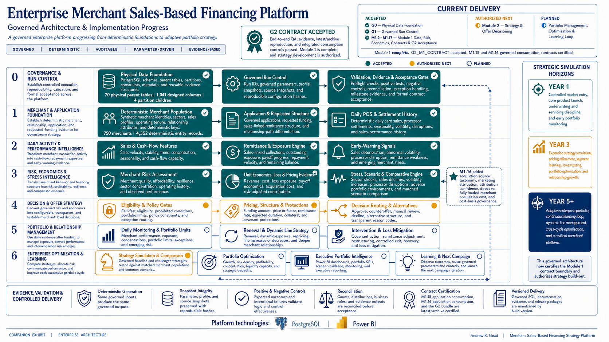
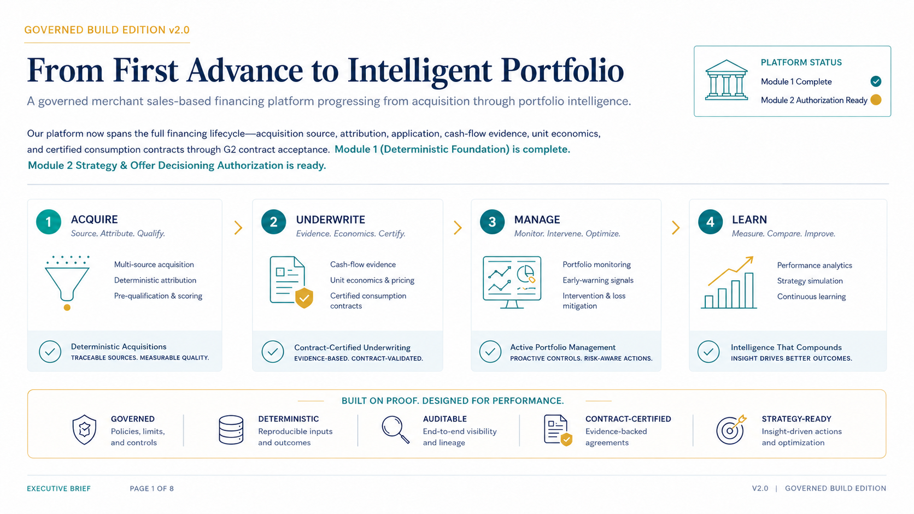

# Merchant Sales-Based Financing Strategy Simulator

## A Governed Enterprise Platform for Merchant Acquisition, Operating Intelligence, Risk, Economics, and Portfolio Learning

[](./docs/enterprise_architecture/Enterprise_Merchant_Sales_Based_Financing_Platform.png)

[Open the enterprise architecture full size](./docs/enterprise_architecture/Enterprise_Merchant_Sales_Based_Financing_Platform.png) | [Open the PDF](./docs/enterprise_architecture/Enterprise_Merchant_Sales_Based_Financing_Platform.pdf)

> **Current release:** Module 1 complete · `G2_M1_CONTRACT = PASS` · Module 2 — Strategy and Offer Decisioning authorized

How do you design, test, evidence, and certify a merchant sales-based financing platform **before** allowing strategy logic to make an offer?

I built this project as a deterministic, synthetic, PostgreSQL 15–based enterprise simulator for merchant financing tied to daily point-of-sale activity and sales-linked repayment. The platform begins before application—with acquisition source, campaigns, touchpoints, attribution, and merchant acquisition cost—and progresses through operating evidence, capacity, resilience, integrated risk, exposure, comparative loss, unit economics, certified consumption contracts, and end-to-end assurance.

This is not a dashboard-only project and it is not a single opaque score. It is a governed evidence chain with explicit analytical boundaries, target-typed hashes, positive and negative controls, immutable archives, fail-closed recovery, independently reconstructed identities, and formal acceptance.

Module 1 intentionally stops at a **certified consumption boundary**. It does not create final pricing, approval, counteroffer, manual-review, decline, or portfolio-allocation decisions. Those capabilities belong to the authorized Module 2 strategy layer.

---

## What This Release Demonstrates

| Dimension | Demonstrated capability |
|---|---|
| **Business architecture** | A merchant-financing lifecycle spanning acquisition, application, daily operating evidence, risk, economics, contracts, and portfolio learning. |
| **Analytics** | Scenario-aware cash flow, capacity, resilience, integrated risk, exposure, recovery, comparative loss, unit economics, attribution, and CAC evidence. |
| **Data engineering** | Deterministic PostgreSQL generation, persisted stage outputs, explicit grains, indexes, immutable archives, versioned contracts, and reproducible hashes. |
| **Governance** | Accepted-only stage progression, fail-closed controls, negative testing, independent reconciliation, correction history, and G2 contract certification. |
| **Executive communication** | Enterprise architecture, strategic brief, reviewer paths, release evidence, and decision-ready summaries for technical and nontechnical audiences. |

## Choose a Review Path

| Reviewer | Recommended path |
|---|---|
| **Executive / hiring leader** | Review the architecture above, scan the [Executive Release Snapshot](#executive-release-snapshot), and open [From First Advance to Intelligent Portfolio](./docs/executive_strategy/From_First_Advance_to_Intelligent_Portfolio.pdf). |
| **Technical / architecture** | Open the [detailed Module 1 lineage map](./docs/enterprise_architecture/Module_1_Governed_Evidence_Contract_and_Acceptance_Lineage.png), follow the stage READMEs, and inspect accepted SQL under each versioned `src/` directory. |
| **Governance / validation** | Start with [`GOVERNANCE_AND_VALIDATION.md`](./GOVERNANCE_AND_VALIDATION.md), review the [accepted hash chain](./docs/project_lineage/MODULE_1_ACCEPTED_HASH_CHAIN.md), and inspect the [M1.17 G2 assurance package](./Module_1/1.17_End_to_End_QA_and_G2_Acceptance/README.md). |
| **Repository navigator** | Use [`PROJECT_ARTIFACT_MAP.md`](./PROJECT_ARTIFACT_MAP.md) for a curated file map, current-versus-historical guidance, and reviewer-specific paths. |

## Executive Release Snapshot

| Release fact | Accepted result |
|---|---:|
| Governed run | `M1_V0_2_BASELINE_BUILD`, version 1 |
| Accepted progression | G0, G1, and M1.2–M1.17 |
| Applications | 750 |
| Matched scenarios | 2: `BASELINE` and `RECESSION_ENERGY` |
| Integrated G2 consumption rows | 1,500 |
| Ordered accepted hash-chain identities | 18 / 18 PASS |
| M1.17 positive controls | 128 / 128 PASS |
| M1.17 negative controls | 20 / 20 PASS |
| Deterministic mismatches | 0 |
| Archive reproduction mismatches | 0 |
| Prohibited PII columns | 0 |
| Premature Module 2 rows | 0 |
| Combined G2 canonical set | `7d9e466da28cad2551aa99c4c40c912b` |
| Final gate | **`G2_M1_CONTRACT — PASS`** |

The accepted source packages represent **110 designed parent/control/reference tables and 2,138 designed columns** at the final Module 1 boundary. These are source-derived design counts; the historical G0 baseline remains 70 parent tables and 1,041 designed columns.

## Repository Navigation

- [`RELEASE_NOTES.md`](./RELEASE_NOTES.md) — Module 1 G2 v1.0.0 release summary and boundaries.
- [`PROJECT_ARTIFACT_MAP.md`](./PROJECT_ARTIFACT_MAP.md) — curated file map and reviewer paths.
- [`MODULE_AND_RELEASE_INDEX.md`](./MODULE_AND_RELEASE_INDEX.md) — accepted versions, principal outputs, and hashes.
- [`GOVERNANCE_AND_VALIDATION.md`](./GOVERNANCE_AND_VALIDATION.md) — deterministic evidence, controls, recovery, and G2 assurance.
- [`SAMPLE_DATA_AND_EVIDENCE_POLICY.md`](./SAMPLE_DATA_AND_EVIDENCE_POLICY.md) — synthetic samples and the Controlled 50-Application Public Review Cohort.
- [`REPRODUCIBILITY_AND_EXECUTION.md`](./REPRODUCIBILITY_AND_EXECUTION.md) — PostgreSQL 15, DBeaver, source provenance, and execution standards.
- [`PROJECT_ROADMAP.md`](./PROJECT_ROADMAP.md) — accepted Module 1 boundary and the authorized transition to Module 2.

---

## Full Synthetic Data Snapshot

The normal repository publishes compact, deterministic samples and accepted evidence so reviewers can navigate the project without downloading operational-scale extracts. The first GitHub Release also provides an **optional full synthetic table-data snapshot** for deeper technical review.

| Data asset fact | Accepted release value |
|---|---:|
| Designed tables represented | 110 |
| Schema distribution | 43 `msbf_ctl` · 52 `msbf_m1` · 15 `msbf_ref` |
| Total rows across table exports | 1,042,591 |
| Formats | 110 CSV files + 110 PostgreSQL INSERT files |
| Prohibited-PII header findings | 0 |
| Data asset SHA-256 | `5a1cec08cb0bbd1b28fa0c04800802746159b6b40d105f2db2c0cecfeea5d26d` |

[Read the data snapshot documentation](./docs/data_snapshot/README.md) | [Download the full synthetic table-data snapshot](https://github.com/andrew-goad/merchant-sales-based-financing-strategy-simulator/releases/download/module-1-g2-v1.0.0/MSBF_Module_1_G2_Full_Synthetic_Table_Data_v1.0.0.zip) | [Download its SHA-256 file](https://github.com/andrew-goad/merchant-sales-based-financing-strategy-simulator/releases/download/module-1-g2-v1.0.0/MSBF_Module_1_G2_Full_Synthetic_Table_Data_v1.0.0.zip.sha256)

> The data asset is a complete table-data export—not a one-command PostgreSQL backup. The accepted repository remains the governing source for schemas, constraints, functions, views, triggers, indexes, and execution order.

---

## Platform Architecture

The flagship architecture shows the enterprise capability chain from governance and merchant foundations through daily operating intelligence, risk and economics, acquisition evidence, governed consumption contracts, G2 assurance, and the next authorized strategy layer.

For the complete stage-by-stage technical chain, open the [Module 1 Governed Evidence, Contract & Acceptance Lineage](./docs/enterprise_architecture/Module_1_Governed_Evidence_Contract_and_Acceptance_Lineage.png).

### End-to-End Evidence Chain

```text
Governed Run Control
→ Deterministic Merchant Population
→ Application & Requested Sales-Linked Structure
→ Daily POS & Settlement History
→ Daily Deposit & Liquidity History
→ Matched Baseline / Stress Scenarios
→ Source Quality & Data Confidence
→ Verification, Fraud & Processor Continuity
→ As-of Cash-Flow Features
→ Obligations, Liquidity & Residual Capacity
→ Cash-Flow Archetypes & Operating Resilience
→ Merchant Risk Components & Integrated Risk Proxy
→ Exposure, Recovery & Comparative Loss
→ Unit Economics & Risk-Adjusted Contribution
→ Latest / Archive / Scenario Comparison Contract
→ Acquisition Source, Attribution & Merchant CAC Contract
→ Integrated Module 1 Consumption Interface
→ End-to-End G2 Assurance
→ Module 2 Strategy & Offer Decisioning
```

### Analytical Separation

The platform intentionally separates each analytical concept. **No single measure is treated as a proxy for another.** Each line below states a boundary—not a causal sequence.

```text
Data confidence                  ≠ Verification evidence
Verification evidence            ≠ Fraud risk
Fraud risk                       ≠ Processor continuity
Processor continuity             ≠ Cash-flow behavior
Cash-flow behavior               ≠ Obligations and capacity
Obligations and capacity         ≠ Operating resilience
Operating resilience             ≠ Synthetic integrated risk proxy
Synthetic integrated risk proxy  ≠ Exposure and recovery
Exposure and recovery            ≠ Comparative loss
Comparative loss                 ≠ Unit economics
Unit economics                   ≠ Acquisition economics
Acquisition economics            ≠ Pricing strategy
Pricing strategy                 ≠ Final offer decision
```

For example, complete and internally consistent data do not prove that a merchant is verified, low fraud risk, affordable, resilient, profitable, or eligible for an offer. Each conclusion requires its own evidence, controls, and interpretation boundary.

---

## Accepted Module 1 Progression

| Capability group | Accepted stages | Purpose |
|---|---|---|
| **Governed foundation** | G0, G1, M1.2–M1.6 | Establish controlled execution, deterministic merchants and applications, daily POS/deposit histories, and matched scenario panels. |
| **Evidence, risk, and economics** | M1.7–M1.14 | Build source confidence, verification, cash-flow features, capacity, resilience, integrated risk, exposure, loss, and unit economics. |
| **Certified consumption contracts** | M1.15–M1.16 | Publish immutable application and acquisition contract families with latest, archive, comparison, attribution, and CAC evidence. |
| **End-to-end assurance** | M1.17 / G2 | Reconcile the complete hash chain, certify both contract families, validate the integrated interface, and authorize Module 2. |

<details>
<summary><strong>View all accepted stages, revisions, and principal outputs</strong></summary>

| Stage | Capability | Accepted revision | Status | Principal output |
|---|---|---:|:---:|---|
| [G0](./Module_0/0.01_G0_Physical_Data_Foundation/README.md) | Physical Data Foundation | v0.2 | **ACCEPTED** | G0 baseline: 70 physical parent tables, 1,041 designed columns, plus four partition children. |
| [G1](./Module_0/0.02_G1_Governed_Run_Control/README.md) | Governed Run Control | v0.2 | **ACCEPTED** | Governed run `M1_V0_2_BASELINE_BUILD`, version 1, with three accepted snapshot identities. |
| [M1.2](./Module_1/1.02_Deterministic_Merchant_Population/README.md) | Deterministic Merchant Population | v0.2R2 | **ACCEPTED** | 750 merchants and 4,352 canonical entities. |
| [M1.3](./Module_1/1.03_Application_and_Requested_Structure/README.md) | Application & Requested Sales-Linked Structure | v0.2R1 | **ACCEPTED** | 750 applications and requested financing structures. |
| [M1.4](./Module_1/1.04_Daily_POS_Settlement_and_Ecosystem/README.md) | Daily POS, Settlement & Merchant Ecosystem | v0.2 | **ACCEPTED** | 135,000 baseline daily POS and settlement rows. |
| [M1.5](./Module_1/1.05_Daily_Deposit_and_Liquidity_History/README.md) | Daily Deposit & Liquidity History | v0.2R2 | **ACCEPTED** | 135,000 daily deposit and liquidity rows. |
| [M1.6](./Module_1/1.06_Matched_POS_and_Deposit_Scenarios/README.md) | Matched POS & Deposit Scenario Overlays | v0.2R3 | **ACCEPTED** | 270,000 POS scenario rows + 270,000 deposit scenario rows; 540,000 canonical entities. |
| [M1.7](./Module_1/1.07_Source_Quality_and_Data_Confidence/README.md) | Source Quality & Data Confidence | v0.2 | **ACCEPTED** | 5,250 source-quality records across 750 applications. |
| [M1.8](./Module_1/1.08_Verification_Fraud_and_Continuity/README.md) | Verification, Fraud & Processor Continuity | v0.2R1 | **ACCEPTED** | 4,500 atomic checks + 750 application summaries; 5,250 canonical entities. |
| [M1.9](./Module_1/1.09_As_Of_Cash_Flow_Features/README.md) | As-of Cash-Flow Feature Engineering | v0.2R5 | **ACCEPTED** | 1,500 wide snapshots + 54,000 long-form values across 36 features; 55,500 canonical entities. |
| [M1.10](./Module_1/1.10_Obligations_Liquidity_and_Capacity/README.md) | Obligations, Liquidity & Residual Cash Flow | v0.2R2 | **ACCEPTED** | 906 atomic obligations + 1,500 capacity snapshots; 2,406 canonical entities. |
| [M1.11](./Module_1/1.11_Cash_Flow_Archetypes_and_Resilience/README.md) | Cash-Flow Archetypes & Operating Resilience | v0.2R2 | **ACCEPTED** | 1,500 snapshots + 7,500 component rows; 9,000 canonical entities. |
| [M1.12](./Module_1/1.12_Merchant_Risk_and_Integrated_Proxy/README.md) | Merchant Risk Components & Integrated Risk Proxy | v0.2R1 | **ACCEPTED** | 1,500 risk snapshots + 10,500 component rows; 12,000 canonical entities. |
| [M1.13](./Module_1/1.13_Exposure_Recovery_and_Expected_Loss/README.md) | Exposure, Recovery & Expected Loss Foundations | v0.2R1 | **ACCEPTED** | 93,720 exposure-path rows + 1,500 snapshots; 95,220 canonical entities. |
| [M1.14](./Module_1/1.14_Unit_Economics_and_Contribution/README.md) | Unit Economics & Risk-Adjusted Contribution | v0.2R4 | **ACCEPTED** | 1,500 snapshots + 21,000 component rows; 22,500 canonical entities. |
| [M1.15](./Module_1/1.15_Latest_Archive_Comparison_and_Contract/README.md) | Latest, Archive, Comparison & Consumption Contract | v0.2R3 | **ACCEPTED** | 1 registry + 1,500 latest + 1,500 archive + 750 comparisons; 3,751 canonical entities. |
| [M1.16](./Module_1/1.16_Acquisition_Attribution_and_CAC/README.md) | Acquisition Source, Marketing Attribution & Merchant CAC | v0.2R3 | **ACCEPTED** | 13,274 canonical entities, including 750 acquisition contracts and a 1,500-row integrated M1.15 × M1.16 view. |
| [M1.17](./Module_1/1.17_End_to_End_QA_and_G2_Acceptance/README.md) | End-to-End QA, Evidence & G2 Contract Acceptance | v0.2R8 | **ACCEPTED** | 18 hash-chain rows + 48 assurance records + one latest/archive/registry bundle; 69 canonical entities. |

The non-executable [`1.01 Module 1 Charter, Architecture & Requirements`](./Module_1/1.01_Charter_Architecture_and_Requirements/README.md) package provides the enterprise design context but is not represented as a separate accepted database milestone.

</details>

---

## Acquisition Source, Marketing Attribution & Merchant CAC

M1.16 extends unit economics from a broad channel-cost proxy into a governed acquisition evidence system that separates **where the merchant came from**, **what influenced the application**, **when costs were incurred**, **which costs are conditional on booking**, and **how new detail overlaps with accepted M1.14 economics**.

> **Accepted scope:** 18 acquisition-source profiles · 20 campaigns · 120 funnel rows · 1,075 touchpoints · 750 attribution snapshots · 750 acquisition-cost contracts · 9,000 cost components

```text
Acquisition Source Profile
→ Campaign & Funnel Evidence
→ Application Touchpoints
→ Deterministic Attribution
→ Incurred Pre-Application Cost
→ Conditional Partner / Broker Cost
→ M1.14 Legacy-Cost Overlap Control
→ Enhanced Acquisition Cost
→ Application-Level Companion Contract
```

### Accepted Funnel

| Funnel stage | Count |
|---|---:|
| Targeted or eligible | 4,704 |
| Delivered or presented | 4,164 |
| Engaged or responded | 1,978 |
| Qualified lead | 1,160 |
| Application started | 870 |
| Application submitted | 750 |

### Accepted Acquisition-Cost Foundation

| Economics item | Accepted amount |
|---|---:|
| Direct attributable incurred cost | $6,574.50 |
| Internally allocated acquisition cost | $46,625.00 |
| Detailed incurred acquisition cost | $53,199.50 |
| Conditional partner / broker cost | $213,530.80 |
| Detailed total acquisition cost if booked | $266,730.30 |
| Accepted M1.14 legacy acquisition cost | $315,834.35 |
| Identified supported M1.14 overlap | $224,293.73 |
| Incremental M1.16 cost beyond M1.14 | $31,587.73 |
| Supported enhanced acquisition cost | $335,108.33 |

Unknown acquisition cost is not converted to zero. Twenty-seven blocked records retain known components and the accepted M1.14 amount but do not receive an unsupported enhanced total.

[Open the M1.16 stage package](./Module_1/1.16_Acquisition_Attribution_and_CAC/README.md)

---

## G2 Contract Certification

M1.17 certifies two accepted contract families **without rewriting them**:

```text
M1_APPLICATION_CONSUMPTION v1
M1_CONTRACT_SCHEMA_V1
Combined M1.15 hash: fcd2704e17ec0d2e73191ea36061d74b

M1_ACQUISITION_CONSUMPTION v1
M1_ACQUISITION_SCHEMA_V1
Combined M1.16 hash: 86df51a0ca68d84096d00ff0f1b19f33
```

The final G2 interface proves:

- exactly 1,500 integrated rows;
- exactly 750 `BASELINE` and 750 `RECESSION_ENERGY` rows;
- zero duplicate application/scenario records;
- zero orphaned applications or scenario-count violations;
- zero contract-hash or latest/archive reproduction mismatches;
- zero acquisition drift between matched scenarios;
- zero premature Module 2 business rows.

[Open the M1.17 G2 assurance package](./Module_1/1.17_End_to_End_QA_and_G2_Acceptance/README.md) | [Review the complete accepted hash chain](./docs/project_lineage/MODULE_1_ACCEPTED_HASH_CHAIN.md)

---

## From First Advance to Intelligent Portfolio

[](./docs/executive_strategy/From_First_Advance_to_Intelligent_Portfolio.pdf)

[Open the eight-page strategic brief](./docs/executive_strategy/From_First_Advance_to_Intelligent_Portfolio.pdf) | [Open the contact sheet](./docs/executive_strategy/from_first_advance_to_intelligent_portfolio_contact_sheet.png) | [Open the page gallery](./docs/executive_strategy/pages/README.md)

> **The first advance is not the destination. It is the beginning of a learning system.**

The Governed Build Edition connects controlled acquisition, merchant operating evidence, contract-certified underwriting, portfolio management, strategy comparison, and acquisition-to-relationship learning.

---

## Technical Rigor

- **PostgreSQL 15 foundation** — implemented schemas, deterministic generation, persistence, contracts, evidence, and validation.
- **Accepted-only stage progression** — each stage consumes persisted predecessor outputs and respects its analytical boundary.
- **Target-typed hashing** — expected values are cast to physical target types before hashing.
- **Independent reconstruction** — stored hashes are rebuilt from persisted physical fields rather than trusted at face value.
- **Matched-scenario discipline** — the same 750 applications are compared across two accepted scenarios.
- **Visible-component reconciliation** — published composites reconcile to persisted visible components.
- **Evidence gating** — `COMPLETE`, `PARTIAL`, and `BLOCKED` states remain explicit; missing evidence is never silently converted to favorable evidence.
- **Immutable archives** — database triggers protect M1.15, M1.16, and G2 archive rows.
- **Fail-closed recovery** — defects are classified, bounded, preserved as evidence, and corrected from the latest safe state.
- **No unnecessary regeneration** — committed business evidence is preserved when a defect is validation-, reporting-, or packaging-only.
- **Versioned delivery** — accepted source, evidence, metadata, manifests, and SHA-256 inventories are maintained by release.

## Data, Privacy, and Interpretation Boundaries

All data in this repository are deterministic and synthetic. The project contains no real merchant, owner, applicant, or customer PII.

This repository is **not**:

- a production underwriting or servicing platform;
- a calibrated probability-of-default, EAD, LGD, or pricing model;
- CECL, accounting-reserve, regulatory-capital, or model-risk approval evidence;
- a financing offer, adverse-action system, or deployed credit policy;
- legal, compliance, tax, or accounting advice;
- affiliated with, sponsored by, endorsed by, or produced for any financial institution, technology provider, or consulting firm.

Scenario results are controlled synthetic sensitivities, not forecasts. Module 1 publishes governed evidence and certified consumption contracts; final merchant-level strategy remains an authorized future capability.

## Technology and Roadmap

| Layer | Status | Role |
|---|---:|---|
| **PostgreSQL 15** | Implemented | Deterministic generation, persistence, analytics, contracts, controls, and acceptance evidence. |
| **DBeaver** | Implemented execution interface | Controlled full-script execution, evidence review, and structured export. |
| **Python** | Publication utility | Public-release validation, link checks, manifests, and checksum verification. |
| **Power BI** | Planned—not represented as implemented | Future executive reconciliation, portfolio intelligence, and strategy reporting. |
| **Module 2** | Authorized next | Eligibility, pricing, structure, alternatives, routing, reason codes, and matched strategy comparison. |

## Author

**Andrew R. Goad**  
[GitHub](https://github.com/andrew-goad) | [LinkedIn](https://www.linkedin.com/in/andrewrgoad/)

Built as an independently developed, portfolio-grade demonstration of credit-risk analytics, enterprise decision-system architecture, governed data engineering, and executive communication.

For professional inquiries, connect through LinkedIn.

---

Licensed under the [MIT License](./LICENSE).
