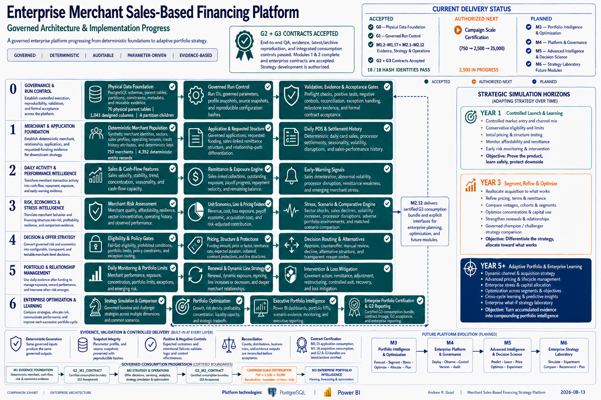
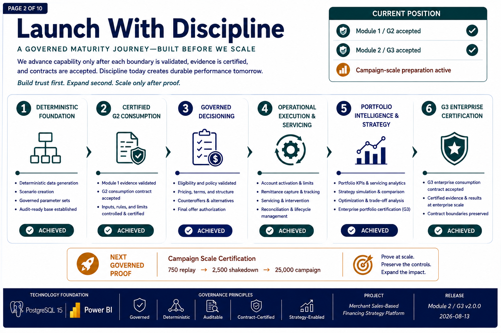
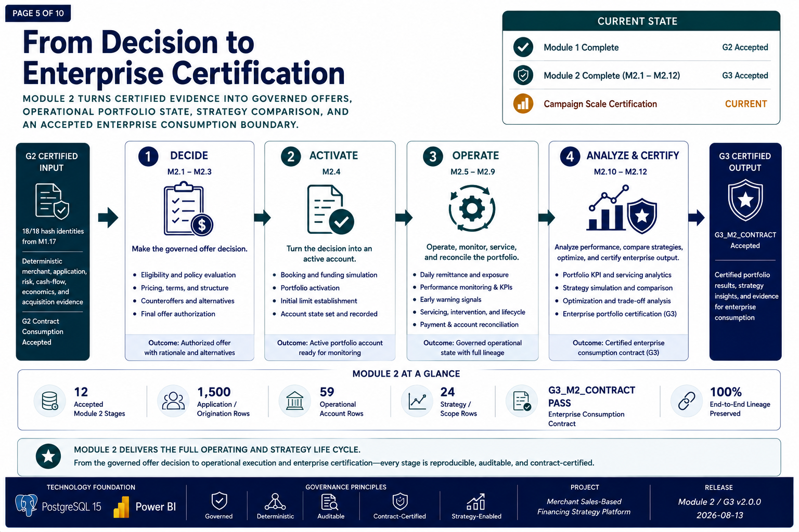
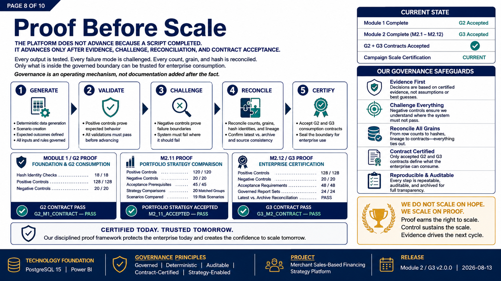
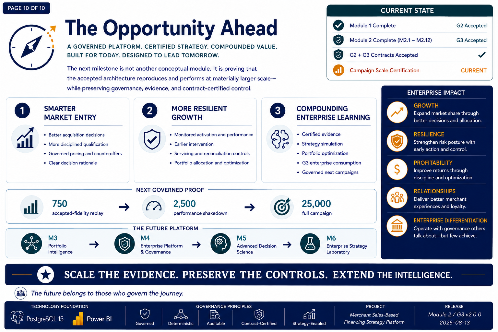
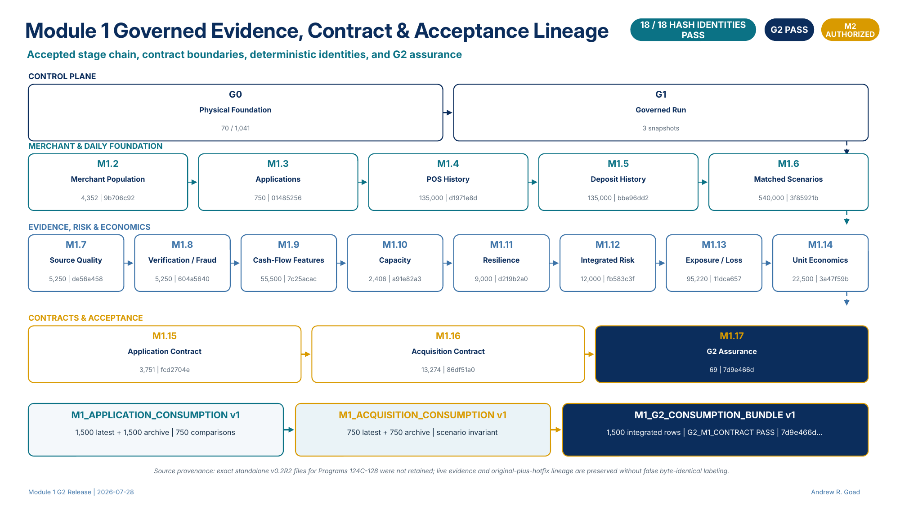

# Merchant Sales-Based Financing Strategy Simulator

## Governed Decisioning, Operating Intelligence, Portfolio Strategy, and Enterprise Certification

[](./docs/enterprise_architecture/Enterprise_Merchant_Sales_Based_Financing_Platform_v2.png)

[Open the architecture full size](./docs/enterprise_architecture/Enterprise_Merchant_Sales_Based_Financing_Platform_v2.png) ·
[Architecture PDF](./docs/enterprise_architecture/Enterprise_Merchant_Sales_Based_Financing_Platform_v2.pdf) ·
[Executive strategy brief](./docs/executive_strategy/From_First_Advance_to_Intelligent_Portfolio_v2.pdf) ·
[Page gallery](./docs/executive_strategy/pages_v2/README.md) ·
[Module 2 / G3 release](https://github.com/andrew-goad/merchant-sales-based-financing-strategy-simulator/releases/tag/module-2-g3-v2.0.0)

[Module 1 / G2 lineage](./docs/enterprise_architecture/Module_1_Governed_Evidence_Contract_and_Acceptance_Lineage.png) ·
[Module 2 / G3 lineage](./docs/enterprise_architecture/Module_2_Governed_Decisioning_Operations_Portfolio_%26_G3_Acceptance_Lineage.png)

> **Current governed position:** Module 1 / G2 accepted · Module 2 / G3 accepted · `G2_M1_CONTRACT = PASS` · `G3_M2_CONTRACT = PASS` · Campaign Scale Certification current

This repository is a deterministic, synthetic PostgreSQL 15 platform for
merchant sales-based financing tied to daily point-of-sale activity and
sales-linked repayment.

The platform governs the complete analytical and strategy path from
acquisition-source evidence and merchant applications through cash-flow,
capacity, risk, economics, eligibility, pricing, counteroffers, final-offer
authorization, simulated activation and operating states, servicing,
reconciliation, portfolio analytics, strategy comparison, optimization, and
enterprise G3 certification.

It is not a production lending system, deployed decision service, calibrated
causal model, or autonomous strategy engine. Its purpose is to demonstrate
enterprise-grade architecture, analytical discipline, reproducibility,
validation, evidence, controls, and governed handoffs.

---

## Executive Visual Story

<table>
<tr>
<td width="50%" valign="top">

<a href="./docs/executive_strategy/pages_v2/02_launch_with_discipline.png">

</a>

<strong>Launch With Discipline</strong>

Capability advances only after the preceding boundary is validated, evidenced,
and contract-certified.

</td>
<td width="50%" valign="top">

<a href="./docs/executive_strategy/pages_v2/05_from_decision_to_enterprise_certification.png">

</a>

<strong>From Decision to Enterprise Certification</strong>

Module 2 converts accepted G2 evidence into governed offers, simulated
operations, portfolio strategy, and an accepted G3 consumption boundary.

</td>
</tr>
<tr>
<td width="50%" valign="top">

<a href="./docs/executive_strategy/pages_v2/08_proof_before_scale.png">

</a>

<strong>Proof Before Scale</strong>

Every stage must generate, validate, challenge, reconcile, and certify before
the enterprise boundary advances.

</td>
<td width="50%" valign="top">

<a href="./docs/executive_strategy/pages_v2/10_the_opportunity_ahead.png">

</a>

<strong>The Opportunity Ahead</strong>

The next governed proof expands accepted-fidelity replay through performance
shakedown and full-campaign certification.

</td>
</tr>
</table>

[Open the complete ten-page executive strategy brief](./docs/executive_strategy/From_First_Advance_to_Intelligent_Portfolio_v2.pdf) ·
[View the ten-page contact sheet](./docs/executive_strategy/from_first_advance_to_intelligent_portfolio_contact_sheet_v2.png)

---

## Release Position

| Governed boundary | Current status |
|---|---|
| Module 0 physical foundation and run control | **ACCEPTED** |
| Module 1 deterministic evidence | **COMPLETE** |
| `G2_M1_CONTRACT` | **PASS** |
| Module 2 stages M2.1–M2.12 | **12 / 12 ACCEPTED** |
| `G3_M2_CONTRACT` | **PASS** |
| Campaign Scale Certification | **CURRENT — PREPARATION** |
| 750 accepted-fidelity replay | **NOT YET AUTHORIZED** |
| 2,500 performance shakedown | **NOT YET AUTHORIZED** |
| 25,000 full campaign | **NOT YET AUTHORIZED** |
| Production deployment | **NOT AUTHORIZED** |
| Module 3 execution | **NOT AUTHORIZED** |

---

## End-to-End Platform

```text
Acquisition Source, Campaign & Attribution
→ Application & Requested Structure
→ POS, Settlement, Deposit & Liquidity Evidence
→ Cash-Flow, Capacity & Operating Resilience
→ Integrated Risk, Exposure, Recovery & Comparative Loss
→ Unit Economics & Merchant Acquisition Cost
→ G2 Certified Consumption
→ Eligibility & Policy Gates
→ Pricing, Structure & Counteroffers
→ Final-Offer Authorization
→ Simulated Booking, Funding & Activation
→ Remittance, Exposure & Portfolio Monitoring
→ Early Warning, Servicing & Intervention
→ Payment Reconciliation & Account-State Certification
→ Portfolio KPI & Servicing Analytics
→ Strategy Comparison, Simulation & Optimization
→ G3 Enterprise Portfolio Certification
→ Campaign Scale Certification
```

---

## Accepted Release Evidence

### Module 1 / G2

| Measure | Accepted result |
|---|---:|
| Governed progression | G0, G1, and M1.2–M1.17 |
| Designed data foundation | 110 parent/control/reference tables |
| Designed columns | 2,138 |
| Deterministic applications | 750 |
| Matched scenarios | `BASELINE` and `RECESSION_ENERGY` |
| Integrated application-scenario rows | 1,500 |
| Accepted physical hash identities | 18 / 18 PASS |
| Final positive controls | 128 / 128 PASS |
| Final negative controls | 20 / 20 PASS |
| Deterministic or archive mismatches | 0 |
| Final contract | **`G2_M1_CONTRACT — PASS`** |

### Module 2 / G3

| Measure | Accepted result |
|---|---:|
| Accepted Module 2 stages | 12 / 12 |
| Integrated application/origination rows | 1,500 |
| Operational-account rows | 59 |
| Strategy/scope rows | 24 |
| M2.11 positive controls | 120 / 120 PASS |
| M2.11 negative controls | 20 / 20 PASS |
| M2.11 acceptance prerequisites | 45 / 45 PASS |
| M2.11 matched strategy groups | 20 |
| M2.11 risk scenarios | 19 |
| M2.12 positive controls | 128 / 128 PASS |
| M2.12 negative controls | 20 / 20 PASS |
| M2.12 acceptance requirements | 48 / 48 PASS |
| M2.12 governed report sets | 24 / 24 PASS |
| Latest-versus-archive reconciliation | PASS |
| Final contract | **`G3_M2_CONTRACT — PASS`** |
| Governed publication manifest | 1,930 files |

---

## Governed Evidence, Contract, and Acceptance Lineage

The platform is governed across two accepted and connected certification
boundaries.

Module 1 establishes the deterministic merchant, application, operating,
risk, economics, acquisition, and consumption evidence required by downstream
strategy. Module 2 consumes that accepted foundation and extends it through
decisioning, simulated operating states, portfolio analytics, strategy
comparison, optimization, and G3 enterprise certification.

### Module 1 / G2 — Deterministic Evidence Foundation

[](./docs/enterprise_architecture/Module_1_Governed_Evidence_Contract_and_Acceptance_Lineage.png)

[Open the Module 1 lineage full size](./docs/enterprise_architecture/Module_1_Governed_Evidence_Contract_and_Acceptance_Lineage.png) ·
[PDF](./docs/enterprise_architecture/Module_1_Governed_Evidence_Contract_and_Acceptance_Lineage.pdf) ·
[Review M1.17 G2 assurance](./Module_1/1.17_End_to_End_QA_and_G2_Acceptance/)

#### What this boundary certifies

- deterministic merchant and application identities;
- daily POS, settlement, deposit, liquidity, and cash-flow evidence;
- capacity, resilience, integrated risk, exposure, loss, and unit economics;
- acquisition source, attribution, confidence, and merchant acquisition cost;
- latest, archive, comparison, and companion consumption layers;
- accepted source-to-contract and contract-to-consumption lineage;
- 18 / 18 accepted physical hash identities;
- `G2_M1_CONTRACT — PASS`.

### Module 2 / G3 — Decisioning, Operations, Portfolio Strategy, and Enterprise Certification

[](./docs/enterprise_architecture/Module_2_Governed_Decisioning_Operations_Portfolio_%26_G3_Acceptance_Lineage.png)

[Open the Module 2 lineage full size](./docs/enterprise_architecture/Module_2_Governed_Decisioning_Operations_Portfolio_%26_G3_Acceptance_Lineage.png) ·
[PDF](./docs/enterprise_architecture/Module_2_Governed_Decisioning_Operations_Portfolio_%26_G3_Acceptance_Lineage.pdf) ·
[Explore the complete Module 2 stage tree](./Module_2/README.md)

#### What this boundary certifies

- eligibility, policy, pricing, structure, counteroffers, and alternatives;
- final-offer authorization, decision routing, and rationale;
- deterministic simulated activation and operating states;
- monitoring, early warning, intervention, servicing, and reconciliation;
- portfolio KPI and servicing analytics;
- matched strategy comparison, simulation, optimization, and trade-offs;
- 12 / 12 accepted Module 2 stages;
- enterprise-certified G3 consumption;
- `G3_M2_CONTRACT — PASS`.

```text
MODULE 1 / G2
Certified evidence foundation
        ↓
MODULE 2 / G3
Governed decisioning, simulated operations, portfolio strategy,
and enterprise certification
        ↓
CURRENT
Campaign Scale Certification
```

> **Connected-boundary principle:** Module 1 proves that the evidence can be
> trusted. Module 2 proves that trusted evidence can drive governed strategy.
> G2 and G3 establish the accepted consumption boundaries connecting the two.

> **Authority boundary:** The lineage exhibits summarize accepted synthetic,
> non-production evidence and contract boundaries. They do not represent live
> account processing, deployed credit policy, causal optimization, or
> autonomous decisioning.

---

## Module 2 Accepted Stage Chain

| Stage | Governed capability | Accepted revision |
|---|---|---|
| [M2.1](./Module_2/2.01_Eligibility_Policy_Gates_and_Decision_Routing/) | Eligibility, policy gates, and decision routing | `v0.2R7_ACCEPTED` |
| [M2.2](./Module_2/2.02_Pricing_Structure_and_Counteroffer/) | Pricing, structure, and counteroffers | `v0.2R2_ACCEPTED` |
| [M2.3](./Module_2/2.03_Final_Offer_and_Decision_Authorization/) | Final-offer and decision authorization | `v0.2R2_ACCEPTED` |
| [M2.4](./Module_2/2.04_Booking_Funding_and_Portfolio_Activation/) | Booking, funding, and portfolio activation | `v0.2_ACCEPTED` |
| [M2.5](./Module_2/2.05_Daily_Remittance_Exposure_and_Portfolio_Monitoring/) | Daily remittance, exposure, and portfolio monitoring | `v0.2R5_ACCEPTED` |
| [M2.6](./Module_2/2.06_Early_Warning_Intervention_and_Servicing_Strategy/) | Early warning, intervention, and servicing strategy | `v0.2R1_ACCEPTED` |
| [M2.7](./Module_2/2.07_Operational_Activation_and_Account_Setup/) | Operational activation and account setup | `v0.2R1_ACCEPTED` |
| [M2.8](./Module_2/2.08_Servicing_Execution_Payment_and_Lifecycle_Control/) | Servicing execution, payment, and lifecycle control | `v0.2_ACCEPTED` |
| [M2.9](./Module_2/2.09_Payment_Reconciliation_and_Account_State_Certification/) | Payment reconciliation and account-state certification | `v0.2R1_ACCEPTED` |
| [M2.10](./Module_2/2.10_Portfolio_Performance_KPI_and_Servicing_Analytics/) | Portfolio performance, KPIs, and servicing analytics | `v0.2R5_ACCEPTED` |
| [M2.11](./Module_2/2.11_Portfolio_Optimization_and_Strategy_Simulation/) | Portfolio optimization and strategy simulation | `v0.2R13_ACCEPTED` |
| [M2.12](./Module_2/2.12_Enterprise_Portfolio_Certification_and_G3_Contract/) | Enterprise portfolio certification and G3 contract | `v1_ACCEPTED` |

> **Simulation boundary:** Public Module 2 operating, activation, servicing,
> and portfolio states are deterministic synthetic simulation outputs. They
> are not evidence of live account processing or production deployment.

Each stage provides a governed public projection containing:

```text
README
→ BRD
→ architecture
→ validation and acceptance
→ source provenance
→ correction history
→ catalogs
→ current source
→ reporting source
→ recovery-only source
→ final sign-off
→ manifests and SHA-256 evidence
```

[Open the complete Module 2 stage index](./Module_2/README.md) ·
[Open the BRD and validation index](./docs/BRD_AND_VALIDATION_INDEX.md)

---

## What the Platform Demonstrates

### 1. Acquire and Establish Evidence

- deterministic merchant, owner, processor, application, POS, settlement,
  deposit, and liquidity foundations;
- acquisition-source taxonomy, campaign funnels, application touchpoints,
  deterministic attribution, and merchant-acquisition cost;
- source confidence, verification evidence, fraud indicators, and processor
  continuity;
- matched baseline and adverse scenarios using the same governed merchant and
  application identities.

### 2. Decide and Structure

- eligibility and policy gates;
- pricing, terms, factor-rate, and remittance design;
- configurable counteroffers and alternative structures;
- final-offer authorization;
- transparent route, disposition, reason-code, and rationale evidence;
- governed lineage from certified G2 input to merchant-level decision output.

### 3. Operate and Service

- deterministic simulated booking, funding, activation, and initial-limit
  states;
- simulated daily remittance, exposure, and performance monitoring;
- early-warning indicators and intervention triggers;
- servicing, restructures, collections, and lifecycle-control evidence;
- payment-event reconciliation;
- account-state certification;
- complete source-to-operating-state lineage.

### 4. Analyze, Compare, Optimize, and Certify

- portfolio KPI and servicing analytics;
- vintage, exposure, concentration, return, and risk-adjusted evidence;
- matched baseline and challenger strategy comparison;
- strategy simulation across governed scenarios and objectives;
- portfolio optimization and trade-off analysis;
- certified G3 enterprise consumption;
- controlled preparation for the next governed campaign cycle.

---

## Proof Before Scale

```text
GENERATE
→ VALIDATE
→ CHALLENGE
→ RECONCILE
→ CERTIFY
```

The repository advances only after:

- expected outcomes are explicitly defined;
- positive controls prove intended behavior;
- negative controls prove failure boundaries;
- counts, grains, identities, hashes, and contracts reconcile;
- recovery programs are isolated from normal execution;
- accepted outputs are sealed through governed consumption contracts;
- manifests and SHA-256 identities reproduce the physical release.

```text
Evidence first.
Challenge everything.
Reconcile all grains.
Certify the contract.
Scale only after proof.
```

---

## Campaign Scale Certification

The current governed initiative is preparation for deterministic scale
verification:

```text
750 accepted-fidelity replay
→ 2,500 performance shakedown
→ 25,000 full campaign
```

Each scale step requires a separate fail-closed readiness and authorization
gate.

Preparation does not imply:

- execution authorization;
- production fitness;
- causal inference;
- calibrated credit performance;
- autonomous decisioning;
- Module 3 authorization.

[Open the campaign-scale documentation](./docs/campaign_scale/README.md) ·
[Read the governance boundary](./docs/campaign_scale/CAMPAIGN_SCALE_GOVERNANCE_BOUNDARY.md) ·
[Read the pre-750 roadmap](./docs/campaign_scale/CAMPAIGN_PRE_750_REPLAY_ROADMAP.md)

---

## Choose a Review Path

| Reviewer | Recommended path |
|---|---|
| Executive or hiring leader | [Architecture](./docs/enterprise_architecture/README.md) → [10-page strategy brief](./docs/executive_strategy/README.md) → [Release notes](./RELEASE_NOTES.md) |
| Product, pricing, or portfolio leader | [Beyond Underwriting](./docs/executive_strategy/pages_v2/03_beyond_underwriting.png) → [Strategy Engine](./docs/executive_strategy/pages_v2/06_the_strategy_engine.png) → [Opportunity Ahead](./docs/executive_strategy/pages_v2/10_the_opportunity_ahead.png) |
| Technical or architecture reviewer | [Module and release index](./MODULE_AND_RELEASE_INDEX.md) → [Module 1 lineage](./docs/enterprise_architecture/Module_1_Governed_Evidence_Contract_and_Acceptance_Lineage.png) → [Module 2 stage tree](./Module_2/README.md) |
| Governance or validation reviewer | [Governance guide](./GOVERNANCE_AND_VALIDATION.md) → [BRD and validation index](./docs/BRD_AND_VALIDATION_INDEX.md) → [M2.12 acceptance](./Module_2/2.12_Enterprise_Portfolio_Certification_and_G3_Contract/) |
| Campaign-scale reviewer | [Campaign Scale Certification](./docs/campaign_scale/README.md) → governance boundary → pre-750 roadmap |
| Development-history reviewer | [Project history](./docs/project_history/README.md) → sanitized transcript archive |
| Repository navigator | [Project artifact map](./PROJECT_ARTIFACT_MAP.md) |

---

## Repository Map

- [`Module_0/`](./Module_0/) — physical data foundation and governed run
  control.
- [`Module_1/`](./Module_1/) — deterministic merchant, application, operating,
  risk, economics, acquisition, contract, and G2-assurance foundation.
- [`Module_2/`](./Module_2/README.md) — twelve accepted decisioning, operating,
  servicing, portfolio, strategy, and G3-certification stages.
- [`docs/enterprise_architecture/`](./docs/enterprise_architecture/README.md) —
  current enterprise architecture and Module 1/Module 2 lineage exhibits.
- [`docs/executive_strategy/`](./docs/executive_strategy/README.md) — Governed
  Build Edition v3.0 ten-page executive brief.
- [`docs/campaign_scale/`](./docs/campaign_scale/README.md) — campaign
  readiness, clean-build source closure, governance boundary, and pre-750
  roadmap.
- [`docs/project_history/`](./docs/project_history/README.md) — sanitized and
  searchable development-transparency archive.
- [`docs/BRD_AND_VALIDATION_INDEX.md`](./docs/BRD_AND_VALIDATION_INDEX.md) —
  direct stage-level BRD, validation, and source navigation.
- [`PROJECT_ARTIFACT_MAP.md`](./PROJECT_ARTIFACT_MAP.md) — repository-wide
  artifact map.
- [`MODULE_AND_RELEASE_INDEX.md`](./MODULE_AND_RELEASE_INDEX.md) — governed
  module and release index.

---

## Validate the Public Release

Clone the repository and run the publication validator:

```bash
git clone https://github.com/andrew-goad/merchant-sales-based-financing-strategy-simulator.git
cd merchant-sales-based-financing-strategy-simulator
python tools/validate_public_release.py
```

Expected result for Module 2 / G3 v2.0.0:

```text
Public release validation PASS
Governed manifest files: 1930
Module 2 stage folders: 12
```

The validator checks repository navigation, manifests, governed file
identities, required Module 2 stage structure, and publication boundaries.

---

## Source Classification

Within each accepted Module 2 stage:

| Source area | Classification |
|---|---|
| `src/current/` | Accepted normal-chain source |
| `src/reporting/` | Reporting, detail-report, and evidence-export source |
| `src/recovery/` | Contingency-only recovery source; excluded from normal execution |

Recovery SQL is retained for provenance, reproducibility, and failure-mode
transparency. It is not part of the normal execution chain.

---

## Transparency and Provenance

The repository includes a sanitized, searchable development-history archive
through August 12, 2026.

It provides:

- date-ordered Markdown transcripts;
- machine-readable JSONL records;
- project chronology;
- milestone and decision indexes;
- source-export identities;
- duplicate-format classification;
- deterministic redaction reporting;
- an explicit authority hierarchy distinguishing working discussion from
  accepted source and formal sign-off.

[Open the project-history guide](./docs/project_history/README.md)

Discussion history is supporting transparency evidence. Accepted SQL,
manifests, BRDs, validation records, and formal sign-offs remain the governing
authorities.

---

## Governance Principles

```text
Governed
Deterministic
Auditable
Parameter-driven
Evidence-based
Reproducible
Contract-certified
Strategy-enabled
```

The governing philosophy is:

> **Logic, controls, validation, evidence, interpretation, and ownership travel together.**

---

## Release and Publication

| Release element | Authority |
|---|---|
| Public release | **Module 2 / G3 v2.0.0** |
| Release title | **Merchant Sales-Based Financing Strategy Simulator — Module 2 G3 — Governed Decisioning, Operations, Portfolio Strategy & Enterprise Certification** |
| Git tag | **`module-2-g3-v2.0.0`** |
| Visual edition | **Governed Build Edition v3.0** |
| Release date | **2026-08-13** |
| Module 1 contract | **`G2_M1_CONTRACT — PASS`** |
| Module 2 contract | **`G3_M2_CONTRACT — PASS`** |
| Current initiative | **Campaign Scale Certification** |

See:

- [Release Notes](./RELEASE_NOTES.md)
- [GitHub Publication Guide](./GITHUB_PUBLICATION_GUIDE.md)
- [Governance and Validation](./GOVERNANCE_AND_VALIDATION.md)
- [Reproducibility and Execution](./REPRODUCIBILITY_AND_EXECUTION.md)
- [Citation metadata](./CITATION.cff)

---

## Interpretation Boundary

All data are synthetic.

This repository is not:

- a financing offer;
- a production underwriting system;
- a deployed servicing platform;
- a calibrated probability-of-default model;
- a CECL or regulatory-capital model;
- legal or accounting advice;
- a causal optimization engine;
- an autonomous decision service.

Power BI references describe governed, Power BI-ready views and publication
visuals—not a production dashboard deployment.

The repository demonstrates transferable methodology, system architecture,
governed simulation, validation discipline, evidence design, release
governance, and executive communication.
