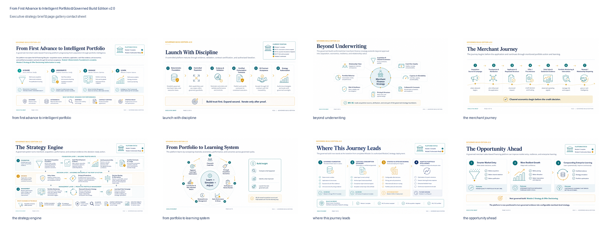

# From First Advance to Intelligent Portfolio

This eight-page strategic brief explains why merchant sales-based financing should be launched as a governed learning system rather than a single product or approval rule.

The Governed Build Edition v2.0 retains the original narrative arc and integrates acquisition discipline, channel economics, discovery before application, contract-certified underwriting, and acquisition-to-relationship learning.

- [Open the PDF](./From_First_Advance_to_Intelligent_Portfolio.pdf)
- [Open the cover](./from_first_advance_to_intelligent_portfolio_cover.png)
- [Open the contact sheet](./from_first_advance_to_intelligent_portfolio_contact_sheet.png)
- [Open the page gallery](./pages/README.md)

## Page gallery

- [Page 1 — From First Advance to Intelligent Portfolio](./pages/01_from_first_advance_to_intelligent_portfolio.png)
- [Page 2 — Launch With Discipline](./pages/02_launch_with_discipline.png)
- [Page 3 — Beyond Underwriting](./pages/03_beyond_underwriting.png)
- [Page 4 — The Merchant Journey](./pages/04_the_merchant_journey.png)
- [Page 5 — The Strategy Engine](./pages/05_the_strategy_engine.png)
- [Page 6 — From Portfolio to Learning System](./pages/06_from_portfolio_to_learning_system.png)
- [Page 7 — Where This Journey Leads](./pages/07_where_this_journey_leads.png)
- [Page 8 — The Opportunity Ahead](./pages/08_the_opportunity_ahead.png)

The brief is an original project artifact authored by Andrew R. Goad. The editable design master is retained privately.
