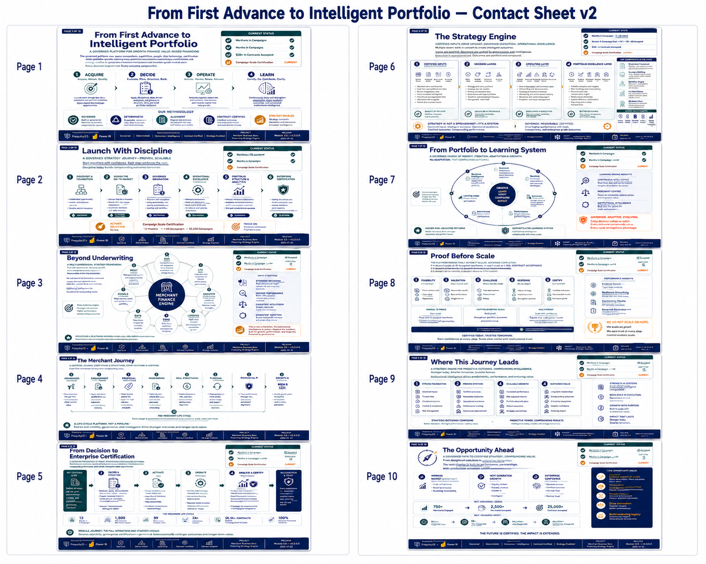

# From First Advance to Intelligent Portfolio

This directory publishes the executive strategy brief for the **Merchant Sales-Based Financing Strategy Simulator**.

## Current edition

| Publication field | Current value |
|---|---|
| Visual edition | **Governed Build Edition v3.0** |
| GitHub release | **Module 2 / G3 v2.0.0** |
| Brief length | **10 pages** |
| Accepted state | **Module 1 complete; Module 2 complete through M2.12; G2 and G3 accepted** |
| Current governed initiative | **Campaign Scale Certification** |
| Release date | **2026-08-13** |

The current brief expands the original eight-page narrative into a ten-page executive story. It explains what Module 2 built, how the platform advances only after evidence and contract acceptance, how strategy learning remains governed and non-causal, and how the accepted architecture progresses toward campaign-scale proof and the planned M3-M6 platform horizon.

- [Open the current 10-page PDF](./From_First_Advance_to_Intelligent_Portfolio_v2.pdf)
- [Open the current cover](./from_first_advance_to_intelligent_portfolio_cover_v2.png)
- [Open the current contact sheet](./from_first_advance_to_intelligent_portfolio_contact_sheet_v2.png)
- [Open the current page gallery](./pages_v2/README.md)

> Repository filenames retain the `_v2` suffix from the visual-package revision cycle. The approved publication label is **Governed Build Edition v3.0**, released with **Module 2 / G3 v2.0.0**.

## Current page sequence

| Page | Title | Executive purpose |
|---:|---|---|
| 1 | [From First Advance to Intelligent Portfolio](./pages_v2/01_from_first_advance_to_intelligent_portfolio.png) | Establish the completed platform, accepted G2/G3 boundaries, and Acquire-Decide-Operate-Learn lifecycle. |
| 2 | [Launch With Discipline](./pages_v2/02_launch_with_discipline.png) | Show the six achieved maturity boundaries and the next governed proof path. |
| 3 | [Beyond Underwriting](./pages_v2/03_beyond_underwriting.png) | Frame merchant-finance strategy across acquisition, economics, risk, servicing, and portfolio behavior. |
| 4 | [The Merchant Journey](./pages_v2/04_the_merchant_journey.png) | Trace the governed lifecycle from acquisition source through G3 certification. |
| 5 | [From Decision to Enterprise Certification](./pages_v2/05_from_decision_to_enterprise_certification.png) | Explain the Module 2 chain from G2-certified inputs to G3-certified enterprise output. |
| 6 | [The Strategy Engine](./pages_v2/06_the_strategy_engine.png) | Present the certified input, decision, simulated operating, and portfolio-intelligence layers. |
| 7 | [From Portfolio to Learning System](./pages_v2/07_from_portfolio_to_learning_system.png) | Show governed observation, simulation, comparison, adjustment, and the non-causal analytical boundary. |
| 8 | [Proof Before Scale](./pages_v2/08_proof_before_scale.png) | Demonstrate the generate-validate-challenge-reconcile-certify control framework. |
| 9 | [Where This Journey Leads](./pages_v2/09_where_this_journey_leads.png) | Describe the Year 1, Year 3, and Year 5+ strategy-maturity horizons. |
| 10 | [The Opportunity Ahead](./pages_v2/10_the_opportunity_ahead.png) | Close with enterprise outcomes, the 750-2,500-25,000 scale path, and the planned M3-M6 evolution. |

## Publication boundary

The brief represents a deterministic, synthetic, non-production platform. Strategy comparisons are governed analytical comparisons, not production causal optimization. Campaign-scale certification is the current initiative rather than a completed acceptance state, and M3-M6 are planned future capabilities rather than delivered functionality.

## Prior eight-page edition

The original **Governed Build Edition v2.0 / Module 1-G2 v1.0.0** assets remain available for release history:

- [Open the prior eight-page PDF](./From_First_Advance_to_Intelligent_Portfolio.pdf)
- [Open the prior cover](./from_first_advance_to_intelligent_portfolio_cover.png)
- [Open the prior contact sheet](./from_first_advance_to_intelligent_portfolio_contact_sheet.png)
- [Open the prior page gallery](./pages/README.md)

## Integrity metadata

[`VISUAL_RELEASE_METADATA.json`](./VISUAL_RELEASE_METADATA.json) records the physical SHA-256 identity, byte size, release classification, visual edition, and image or PDF properties for every published file in this directory except the metadata file itself.

The brief and visual system are original project artifacts authored by **Andrew R. Goad**. Editable design masters are retained privately.
