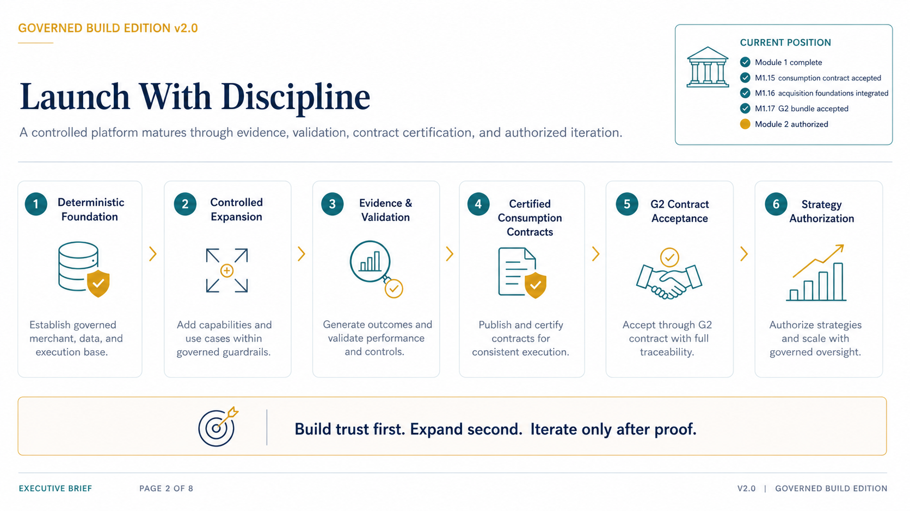
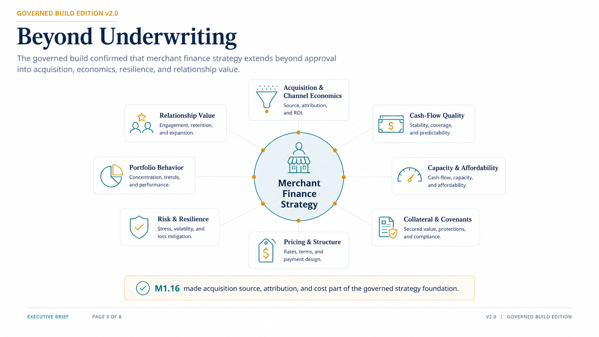
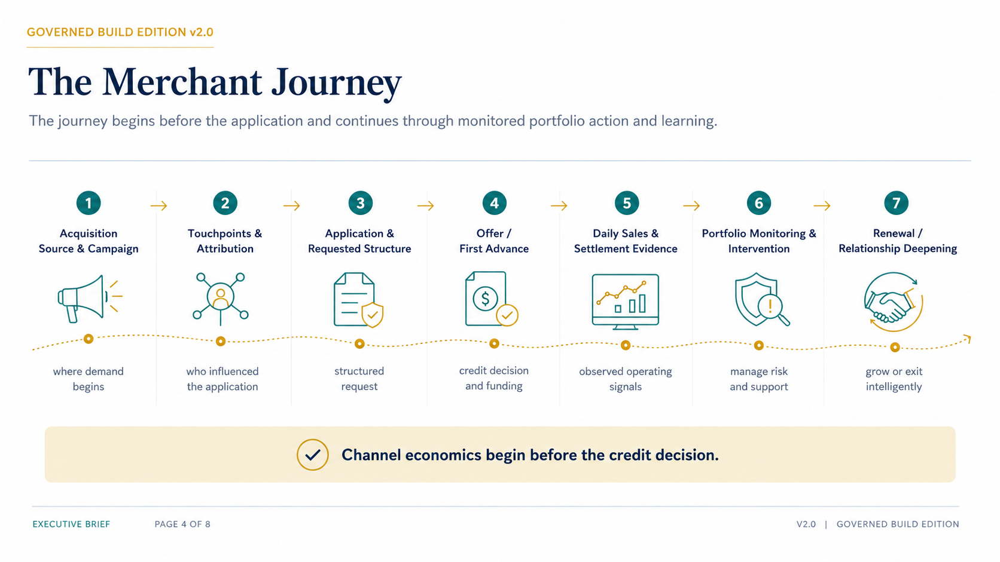
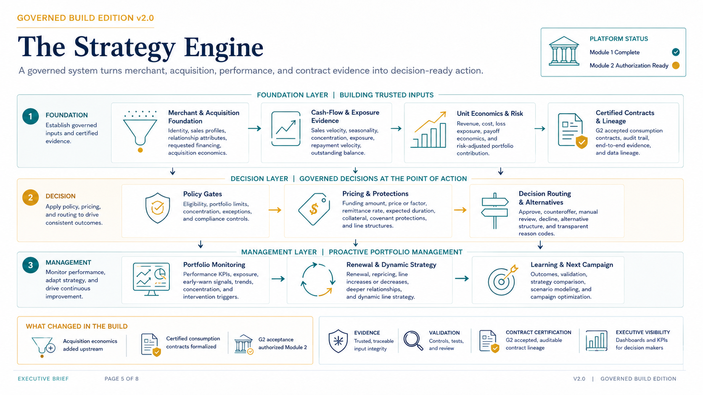
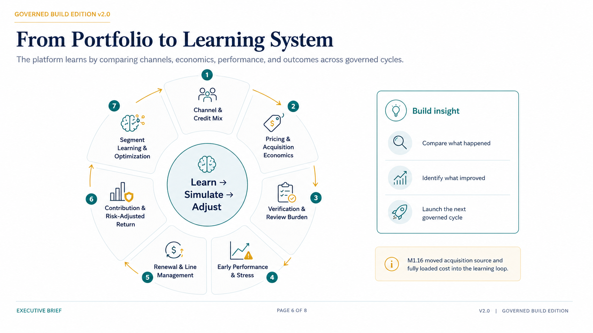
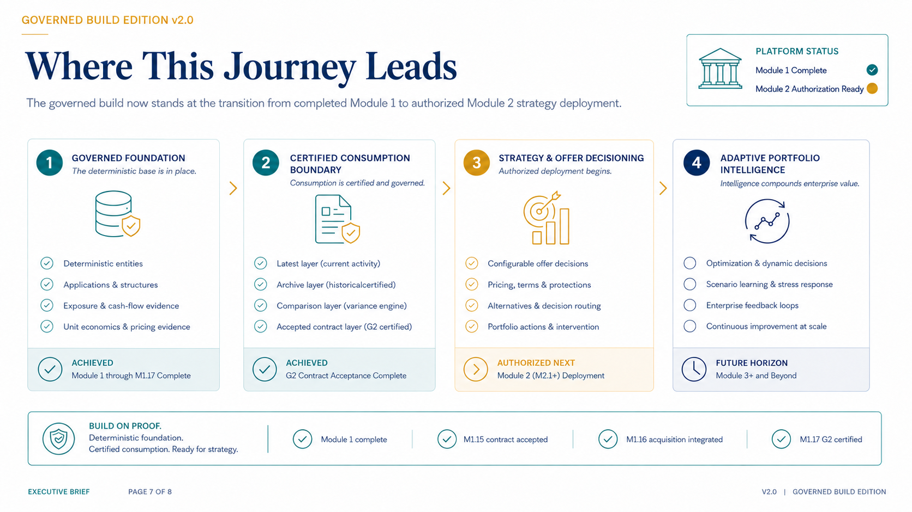
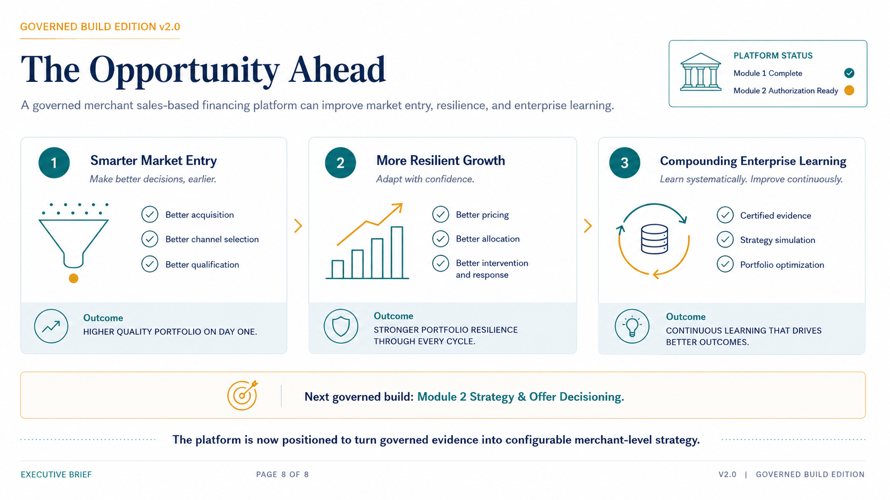

# Executive Strategy Brief — Page Gallery

This gallery provides browser-native access to all eight pages of the executive strategy brief.

- [Return to executive strategy overview](../README.md)
- [Open the full PDF](../From_First_Advance_to_Intelligent_Portfolio.pdf)

## Gallery

### Page 1 — From First Advance to Intelligent Portfolio

### Page 2 — Launch With Discipline

### Page 3 — Beyond Underwriting

### Page 4 — The Merchant Journey

### Page 5 — The Strategy Engine

### Page 6 — From Portfolio to Learning System

### Page 7 — Where This Journey Leads

### Page 8 — The Opportunity Ahead

