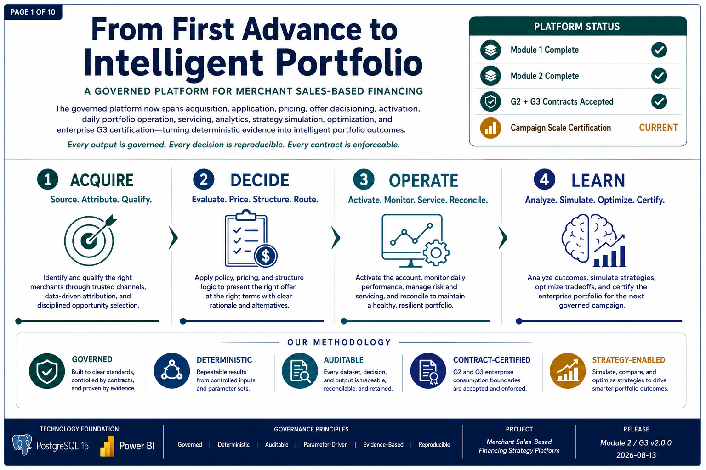
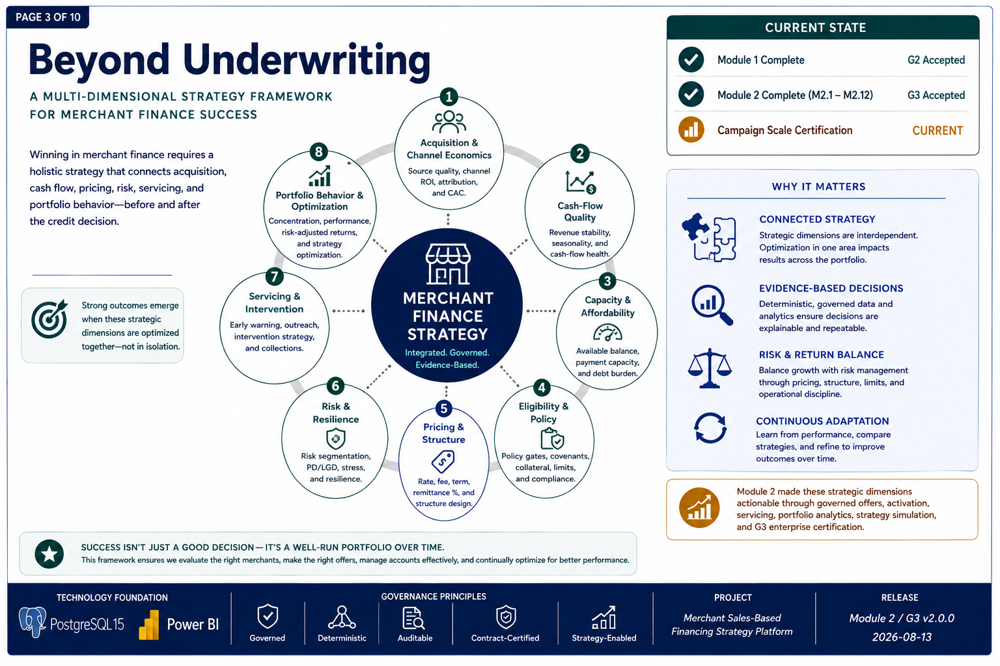
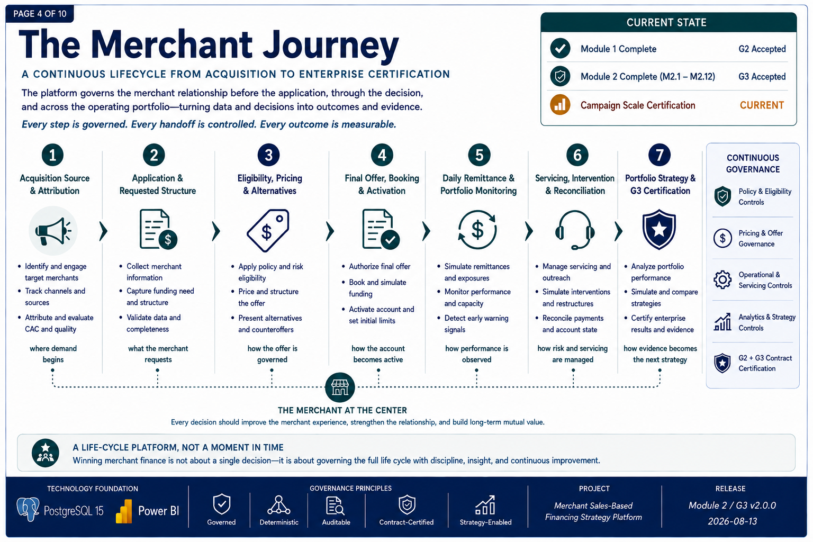
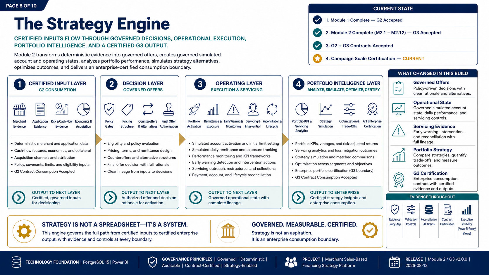
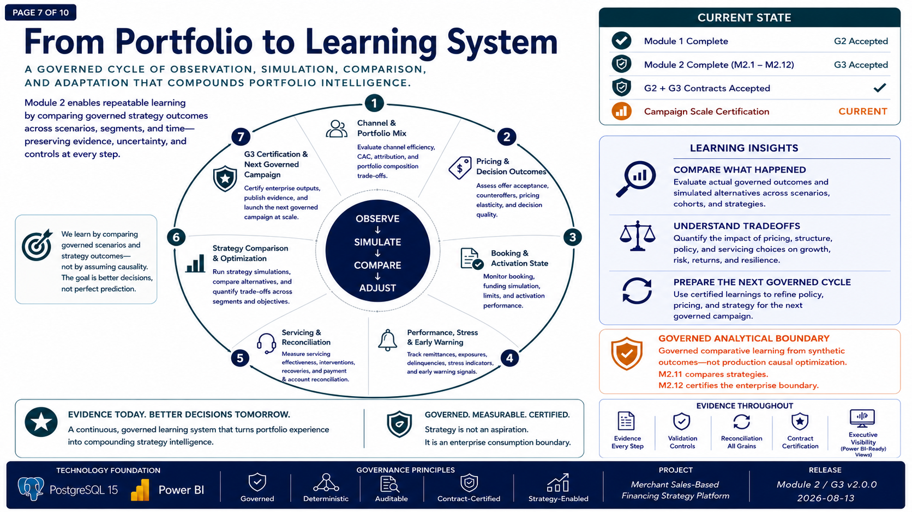
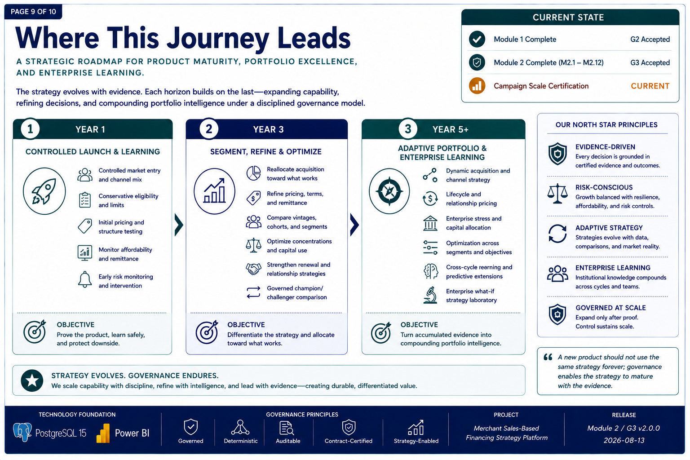

# Executive Strategy Brief - Current Ten-Page Gallery

This gallery provides browser-native access to the approved **Governed Build Edition v3.0**, published with the **Module 2 / G3 v2.0.0** GitHub release.

- [Return to the executive strategy overview](../README.md)
- [Open the current 10-page PDF](../From_First_Advance_to_Intelligent_Portfolio_v2.pdf)
- [Open the current contact sheet](../from_first_advance_to_intelligent_portfolio_contact_sheet_v2.png)

## Gallery

### Page 1 - From First Advance to Intelligent Portfolio

### Page 2 - Launch With Discipline

### Page 3 - Beyond Underwriting

### Page 4 - The Merchant Journey

### Page 5 - From Decision to Enterprise Certification

### Page 6 - The Strategy Engine

### Page 7 - From Portfolio to Learning System

### Page 8 - Proof Before Scale

### Page 9 - Where This Journey Leads

### Page 10 - The Opportunity Ahead

